# SAM3D Dining Scene — Full Pipeline Results

**Date:** 2026-02-15
**Author:** kingy + Claude (Opus 4.6)
**Hardware:** RTX 5080 16GB | 32GB DDR5-6000 | Ryzen 9 9900X

---

## Summary

Ran the full SAM3D pipeline (SAM segmentation + MoGe depth + TRELLIS 3D reconstruction + Blender rendering) on a new dining scene photograph. All 9 segmented objects were successfully reconstructed and placed in a 3D scene matching the original camera view. One object (chair_legs) required a solo rerun after CUDA OOM during batch processing.

---

## 1. Input Image

**Source:** `PXL_20260216_043628375.jpg` (3072 x 4080, portrait)
**Resized:** `target_resized.jpg` (771 x 1024) — resized to match greentea scene resolution

The scene shows a dining area with a wooden chair, round table with tablecloth, patterned sofa, and various items on the table (newspaper, placemat, strainer, travel pillow).

---

## 2. SAM Segmentation

**Conda env:** `sam` (Python 3.10)
**Script:** `tools/sam3d/sam_worker.py`

Initial attempt on full-resolution (3072x4080) failed with CUDA OOM. After resizing to 771x1024, SAM successfully segmented 9 objects:

| # | Object Name | Description |
|---|---|---|
| 1 | wooden_chair | Foreground wooden chair |
| 2 | chair_cushion | Seat cushion on the chair |
| 3 | chair_legs | Chair legs and floor area |
| 4 | round_table_with_tablecloth | Round dining table with white tablecloth |
| 5 | sofa_with_patterned_cover | Background sofa with black/white pattern |
| 6 | travel_pillow | Pillow on the sofa |
| 7 | newspaper | Newspaper on the table |
| 8 | strainer | Strainer/colander on the table |
| 9 | placemat | Placemat on the table |

---

## 3. MoGe Depth Estimation

**Script:** `diagnose_moge.py`

### Camera Intrinsics

```
fx = 701.1 px    fy = 701.1 px
cx = 385.5 px    cy = 512.0 px
Image: 771 x 1024 px
```

### Depth Map

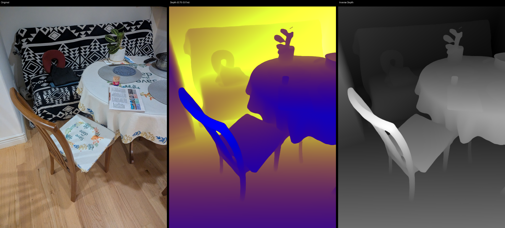

*Left: Original image | Center: Depth colormap (warm = near, cool = far) | Right: Inverse depth*

- Depth range: 0.70 m (nearest) to 3.01 m (farthest)
- Chair and table are closest (~0.7-1.4 m), sofa is mid-range (~2.0 m), wall is farthest (~3.0 m)

---

## 4. TRELLIS 3D Reconstruction

**Conda env:** `sam3d_py311` (Python 3.11)
**Script:** `tools/sam3d/sam3d_worker.py`

### Batch Run (8 of 9 objects)

Objects were processed sequentially in a single batch run. 8 completed, 1 OOM'd.

| Object | Start | End | Duration | Status |
|---|---|---|---|---|
| wooden_chair | 21:48 | 21:56 | ~8 min | Completed |
| travel_pillow | 21:56 | 22:07 | ~11 min | Completed |
| sofa_with_patterned_cover | 22:07 | 22:14 | ~8 min | Completed |
| round_table_with_tablecloth | 22:14 | 22:21 | ~6 min | Completed |
| chair_cushion | 22:21 | 22:37 | ~16 min | Completed |
| **chair_legs** | **22:37** | **22:43** | **~6 min** | **CUDA OOM** |
| newspaper | 22:43 | 22:59 | ~16 min | Completed |
| strainer | 22:59 | 23:03 | ~4 min | Completed |
| placemat | 23:03 | 23:11 | ~8 min | Completed |

**Total batch time:** ~83 min (21:48 to 23:11)

### Chair_legs Solo Rerun

Chair_legs failed with `torch.AcceleratorError: CUDA error: out of memory` during batch processing (after chair_cushion's heavy 16-min decode leaked VRAM). Solo rerun succeeded:

| Stage | Time | Details |
|---|---|---|
| Model loading | ~22 sec | 23:19:36 to 23:19:58 |
| Sparse structure | ~13 sec | 15,814 coords, downsampled to 12,555 |
| SLAT sampling | ~1m 25s | 23:20:27 to 23:21:52 |
| Decode | ~12m 36s | 23:21:52 to 23:34:28 |
| **Total** | **~15 min** | 23:19:36 to 23:34:28 |

---

## 5. Object Transforms

All transforms in PyTorch3D camera space (X-left, Y-up, Z-forward). Stored in `output/sam3d_dining/object_transforms.json`.

| Object | Translation (X, Y, Z) | Scale | GLB Size |
|---|---|---|---|
| wooden_chair | (0.105, -0.237, 1.206) | 1.290 | 4.4 MB |
| chair_cushion | (-0.003, -0.163, 1.290) | 0.447 | 17.3 MB |
| chair_legs | (-0.439, -0.481, 1.665) | 2.322 | 15.0 MB |
| round_table_with_tablecloth | (-0.615, 0.241, 1.408) | 1.347 | 10.4 MB |
| sofa_with_patterned_cover | (-0.523, 0.505, 2.067) | 2.666 | 10.5 MB |
| travel_pillow | (0.294, 0.668, 2.076) | 0.572 | 12.3 MB |
| newspaper | (-0.291, 0.149, 1.116) | 0.288 | 13.3 MB |
| strainer | (-0.937, 0.449, 1.427) | 1.178 | 1.8 MB |
| placemat | (-0.356, 0.432, 1.447) | 0.450 | 4.5 MB |

**Total GLB size:** ~89 MB

### Depth ordering (Z-forward)

Nearest to farthest:
1. newspaper (Z=1.12) — on table, closest to camera
2. wooden_chair (Z=1.21) — foreground
3. chair_cushion (Z=1.29) — on chair seat
4. round_table_with_tablecloth (Z=1.41) — center
5. strainer (Z=1.43) — on table
6. placemat (Z=1.45) — on table
7. chair_legs (Z=1.67) — floor area under table
8. sofa_with_patterned_cover (Z=2.07) — background
9. travel_pillow (Z=2.08) — on sofa

---

## 6. Per-Object Comparisons

### wooden_chair

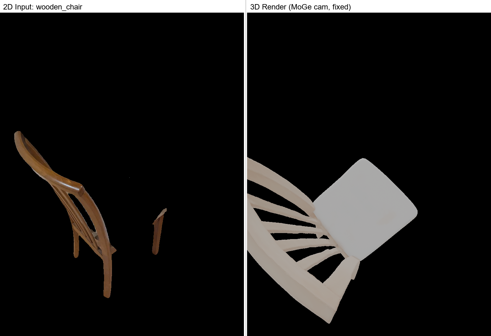

- Shape: Good chair profile with back and seat visible
- Position: Foreground center, matches 2D input

### chair_cushion

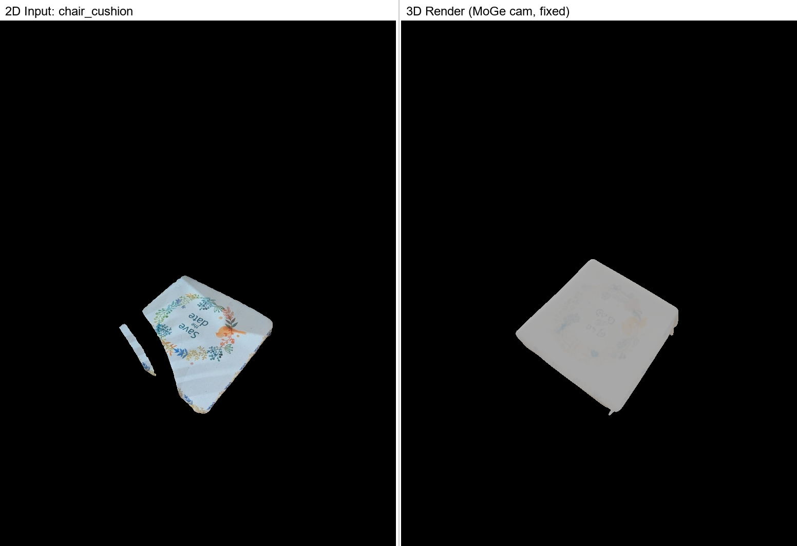

- Shape: Recognizable cushion with floral pattern
- Position: On the chair seat area

### chair_legs (solo rerun)

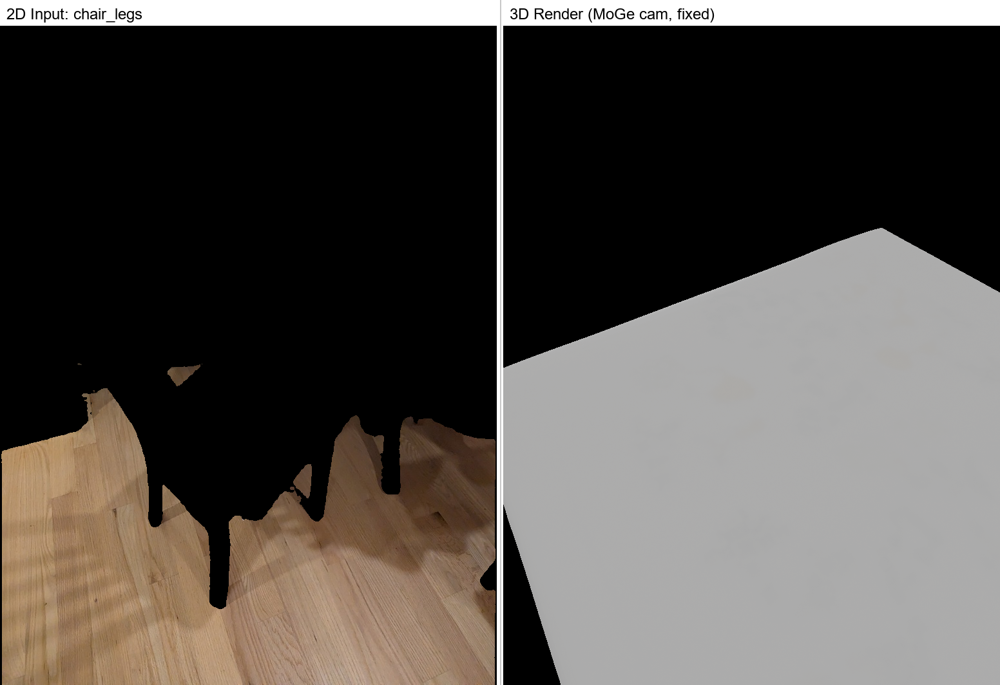

- Shape: Large flat surface (floor + chair leg area)
- Position: Lower portion of frame
- Note: Reconstructed as a flat slab. Similar to the greentea "desk surface" — large floor segments produce generic geometry.

### round_table_with_tablecloth

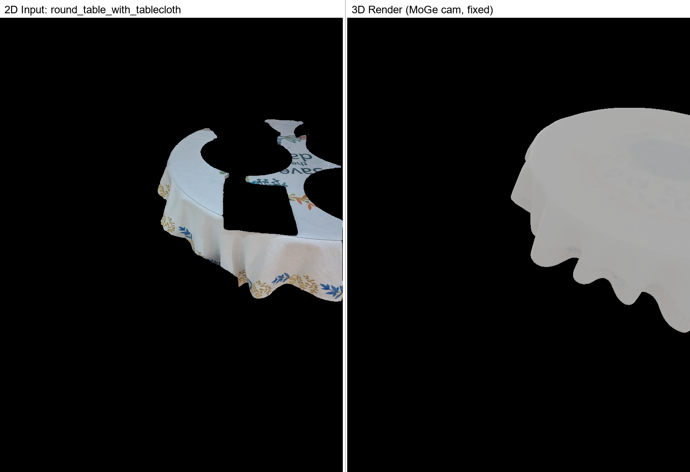

- Shape: Round table with cloth draping
- Position: Center of scene

### sofa_with_patterned_cover

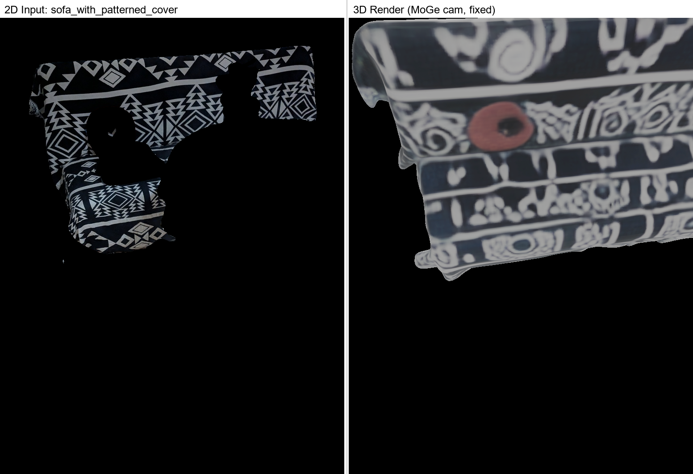

- Shape: Large sofa with visible black/white pattern
- Position: Background, matches 2D input

### travel_pillow

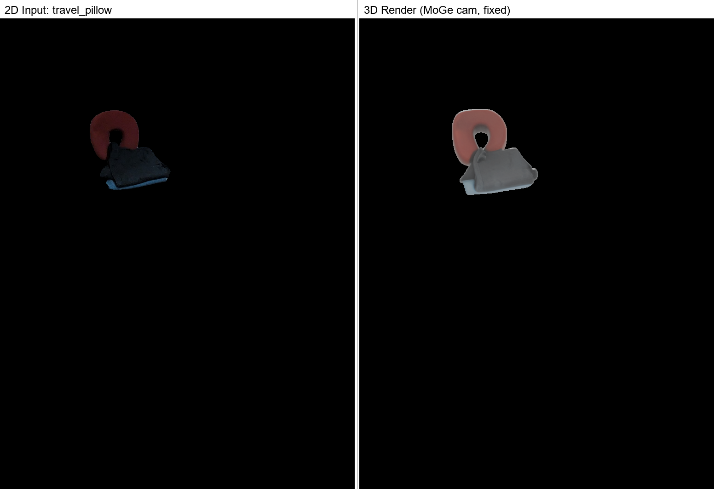

- Shape: Small pillow shape
- Position: Upper area (on sofa)

### newspaper

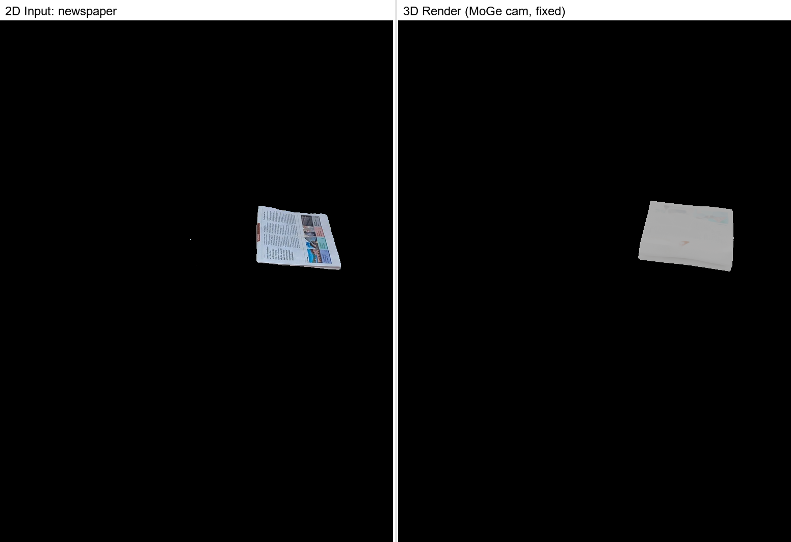

- Shape: Flat object with text visible
- Position: On table surface

### strainer

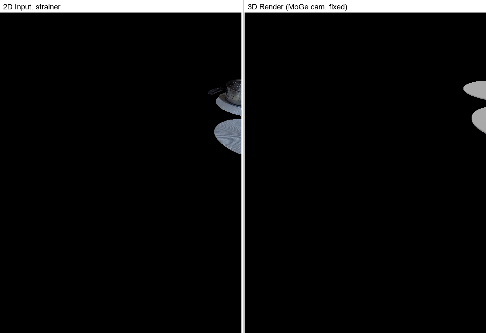

- Shape: Small round object
- Position: Left side of table area

### placemat

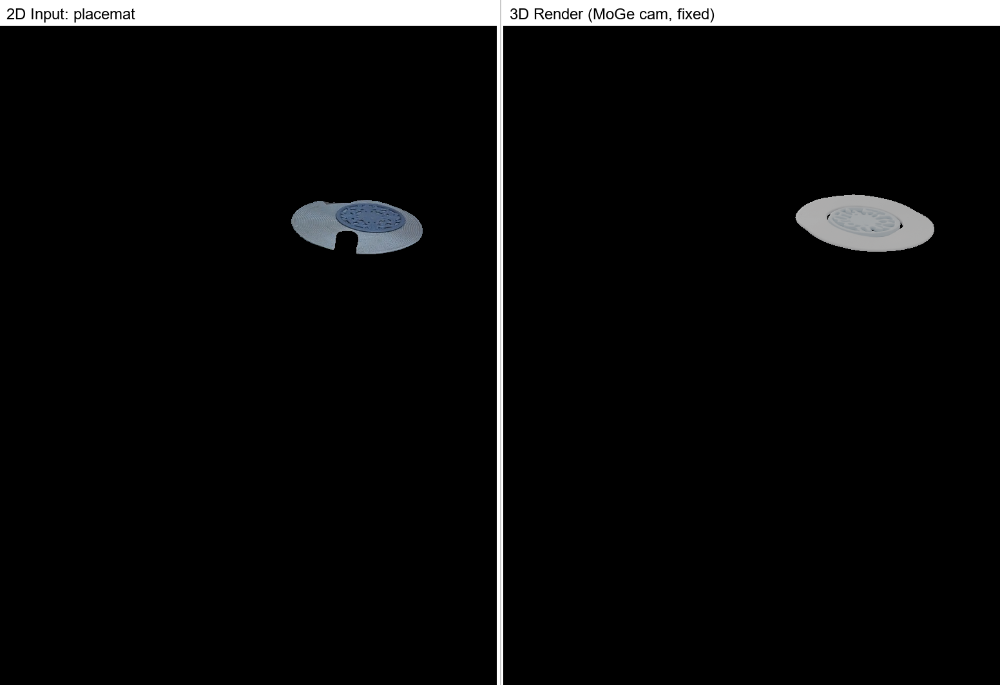

- Shape: Flat rectangular shape
- Position: On table

---

## 7. Full Scene Comparison

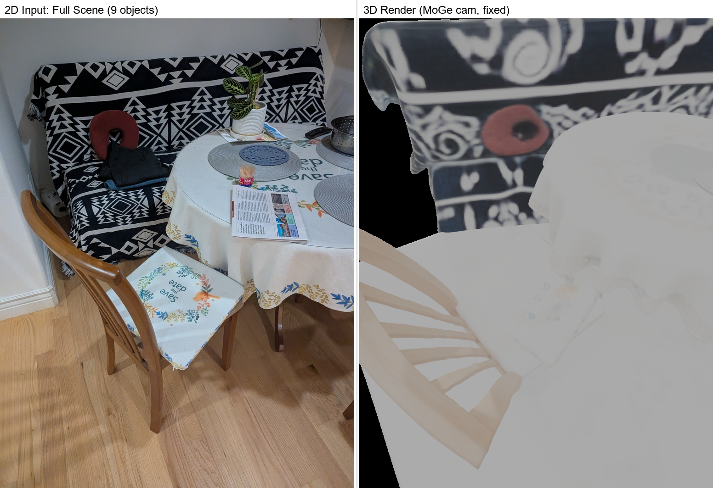

**Left:** Original target photograph
**Right:** 3D render of all 9 reconstructed objects placed using MoGe camera + SAM3D transforms

The overall spatial layout matches: chair in the foreground, table behind it with items on top, sofa in the background with patterned cover. All 9 objects are positioned in 3D space consistent with the original 2D photograph.

---

## 8. Pipeline Timing Summary

| Stage | Time | Notes |
|---|---|---|
| SAM segmentation | ~2 min | 9 masks extracted (after resize to 771x1024) |
| MoGe depth estimation | ~1 min | Camera intrinsics + depth map |
| TRELLIS batch (8 objects) | ~83 min | Sequential, one OOM failure |
| TRELLIS solo rerun (chair_legs) | ~15 min | 12.5K sparse coords |
| Blender rendering (9 objects) | ~2 min | Individual + full scene |
| **Total pipeline** | **~103 min** | End-to-end for 9 objects |

---

## 9. Issues Encountered

### CUDA OOM on Full-Resolution SAM

**Problem:** SAM segmentation failed on the original 3072x4080 image with `torch.AcceleratorError: CUDA error: out of memory`.

**Fix:** Resized to 771x1024 before running SAM. This matches the greentea scene resolution and fits within 16GB VRAM.

### CUDA OOM on chair_legs During Batch

**Problem:** chair_legs (object #6 in batch) failed with CUDA OOM after chair_cushion's heavy 16-min decode. VRAM fragmentation from sequential processing caused the failure.

**Fix:** Solo rerun with a fresh process. Completed successfully in ~15 min with 12.5K sparse coordinates.

### Large Floor Segments Produce Generic Geometry

**Observation:** chair_legs (floor area) reconstructed as a flat slab rather than detailed chair legs. This matches the behavior seen in the greentea scene where the "desk surface" also produced generic geometry. Large, flat, texture-poor segments have inherently ambiguous 3D structure for feed-forward reconstruction.

---

## 10. Comparison with Greentea Scene

| Metric | Greentea | Dining |
|---|---|---|
| Input resolution | 771 x 1024 | 771 x 1024 (resized from 3072x4080) |
| Objects segmented | 6 | 9 |
| Objects reconstructed | 6/6 | 9/9 |
| OOM failures | 1 (headphones, batch) | 1 (chair_legs, batch) |
| Solo reruns needed | 1 | 1 |
| Total TRELLIS time | ~68 min | ~98 min |
| MoGe fx/fy | 940.7 px | 701.1 px |
| Depth range | — | 0.70 - 3.01 m |

Both scenes show the same pattern: batch processing causes CUDA OOM on the most complex or unlucky object, which succeeds on solo rerun. Feed-forward reconstruction quality is good for compact objects but generic for large flat surfaces.

---

## 11. Files

### Output Data

```
output/sam3d_dining/
├── all_masks.npy                              # SAM masks (9 objects)
├── all_masks_object_names.json                # Object name mapping
├── object_transforms.json                     # Combined transforms (9 objects)
├── target_moge.npz                            # MoGe depth + intrinsics
├── moge_depth_visualization.png               # Depth map visualization
├── *.glb                                      # 9 reconstructed GLB files
├── *_info.json                                # Per-object transform JSON
├── *.png                                      # Per-object segmented images
├── *_render.png                               # Per-object renders
├── *_compare.png                              # Per-object 2D vs 3D comparisons
├── full_scene_render_9obj.png                 # All 9 objects in one scene
└── full_scene_comparison_9obj.png             # Full scene vs target image
```

### Scripts Used

| Script | Conda Env | Purpose |
|---|---|---|
| `tools/sam3d/sam_worker.py` | `sam` (3.10) | SAM segmentation |
| `tools/sam3d/sam3d_worker.py` | `sam3d_py311` (3.11) | TRELLIS 3D reconstruction |
| `diagnose_moge.py` | `sam3d_py311` (3.11) | MoGe depth estimation |
| `diagnose_render_glb.py` | Blender 4.5 | Per-object render with MoGe camera |
| `render_full_scene.py` | Blender 4.5 | Full scene render |
| `make_comparison.py` | `agent` (3.10) | Side-by-side comparisons |
