# SAM3D Dining Scene v2 — Post-Transform-Fix Full Run

**Date:** 2026-02-16
**Run:** `output/sam3d_dining_v2/`
**Scene:** Dining (9 objects)
**Baseline:** `output/sam3d_dining/` (v1, pre-fix)

---

## What Was Done

First full 9-object dining run after fixing the three critical Transform3d bugs in `tools/sam3d/sam3d_worker.py` (commit `d82b86e`). Adds:

1. **Scale correction** — per-object scale ratio applied after pose decoding.
2. **Convex hull mask growth** (Sobel-based, early version) — each object's SAM mask grown toward its convex hull to recover boundary pixels lost to segmentation conservatism.

Fixes applied in this run vs v1:
- Translation stored in correct row (row-vector convention)
- Pre-transform sign corrected (`[[1,0,0],[0,0,1],[0,-1,0]]`)
- Dead post-transforms removed

---

## Depth Alignment Results (after scale correction)

| Object | Abs Err (m) | Rel Error | Scale Ratio | Notes |
| --- | --- | --- | --- | --- |
| chair_cushion | 0.035 | 2.7% | 1.000 | Well aligned |
| newspaper | 0.017 | 1.6% | 1.006 | Well aligned |
| placemat | 0.008 | 0.6% | 1.004 | Best alignment |
| round_table_with_tablecloth | 0.127 | 10.3% | 1.093 | Draped cloth — high variance |
| sofa_with_patterned_cover | 0.166 | 7.8% | 1.033 | Large curved surface |
| strainer | 0.039 | 2.6% | 0.993 | Good alignment |
| travel_pillow | 0.053 | 2.5% | 1.005 | Good alignment |
| wooden_chair | 0.228 | 21.8% | 1.052 | Sparse frame — high spread |
| chair_legs | 0.091 | 5.3% | 0.993 | Improved vs v1 (was 55%) |

---

## Per-Object Comparisons

Each image: left = 2D SAM mask overlay, right = 3D GLB projection.

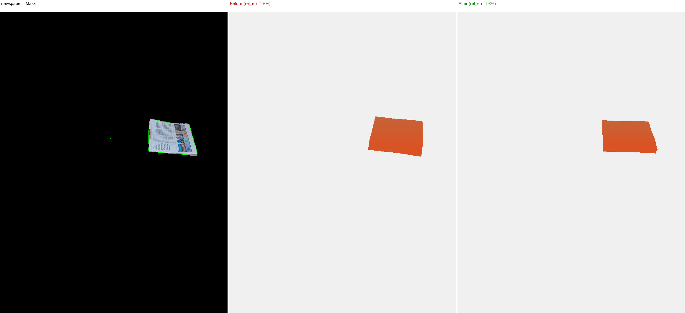

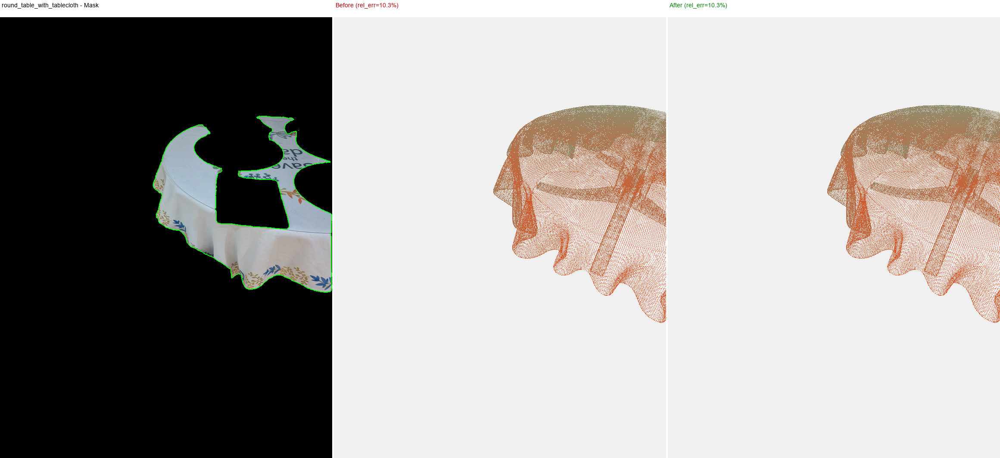

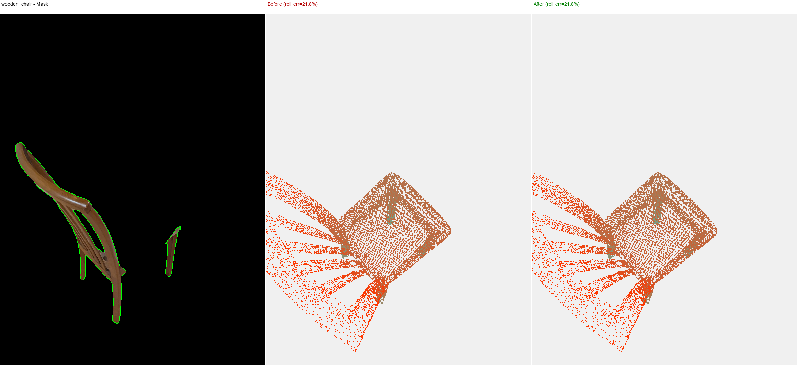

---

## Convex Hull Mask Growth (Sobel-based)

Early mask growth: Sobel edge detection on MoGe depth map, grows mask toward convex hull stopping at depth edges.

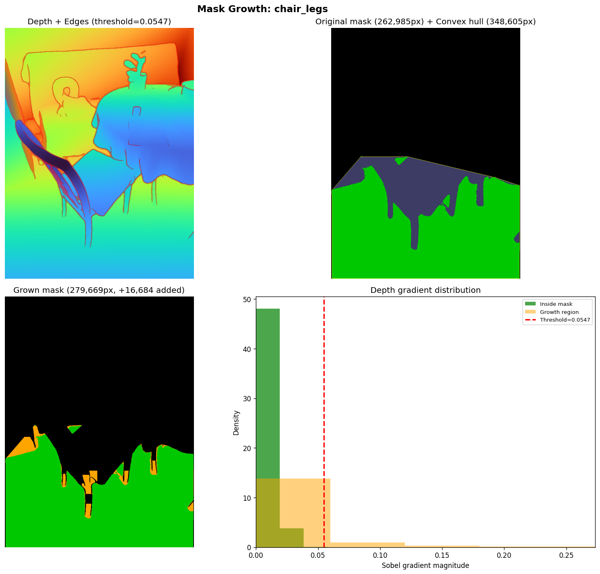

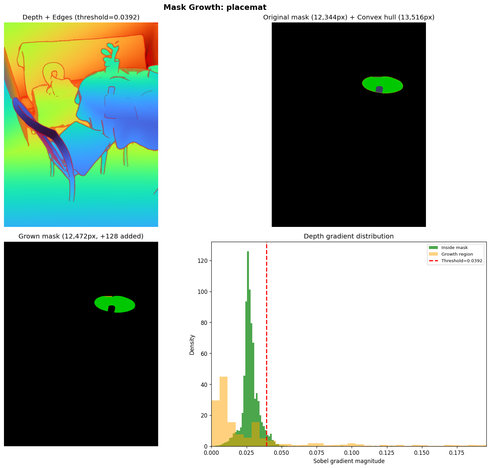

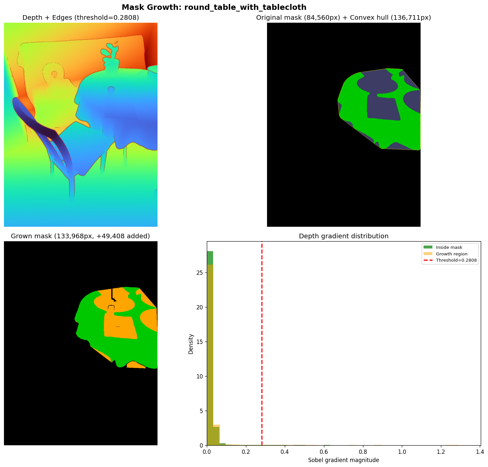

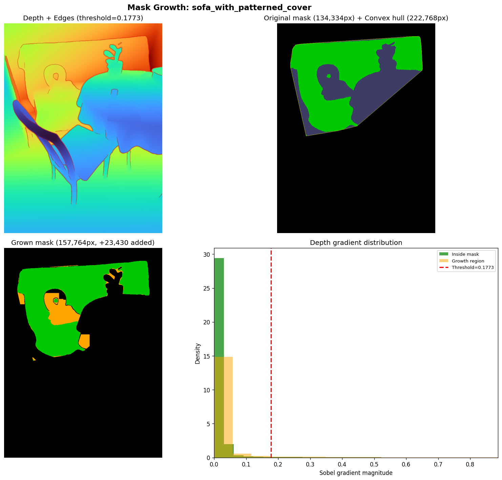

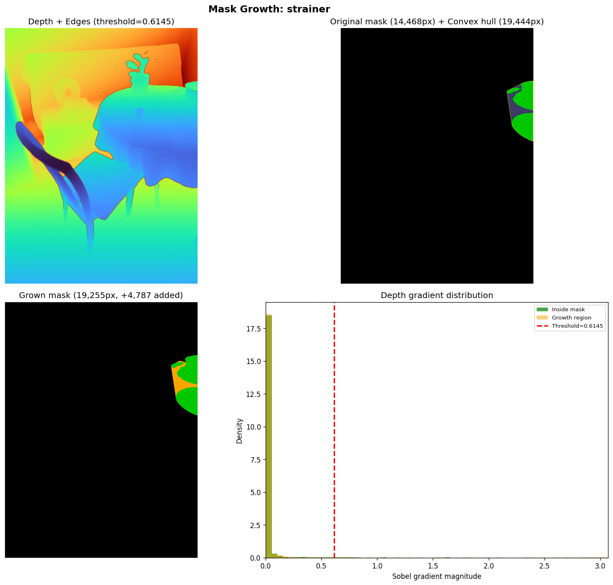

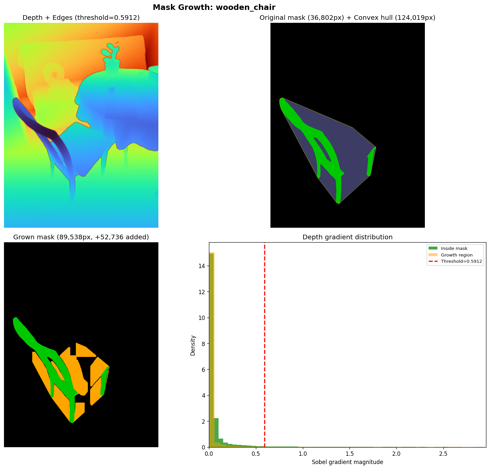

---

## Full Scene Comparison

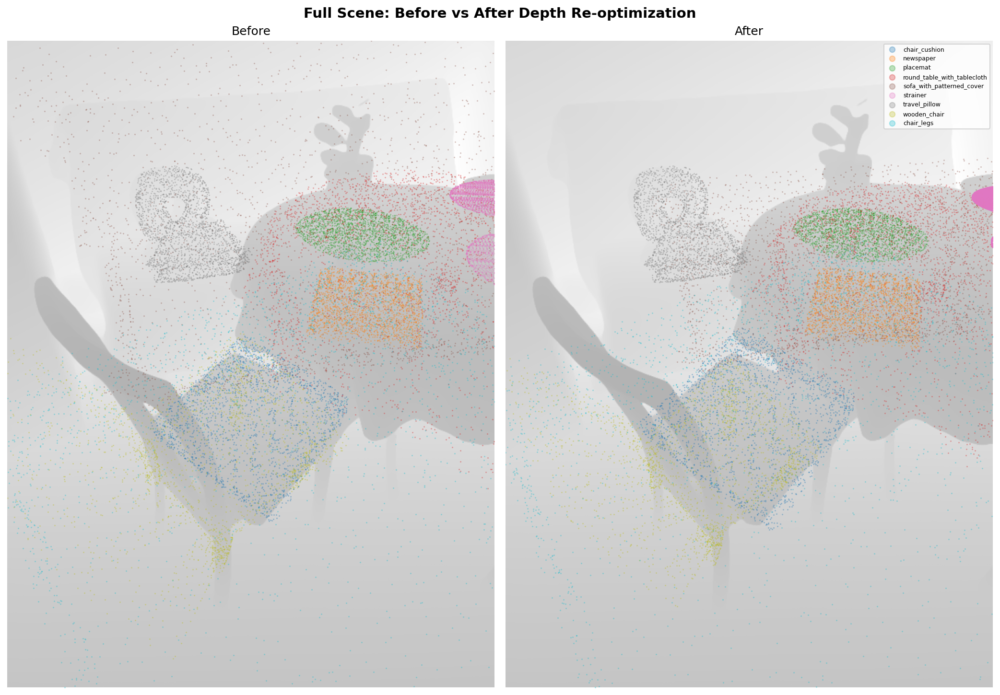

---

## Depth Diagnostic

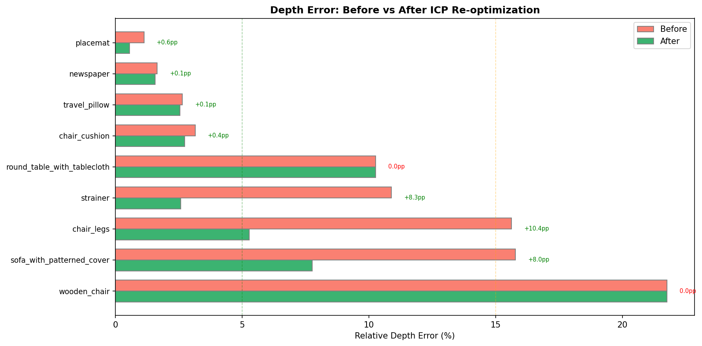

---

## Files

| File | Description |
| --- | --- |
| `output/sam3d_dining_v2/` | GLBs, masks, compare PNGs, mask_growth PNGs |
| `output/sam3d_dining_v2/depth_alignment_results.json` | Before/after scale correction metrics |
| `tools/sam3d/sam3d_worker.py` | Transform3d fix (commit `d82b86e`) |

### Key Fix (relative to v1)

- `tools/sam3d/sam3d_worker.py` — translation placed in row 3 (not column 3); pre-transform sign corrected; dead post-transforms removed
