# SAM3D Dining Scene v3 — Scene-2D Comparison Added

**Date:** 2026-02-16
**Run:** `output/sam3d_dining_v3/`
**Scene:** Dining (9 objects)
**Baseline:** `output/sam3d_dining_v2/` (first post-fix run)

---

## What Was Done

Iteration on v2 adding **scene-level 2D comparison visualization**: all 9 objects' 3D projections overlaid onto the target image, compared side-by-side with the 2D SAM masks. This is the `scene_2d_before/after/comparison` diagnostic.

Depth alignment metrics are nearly identical to v2 for most objects; minor differences in `round_table_with_tablecloth` and `wooden_chair` reflect different random seeds or minor pipeline variation.

---

## Depth Alignment Results (after scale correction)

| Object | Abs Err (m) | Rel Error | Scale Ratio | vs v2 |
| --- | --- | --- | --- | --- |
| chair_cushion | 0.035 | 2.7% | 0.998 | Same |
| newspaper | 0.017 | 1.6% | 1.006 | Same |
| placemat | 0.008 | 0.6% | 1.004 | Same |
| round_table_with_tablecloth | 0.143 | 11.4% | 1.060 | Slightly worse |
| sofa_with_patterned_cover | 0.166 | 7.8% | 1.033 | Same |
| strainer | 0.039 | 2.6% | 0.993 | Same |
| travel_pillow | 0.053 | 2.5% | 1.005 | Same |
| wooden_chair | 0.231 | 25.0% | 1.140 | Slightly worse |
| chair_legs | 0.091 | 5.3% | 0.993 | Same |

---

## Scene-Level 2D Comparison

2D SAM masks (left) vs all 9 objects' 3D GLB projections overlaid (right).

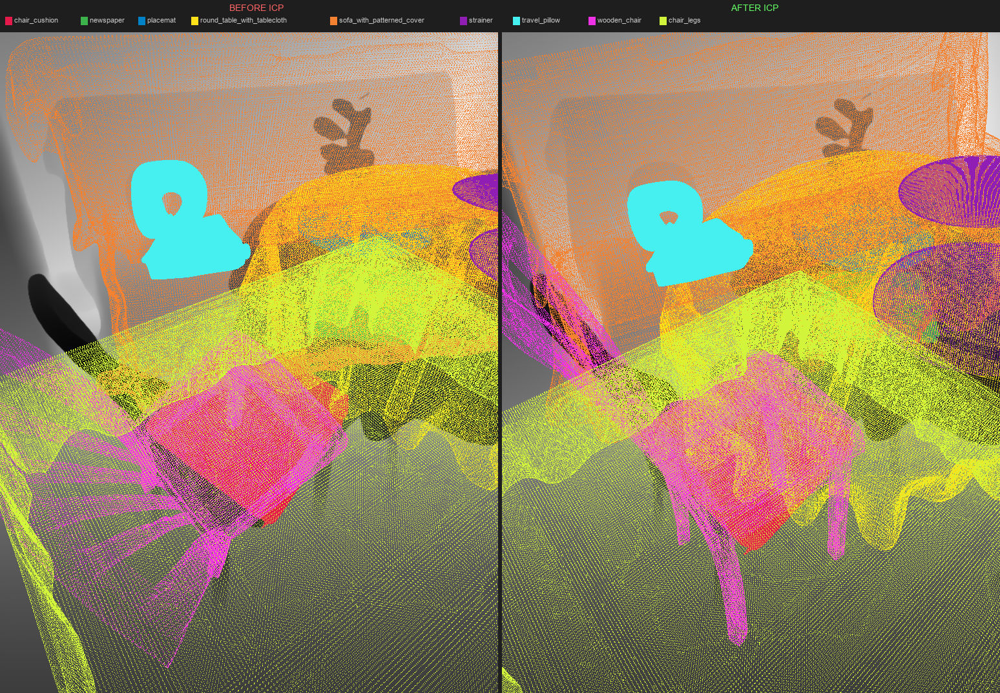

**Before scale correction:**
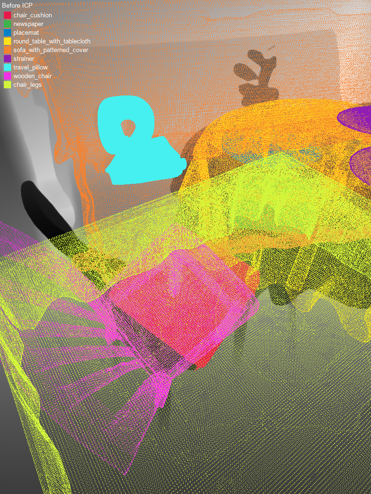

**After scale correction:**
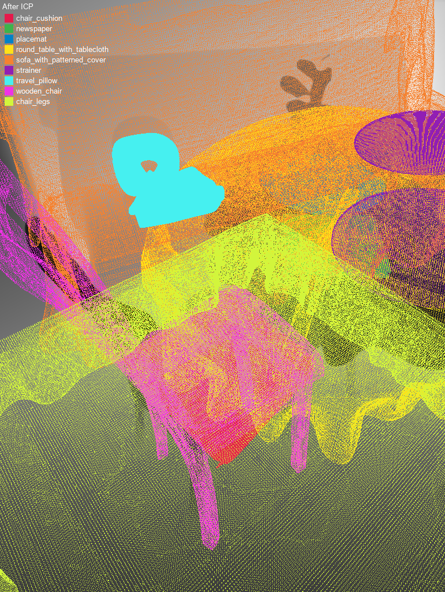

---

## Per-Object Comparisons

Each image: left = 2D SAM mask overlay, right = 3D GLB projection.

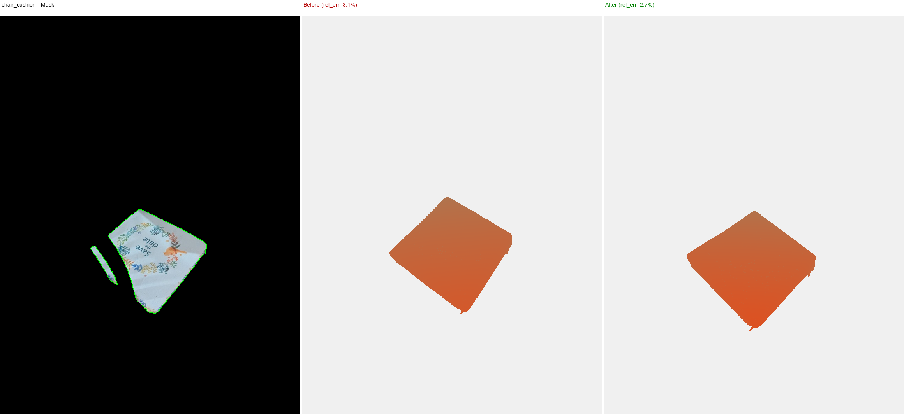

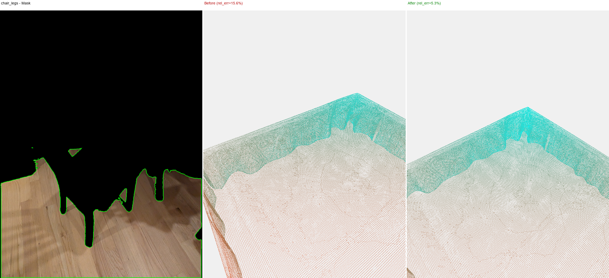

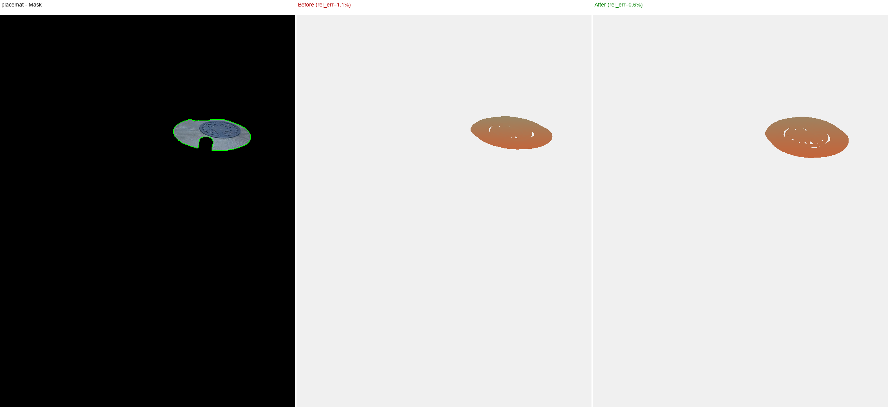

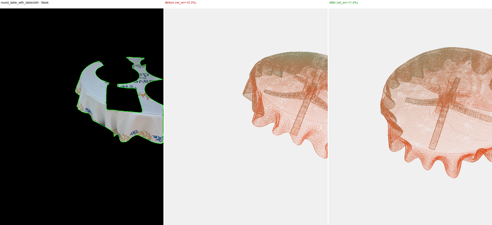

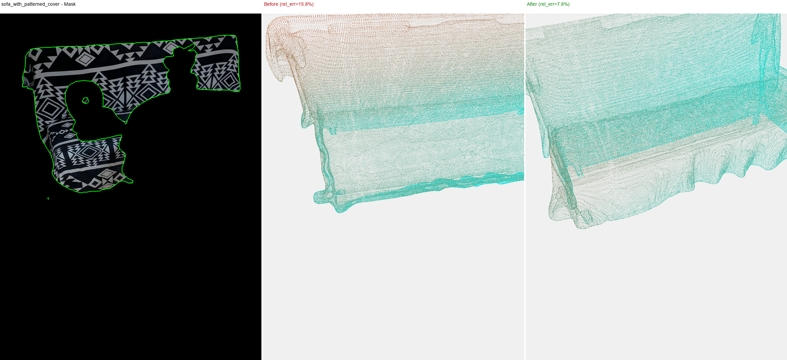

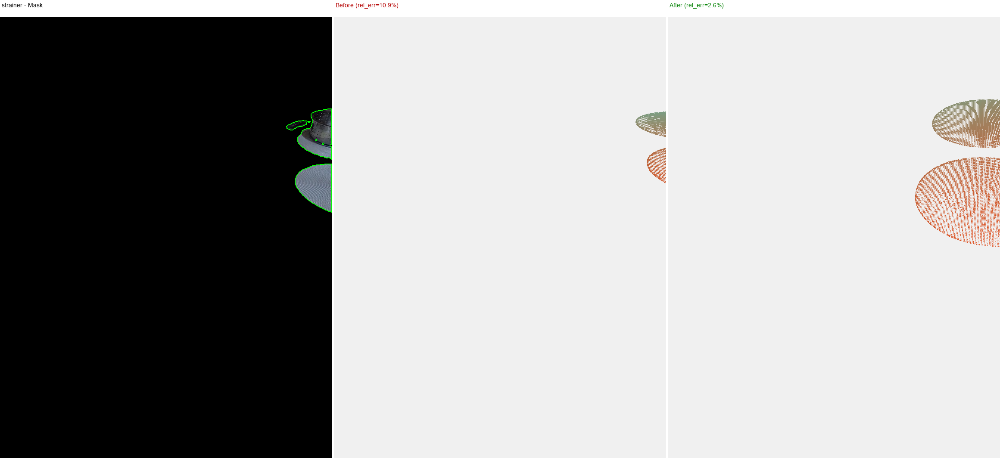

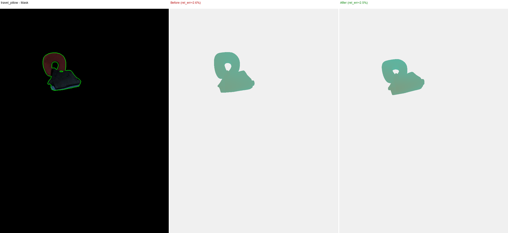

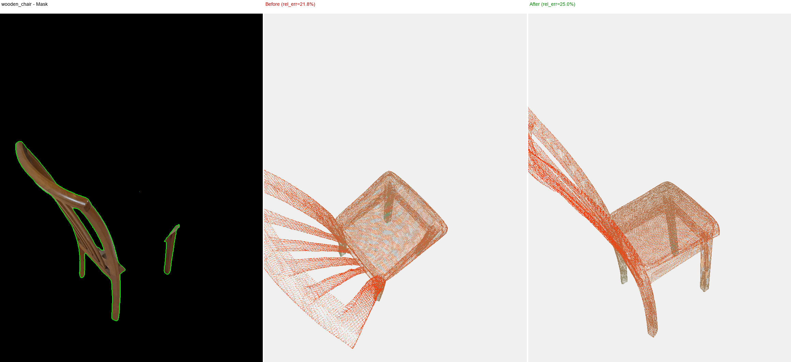

---

## Convex Hull Mask Growth (Sobel-based)

Same Sobel-based convex hull growth as v2.

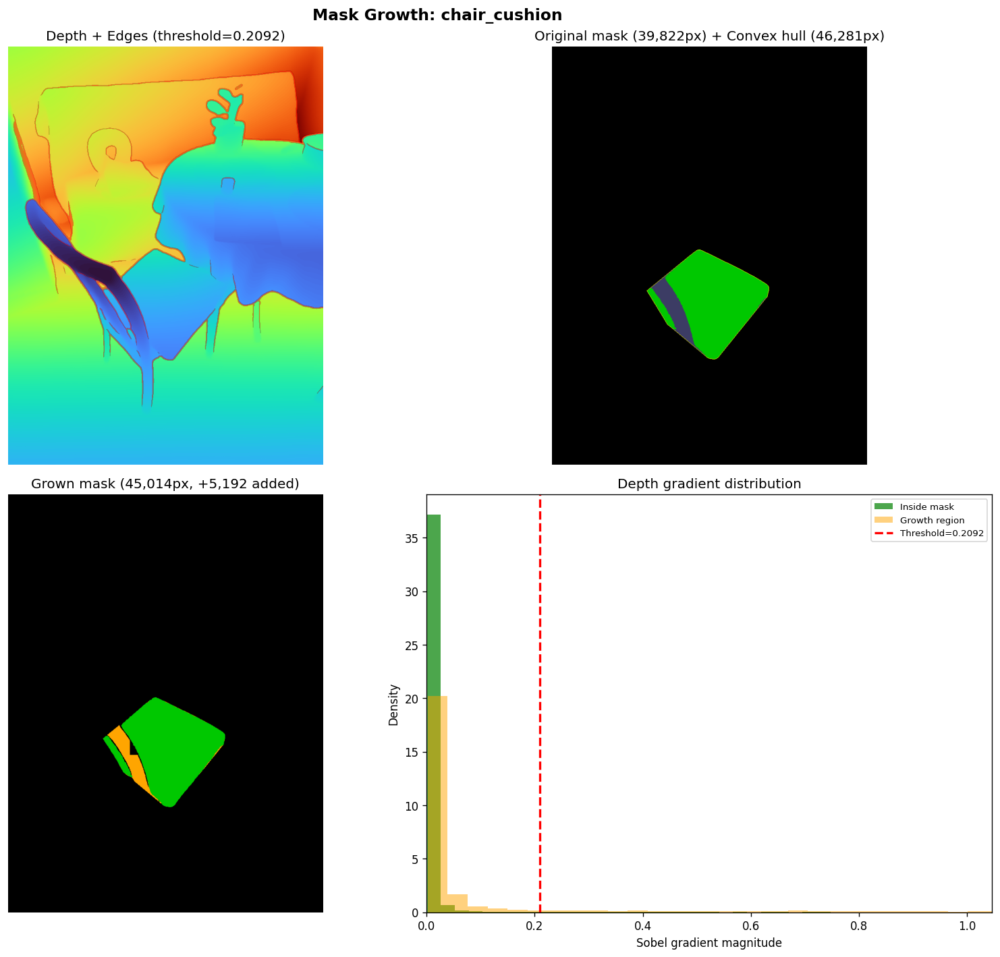

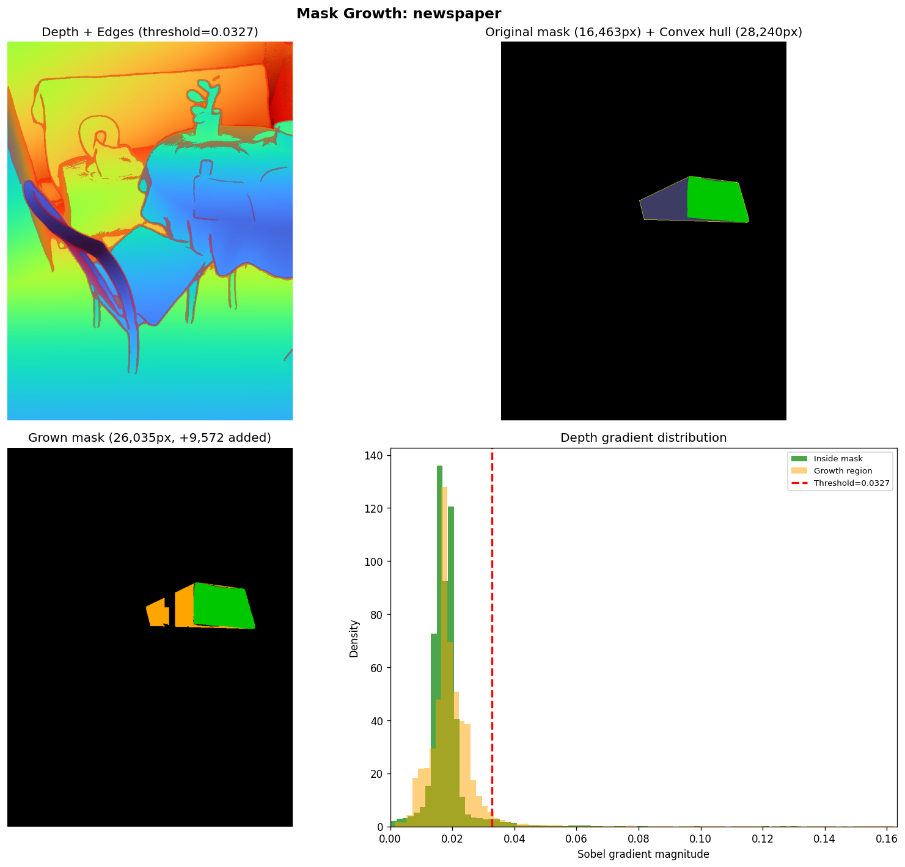

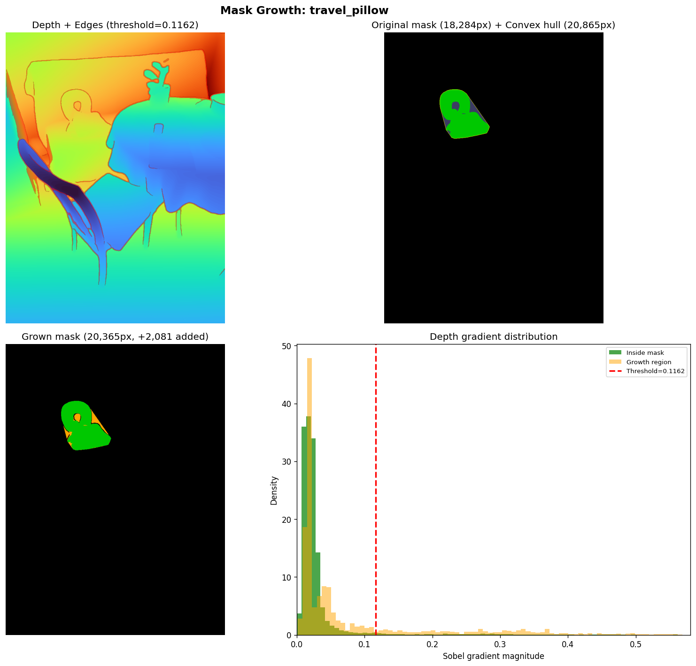

---

## Depth Diagnostic

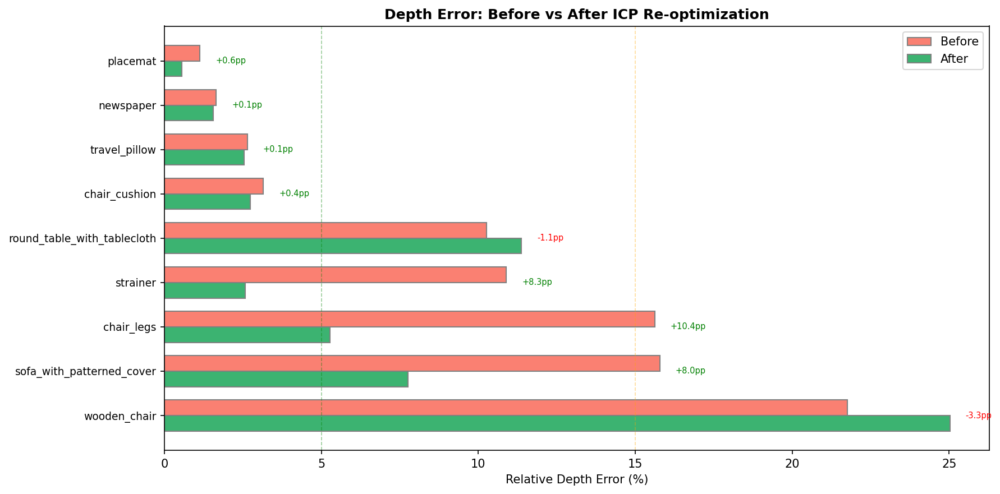

---

## Files

| File | Description |
| --- | --- |
| `output/sam3d_dining_v3/` | GLBs, masks, compare PNGs, mask_growth PNGs, scene_2d_*.png |
| `output/sam3d_dining_v3/depth_alignment_results.json` | Before/after scale correction metrics |
| `output/sam3d_dining_v3/scene_2d_comparison.png` | Side-by-side 2D vs 3D scene overlay |
