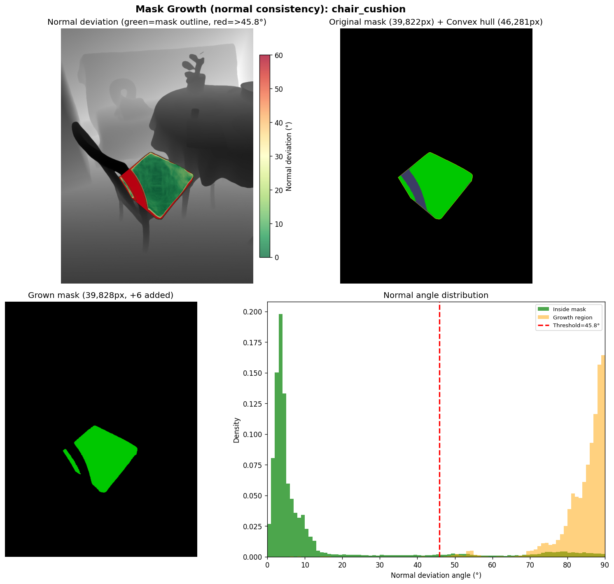
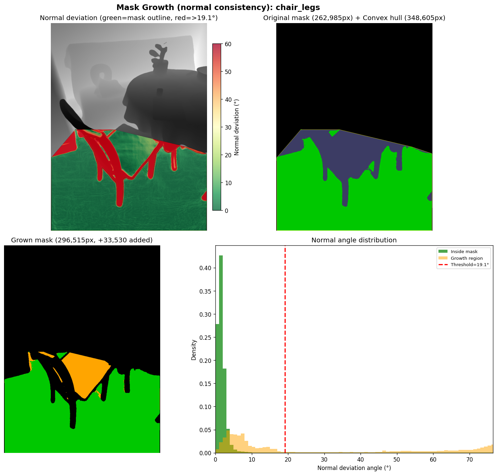
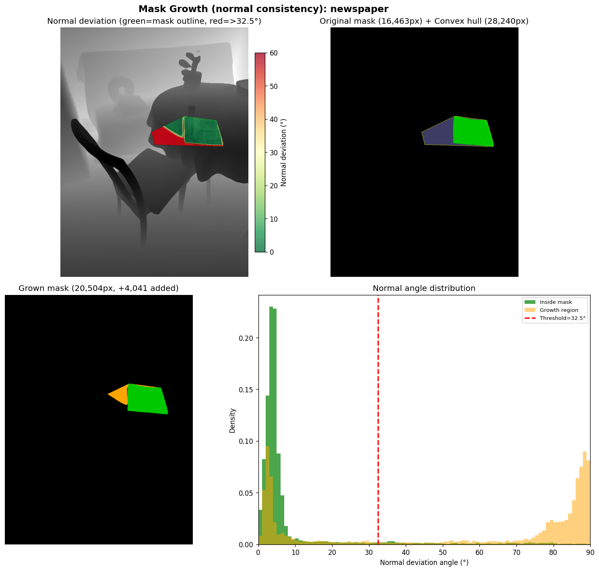
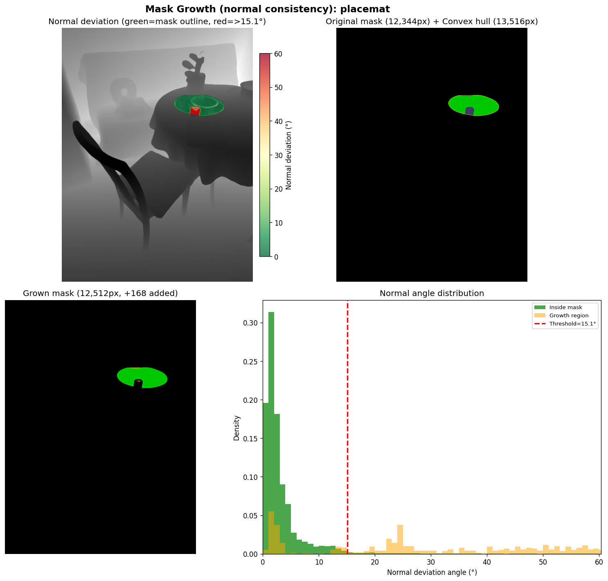
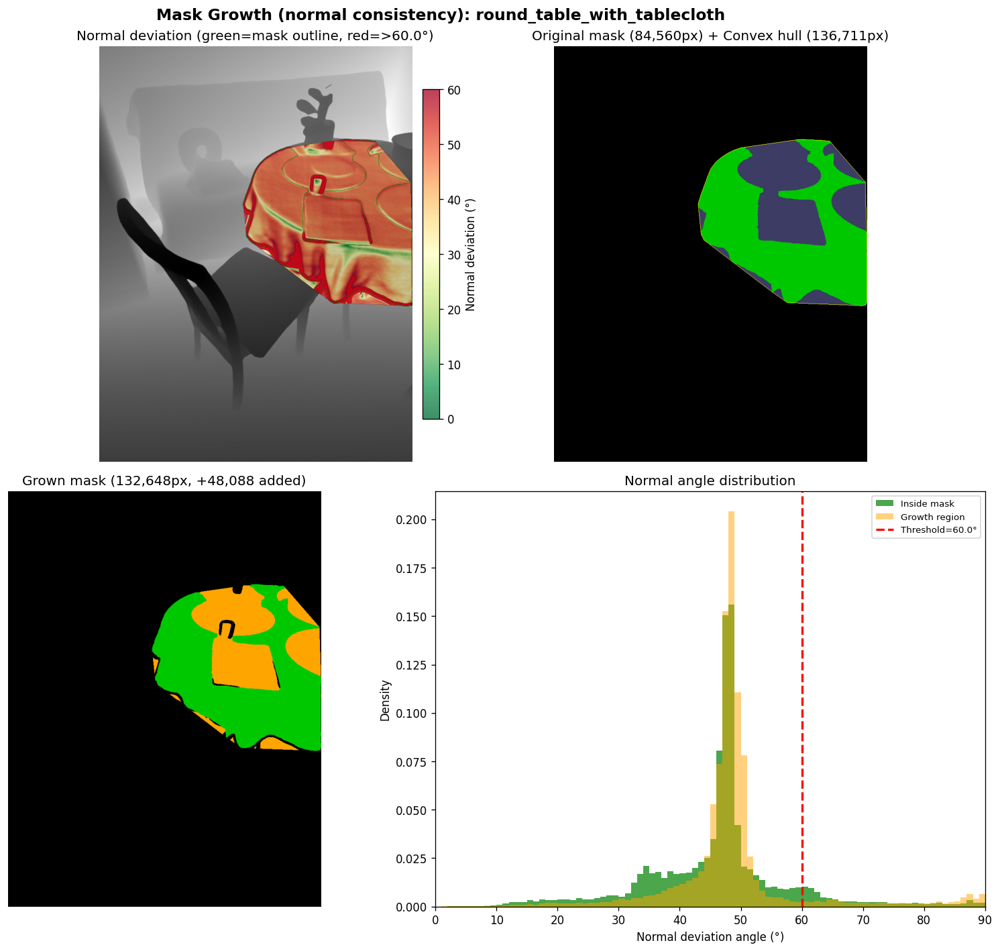
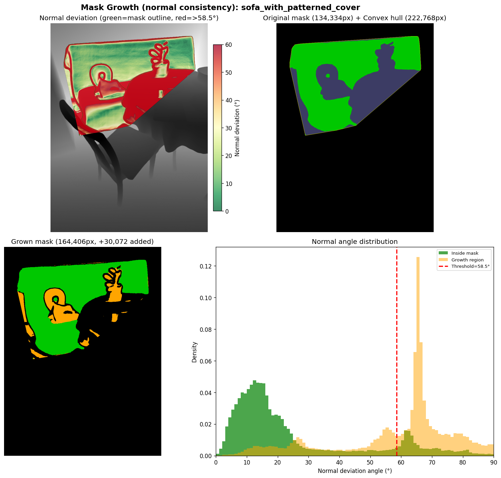
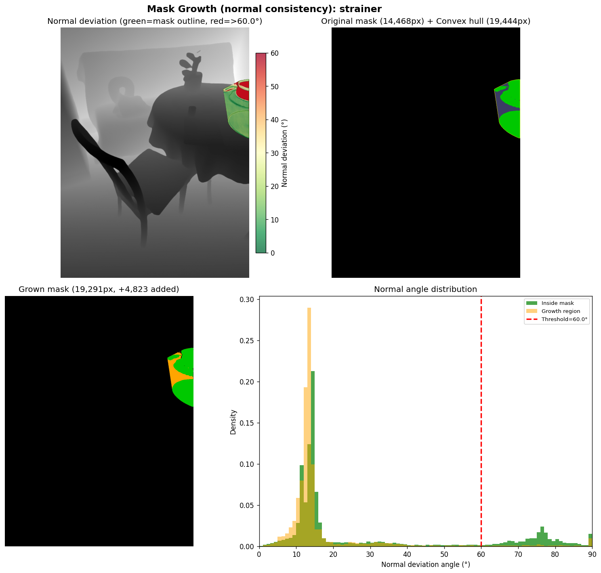
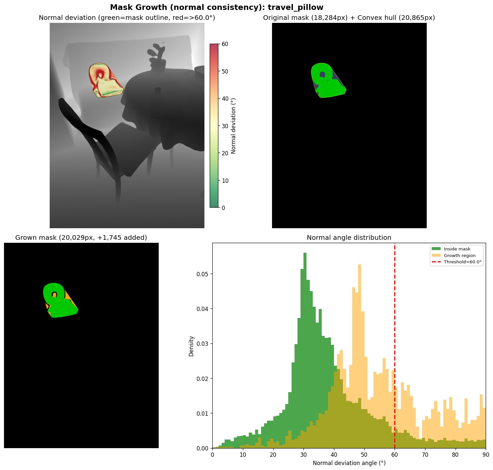
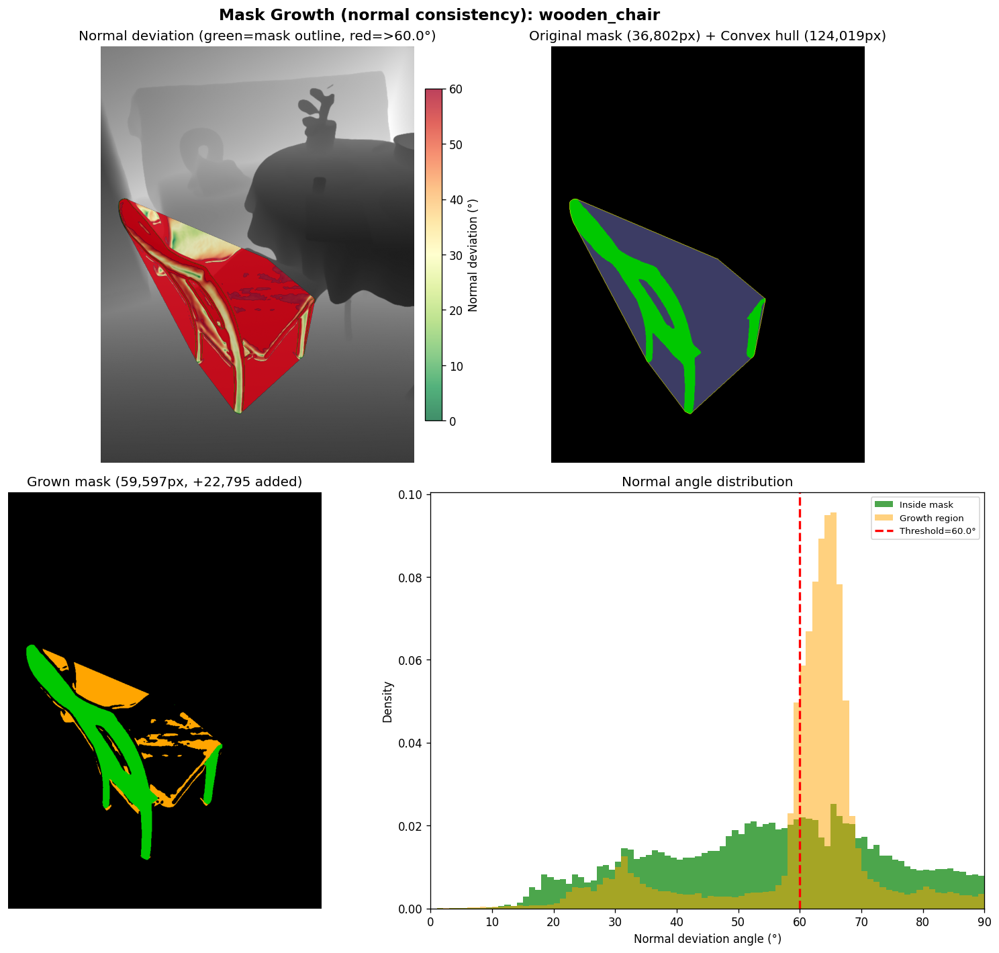

# SAM3D Dining Scene v5 — Normal-Consistency Mask Growth

**Date:** 2026-02-18
**Run:** `output/sam3d_dining_v5/`
**Baseline:** `output/sam3d_dining_v4/` (Sobel-based growth)
**Scene:** Dining (9 objects)

---

## What Was Done

Applied the normal-consistency convex hull mask growth algorithm (v3, developed on the greentea scene) to the dining scene. This is a visualization-only run — no TRELLIS reconstruction, comparing grown masks to v4 Sobel baseline.

**Algorithm:** Direct assignment of hull pixels where surface normal angle deviation from object reference < adaptive threshold (median + 2σ, clamped to [10°, 60°]). Normals computed from MoGe pointmap via Gaussian-smoothed central differences (σ=2.0, effective 13×13 window).

---

## Results

### Mask Growth: v4 Sobel vs v5 Normal-Consistency

| Object | Mask (px) | Hull (px) | v4 Sobel | v5 Normal | Threshold | Notes |
|---|---|---|---|---|---|---|
| chair_cushion | 39,822 | 46,281 | — | **+6px** | 45.8° | Nearly convex, tiny hull gap |
| chair_legs | 262,985 | 348,605 | — | **+33,530px** | 19.1° | Large flat region, tight threshold |
| newspaper | 16,463 | 28,240 | — | **+4,041px** | 32.5° | Flat rect, significant concavities |
| placemat | 12,344 | 13,516 | — | **+168px** | 15.1° | Very flat, extremely tight threshold |
| round_table_with_tablecloth | 84,560 | 136,711 | — | **+48,088px** | 60.0° (cap) | Curved/draped cloth — threshold hits cap |
| sofa_with_patterned_cover | 134,334 | 222,768 | — | **+30,072px** | 58.5° | Large curved object |
| strainer | 14,468 | 19,444 | — | **+4,823px** | 60.0° (cap) | Complex shape — threshold hits cap |
| travel_pillow | 18,284 | 20,865 | — | **+1,745px** | 60.0° (cap) | Curved pillow |
| wooden_chair | 36,802 | 124,019 | — | **+22,795px** | 60.0° (cap) | Large sparse mask, curved structure |

*v4 Sobel numbers not available — v4 was a full pipeline run with different mask files.*

---

## Per-Object Visualizations

Each 4-panel: normal deviation angle map | original mask + convex hull | grown mask | angle histogram.

**chair_cushion (+6px, threshold=45.8°):** Mask is already nearly convex — hull gap is only 6,459px and the normal method correctly identifies that almost all gap pixels have different normals (edge of cushion against chair frame).

**chair_legs (+33,530px, threshold=19.1°):** Large flat structure. Tight adaptive threshold (19.1°) reflects uniform surface normals inside the mask. Growth fills in substantial concavities (leg gaps, crossbars) — 39% of the hull gap (85,620px gap, 33,530 added).

**newspaper (+4,041px, threshold=32.5°):** Flat rectangular object lying on table. Hull gap is 11,777px; 4,041 (34%) are added. Concave corners and edge indentations filled.

**placemat (+168px, threshold=15.1°):** Extremely flat surface → extremely tight threshold. Only 168 of the 1,172px hull gap accepted. Indicates placemat normal distribution is very peaked — growth only where surface is truly coplanar.

**round_table_with_tablecloth (+48,088px, threshold=60.0°):** Threshold hits 60° cap — draped tablecloth has highly varying normals. 92% of the 52,151px hull gap filled. The tablecloth's folds create wide normal spread inside the mask, driving the adaptive threshold up to the cap.

**sofa_with_patterned_cover (+30,072px, threshold=58.5°):** Large curved sofa, threshold near cap. 34% of the 88,434px hull gap filled — the patterned cover introduces normal variation, keeping some background pixels rejected.

**strainer (+4,823px, threshold=60.0°):** Complex 3D shape (perforated bowl). Threshold hits cap — curved/perforated surface has highly varying normals. 97% of the 4,976px hull gap filled.

**travel_pillow (+1,745px, threshold=60.0°):** U-shaped curved pillow. Threshold hits cap, 68% of the 2,581px hull gap filled.

**wooden_chair (+22,795px, threshold=60.0°):** Large sparse mask (chair frame gaps). Hull gap is 87,217px — SAM missed large interior regions between chair slats. Threshold hits 60° cap; 26% of gap filled. Curved chair back and legs cause wide normal spread.

---

## Observations

- **Flat objects (chair_legs, newspaper, placemat):** Tight adaptive thresholds (15–32°) — normal method correctly conservative, only fills true coplanar regions.
- **Curved/complex objects (table, sofa, strainer, wooden_chair):** Threshold hits 60° cap — surface normal variance is too high for the global reference approach. Growth is aggressive but may include some background.
- **placemat is extremely conservative (+168px):** 15.1° threshold suggests near-perfect surface flatness inside the mask. This is the expected behavior for a flat placemat.
- **chair_legs fills 33K px:** Largest absolute growth in the scene — the complex multi-leg structure has many concavities that benefit from direct assignment.

---

## Files

| File | Description |
|---|---|
| `visualize_convex_hull_growth.py` | Normal-consistency script (current config: dining v5) |
| `output/sam3d_dining_v5/vis/` | Normal-consistency mask growth images |
| `output/sam3d_dining_v4/` | Baseline Sobel run (GLBs + Sobel mask growth) |
