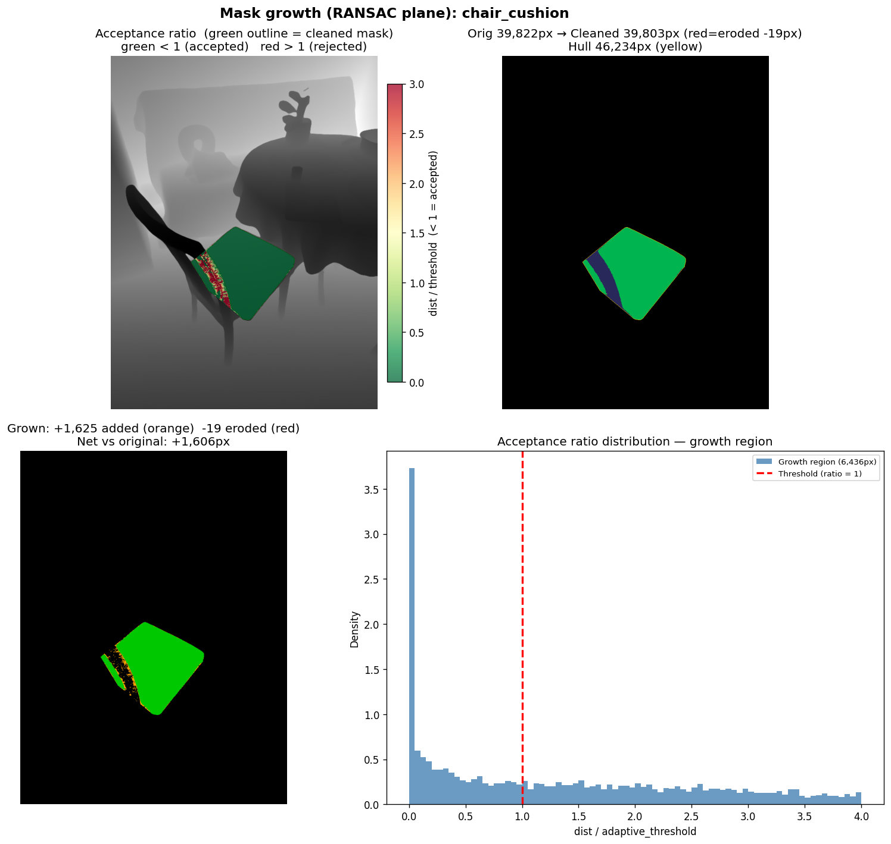
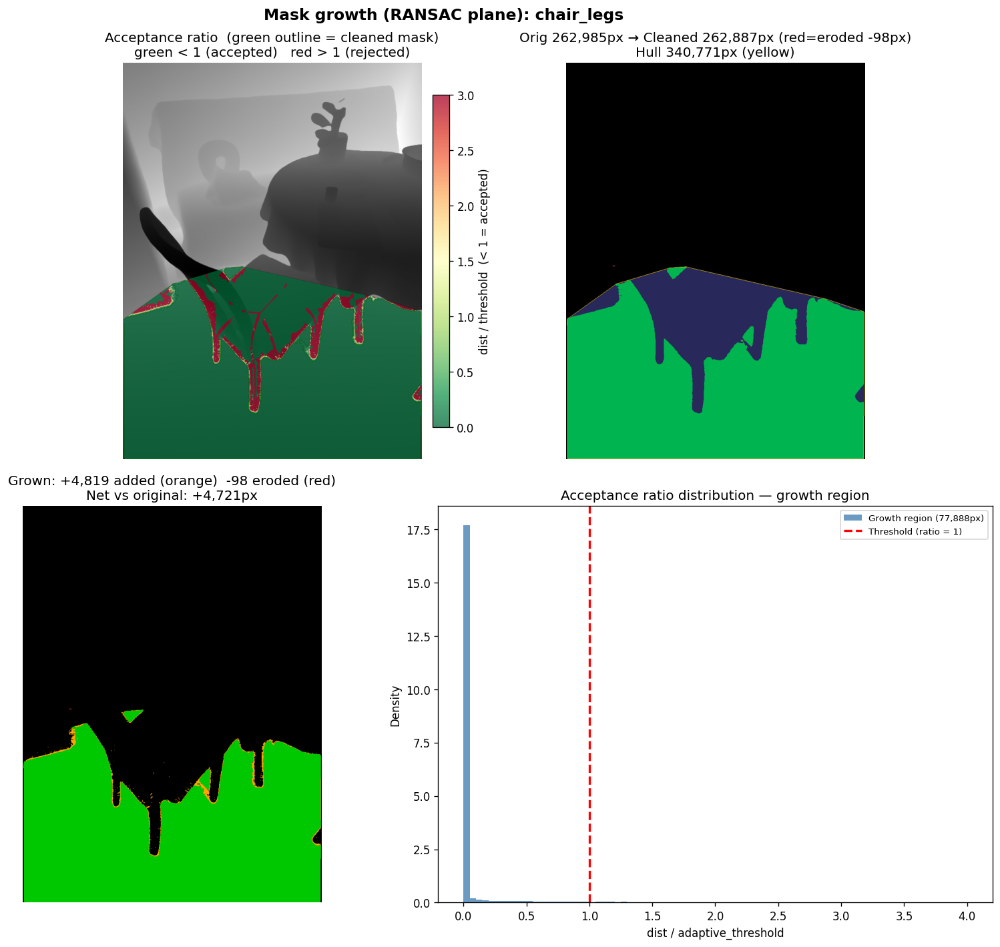
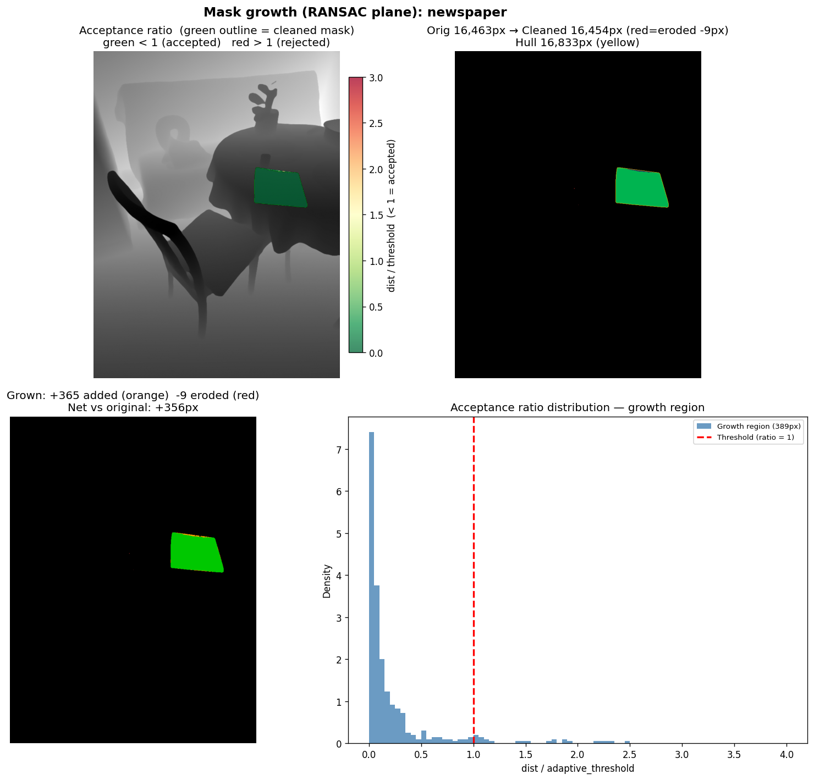
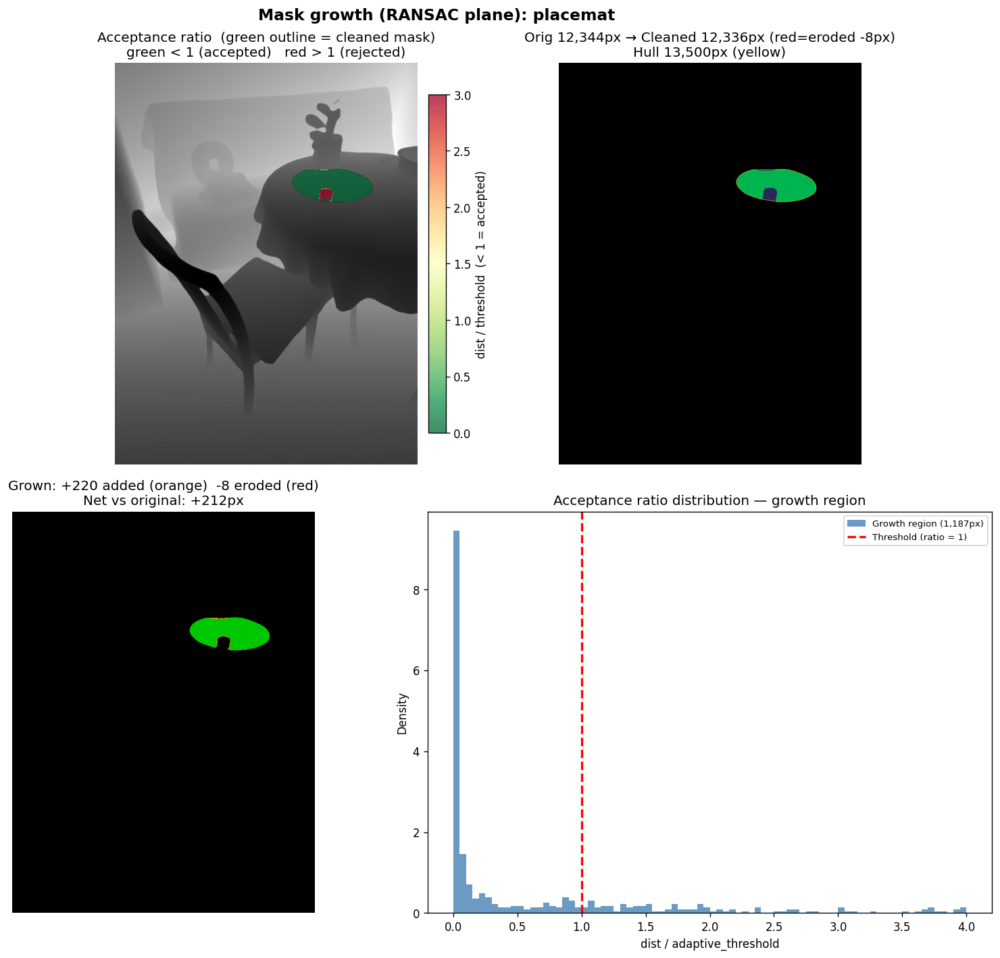
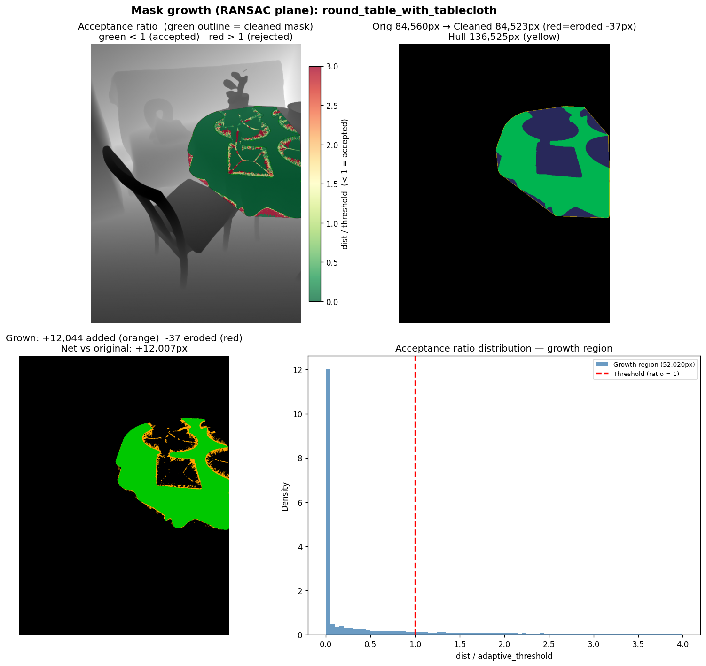
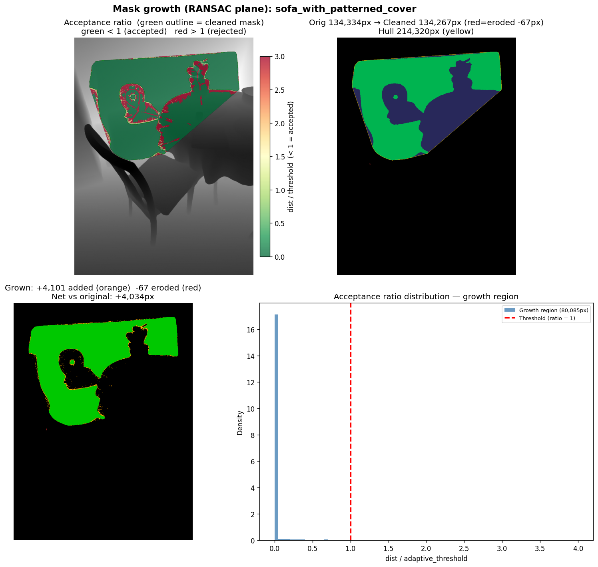
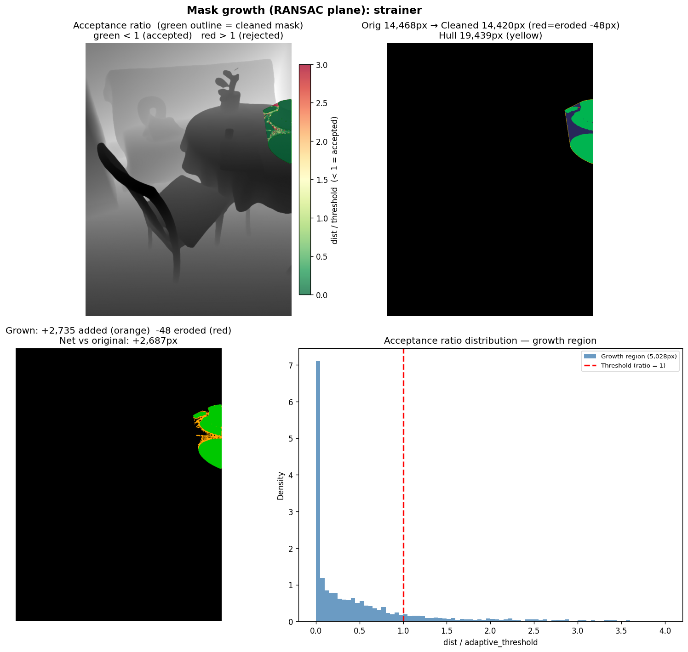
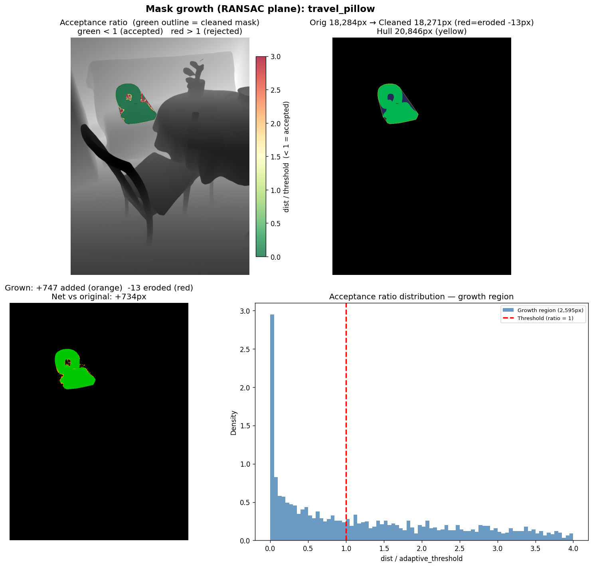
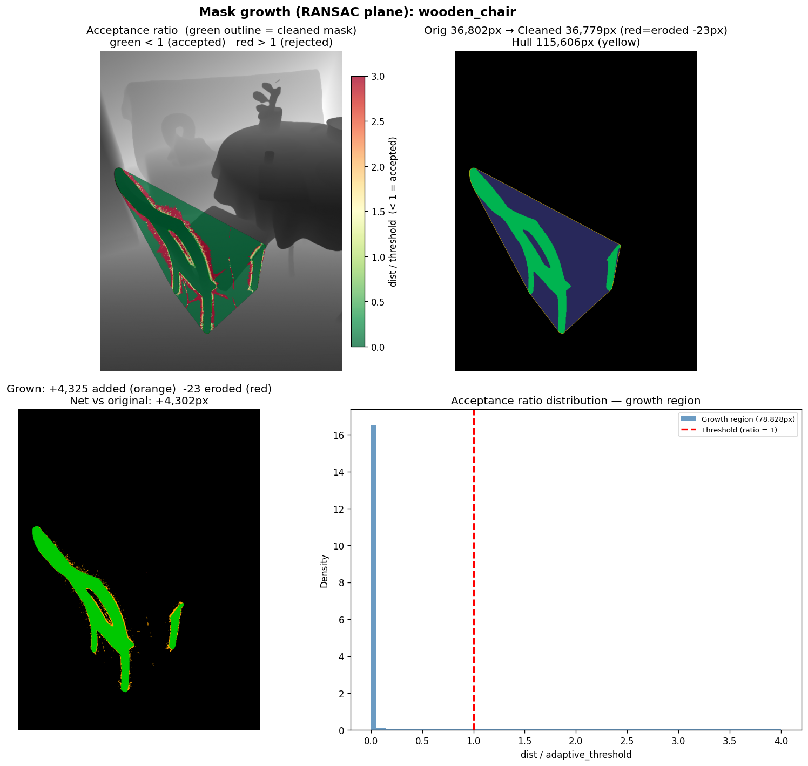

# SAM3D Dining Scene — RANSAC Plane Fitting Mask Growth

**Date:** 2026-02-18
**Run:** `output/sam3d_dining_ransac/`
**Scene:** Dining (9 objects)
**Baseline:** `output/sam3d_dining_plane_dist/` (EDT plane-distance, threshold = 3 cm)

---

## What Was Done

Replaced the local plane-distance criterion (v4, fixed 3 cm threshold) with a new algorithm using **8-sector RANSAC plane fitting** with an **adaptive acceptance threshold**. Visualization-only run on the dining scene using existing MoGe pointmap from `sam3d_dining_v4`.

---

## Key Finding: RANSAC Is Significantly More Conservative Than Plane Distance

The plane-distance method used a fixed 3 cm threshold. RANSAC replaces this with an adaptive threshold derived from the **maximum inlier error of the best-fit plane**:

```python
# Plane-distance method (fixed threshold):
plane_dist = |dot(norm_n, pos_candidate - pos_n)|
accept     = plane_dist < 0.03  # 3 cm fixed

# RANSAC method (adaptive threshold):
# 1. For each hull pixel P, find K=60 nearest mask pixels via KD-tree
# 2. Assign to 8 sectors (45° each) by 2D angle from P → up to 8 Q's
# 3. Exhaustive RANSAC over all C(8,3)=56 triplets:
#      fit 3D plane, count inliers within ransac_thresh=5cm
#      best plane = most inliers (ties broken by smallest max inlier error)
# 4. Adaptive threshold = max(max_inlier_error, 5mm floor)
# 5. Accept P if dist(P, best_plane) <= adaptive_threshold
accept = dist(P, best_plane) <= max(max_inlier_error_of_best_fit, 0.005)
```

**Why RANSAC is more conservative:**
- On **flat surfaces**, RANSAC Q's lie exactly on the plane → inlier errors are sub-mm → adaptive threshold collapses to the 5 mm floor. A P pixel 1–3 cm away (within the 3 cm plane-distance budget) gets rejected.
- On **curved surfaces**, Q's span a curved surface → RANSAC inlier errors are larger → threshold relaxes, but the 8-sector constraint means some sectors near object edges have no valid Q's → RANSAC rejects due to `min_inliers=3` not met.
- The fixed 3 cm plane-distance threshold was world-scale calibrated and consistently permissive; the adaptive RANSAC threshold is per-plane self-calibrated and much tighter when the local geometry is clean.

---

## Results

### v5 Angle vs Plane-Distance vs RANSAC (dining scene)

| Object | Mask (px) | v5 Angle +added | Plane-Dist +added | RANSAC +added | Eroded | Net Δ (RANSAC) | Notes |
|---|---|---|---|---|---|---|---|
| chair_cushion | 39,822 | +6px | +6,436px | **+1,625px** | -19px | +1,606 | Curved — RANSAC between angle and plane-dist |
| chair_legs | 262,985 | +33,530px | +35,300px | **+4,819px** | -98px | +4,721 | Flat — tight RANSAC threshold collapses to 5mm floor |
| newspaper | 16,463 | +4,041px | +389px | **+365px** | -9px | +356 | Similar to plane-dist, correctly conservative |
| placemat | 12,344 | +168px | +1,187px | **+220px** | -8px | +212 | Flat — RANSAC much more conservative than plane-dist |
| round_table_with_tablecloth | 84,560 | +48,088px | +45,143px | **+12,044px** | -37px | +12,007 | Draped cloth — RANSAC most conservative |
| sofa_with_patterned_cover | 134,334 | +30,072px | +36,710px | **+4,101px** | -67px | +4,034 | Large curved sofa — RANSAC very conservative |
| strainer | 14,468 | +4,823px | +4,922px | **+2,735px** | -48px | +2,687 | Complex perforated shape |
| travel_pillow | 18,284 | +1,745px | +2,509px | **+747px** | -13px | +734 | Curved pillow — moderate conservatism |
| wooden_chair | 36,802 | +22,795px | +23,945px | **+4,325px** | -23px | +4,302 | Sparse frame — RANSAC very conservative |

---

## Per-Object Visualizations

Each 4-panel: acceptance ratio map (green < 1 = accepted, red > 1 = rejected) | original + cleaned + hull | grown mask | ratio histogram.



**chair_cushion:** +1,625px. Previous angle method gave +6px (global reference fails for curved cushion). RANSAC gives +1,625px — better than angle, but less than plane-distance (+6,436px). The 8-sector constraint helps but the adaptive threshold is tighter than a fixed 3cm.



**chair_legs:** Only +4,819px (vs +33,530px angle / +35,300px plane-dist). Surprising — this is a flat object where RANSAC should work well. Root cause: very flat surface → RANSAC inlier errors are sub-mm → adaptive threshold collapses to 5mm floor. Hull pixels 1–3cm away (well within the 3cm plane-distance budget) are rejected. RANSAC is over-conservative on large flat objects.



**newspaper:** +365px, similar to plane-distance +389px. Both correctly conservative — hull region overlaps with the table surface at different depth. RANSAC slightly tighter but consistent result.



**placemat:** +220px (vs +1,187px plane-dist). Flat object, very small hull gap. RANSAC floor threshold makes it conservative. The plane-distance method was more permissive here.



**round_table_with_tablecloth:** +12,044px (vs +48,088px angle / +45,143px plane-dist). Draped tablecloth with complex geometry — RANSAC is the most conservative of all three methods. The cloth folds cause high inlier variance, making the adaptive threshold unpredictable sector-by-sector.



**sofa_with_patterned_cover:** +4,101px (vs +36,710px plane-dist). RANSAC is very conservative on large curved objects. The 8-sector search near a large curved sofa finds Q's on different parts of the curve → plane fit degenerate or high inlier error → tight threshold.



**strainer:** +2,735px (vs +4,922px plane-dist). Small perforated bowl — RANSAC fills ~55% of what plane-distance fills. Some sectors around the bowl interior have no mask pixels, reducing RANSAC effectiveness.



**travel_pillow:** +747px (vs +2,509px plane-dist). Curved U-shape pillow. RANSAC more conservative than plane-distance.



**wooden_chair:** +4,325px (vs +23,945px plane-dist). Sparse frame mask — large hull gap (78K px between chair slats). RANSAC correctly rejects background (transparent regions between slats at different depths), but also rejects many legitimate chair surface pixels due to floor-threshold tightness.

---

## Observations

- **RANSAC is universally more conservative than plane-distance** (3 cm fixed threshold): all 9 objects show fewer pixels added. Total added: ~30K px (RANSAC) vs ~156K px (plane-dist) vs ~145K px (angle).
- **Root cause for over-conservatism on flat surfaces** (`chair_legs`, `placemat`): flat geometry → RANSAC inlier errors sub-mm → adaptive threshold collapses to 5mm floor → P pixels at 1–3cm are rejected even though they're clearly on the same plane.
- **`newspaper` is the exception**: both RANSAC (+365px) and plane-distance (+389px) give nearly identical, correctly conservative results. The hull region genuinely overlaps with off-surface pixels; both methods reject them well.
- **`chair_cushion` shows improvement vs angle**: RANSAC +1,625px vs angle method's +6px. The 8-sector constraint handles curved surfaces better than the global reference angle. But plane-distance (+6,436px) is still more aggressive.
- **RANSAC works best for small concavities** (`strainer`, `newspaper`, `placemat`): where the hull gap is small, nearby Q's are available in all 8 sectors, and the plane fit is reliable.
- **RANSAC underperforms for large objects** with big hull gaps (`chair_legs`, `sofa`, `wooden_chair`): far-from-mask hull pixels have sparser sector coverage; some sectors may be empty → `min_inliers=3` not met → rejection.

---

## Algorithm Trade-offs: Three Methods Compared

| Property | v5 Angle (global) | Plane-Distance (EDT) | RANSAC (8-sector) |
|---|---|---|---|
| Reference normal | Global mask mean | Local nearest neighbor (EDT) | Locally fitted 3D plane |
| Threshold | 60° adaptive (median + 2σ) | Fixed 3 cm in meters | Adaptive = max inlier error (≥ 5mm) |
| Curved surfaces | Poor (global mean fails) | Good (local reference) | Mixed (sector coverage issue) |
| Flat surfaces | Good | Good | Over-conservative (floor threshold) |
| Large hull gaps | Good | Good | Poor (empty sectors) |
| Outlier robustness | Low | Medium | High (RANSAC) |
| Implementation complexity | Low | Medium | High |

**Conclusion**: Plane-distance (EDT, 3 cm threshold) remains the best overall method for this scene. RANSAC is theoretically more principled but practically over-conservative due to the adaptive threshold collapsing to the floor on flat surfaces.

---

## What Was Not Isolated

- TRELLIS reconstruction quality impact not measured — visualization only. Full pipeline re-run needed to compare IoU.
- The `min_floor_err=5mm` parameter is a key sensitivity knob. Raising it to 10–15mm would relax RANSAC significantly on flat surfaces — not ablated.
- The `K_SEARCH=60` and `N_SECTORS=8` parameters not ablated. Reducing K or sectors would further degrade coverage.
- RANSAC with a **fixed** (non-adaptive) threshold (e.g., always 3cm) was not tested — this might give behavior closer to plane-distance while keeping the multi-sector robustness.

---

## Files

| File | Description |
|---|---|
| `visualize_convex_hull_growth.py` | RANSAC growth script (current config: dining RANSAC) |
| `output/sam3d_dining_ransac/vis/` | RANSAC mask growth images |
| `output/sam3d_dining_plane_dist/vis/` | Plane-distance mask growth images (previous best) |
| `output/sam3d_dining_v5/vis/` | Angle-based (v5) mask growth images |

### Key Code Changes

- `visualize_convex_hull_growth.py` — `_grow_mask_ransac_plane()` + `_batch_ransac_plane()` replace `_grow_mask_plane_distance()`; `_COMBO_IDX` precomputes all C(8,3)=56 triplets; visualization shows acceptance ratio map (p_dist / adaptive_threshold)
