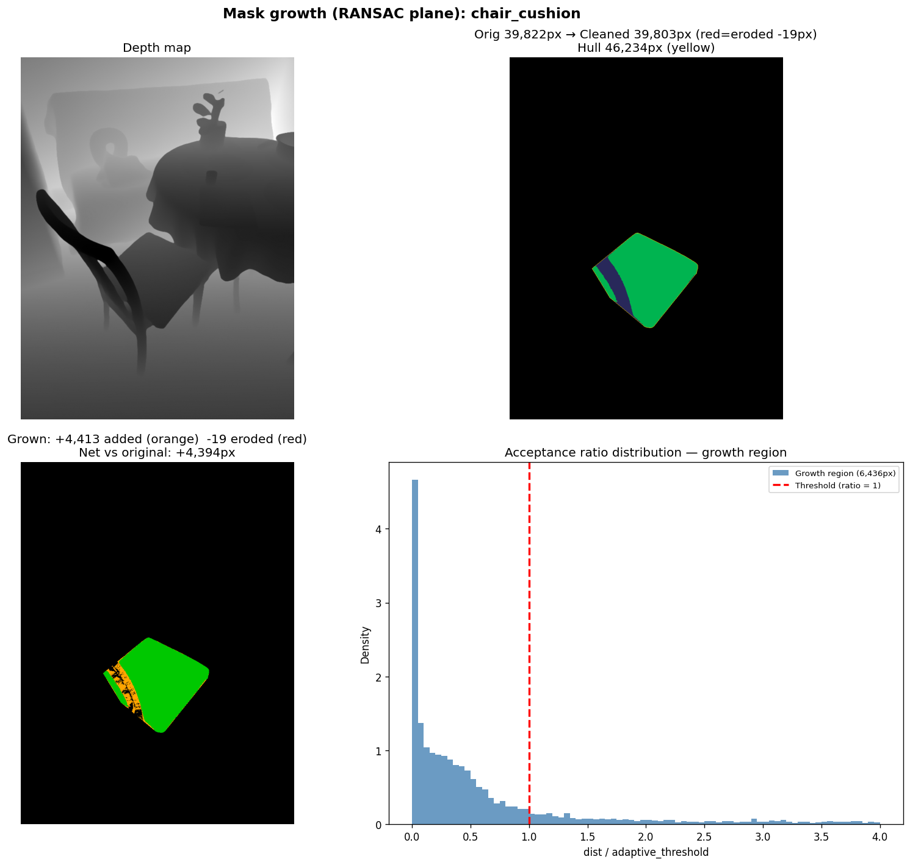
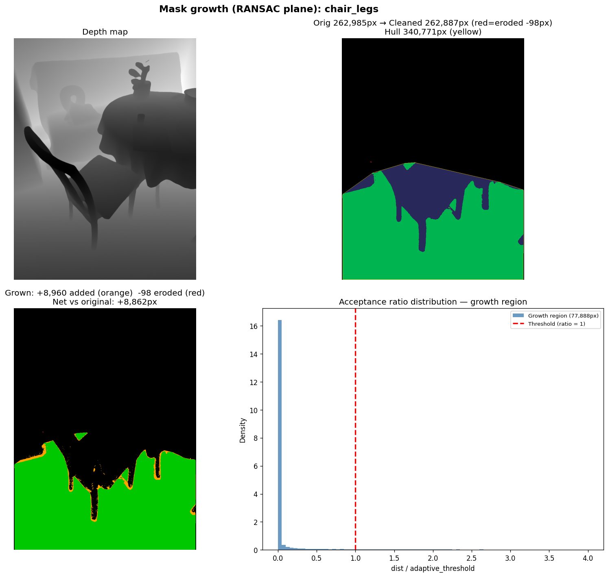
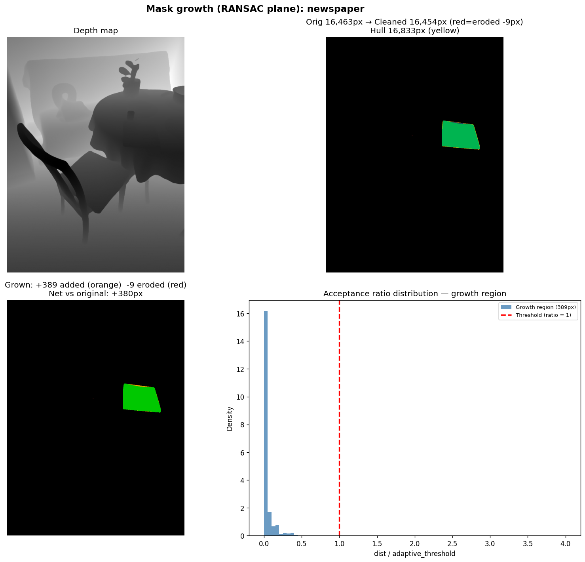
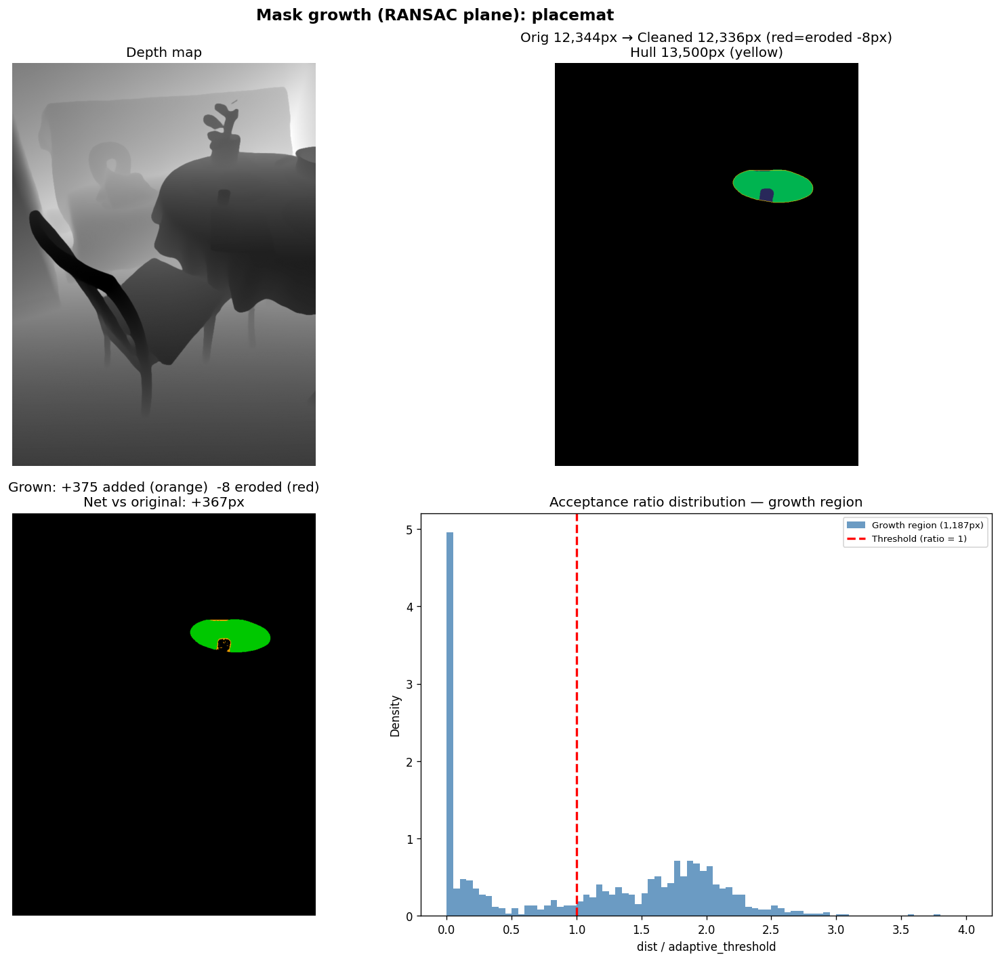
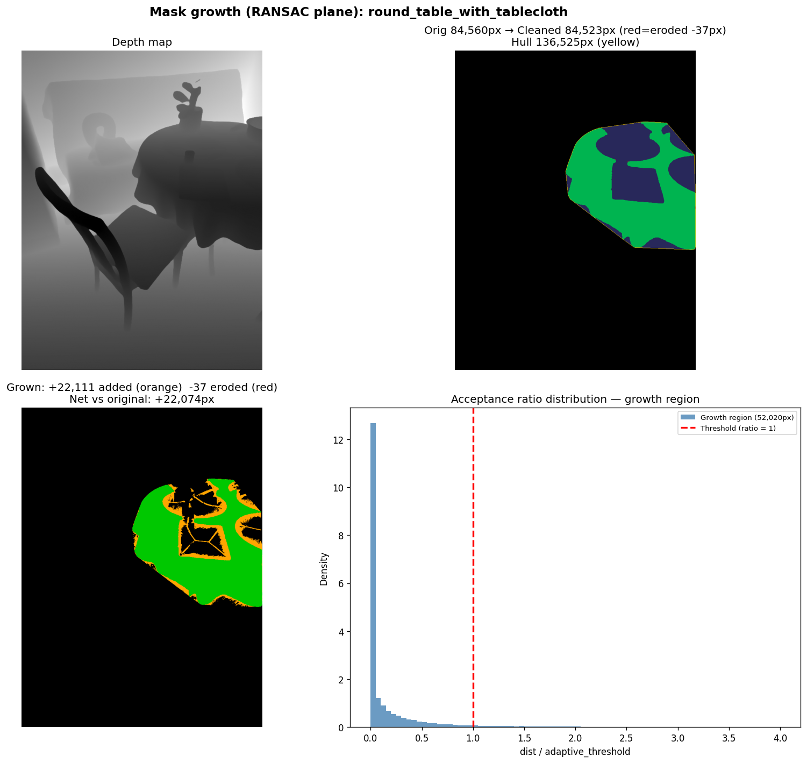
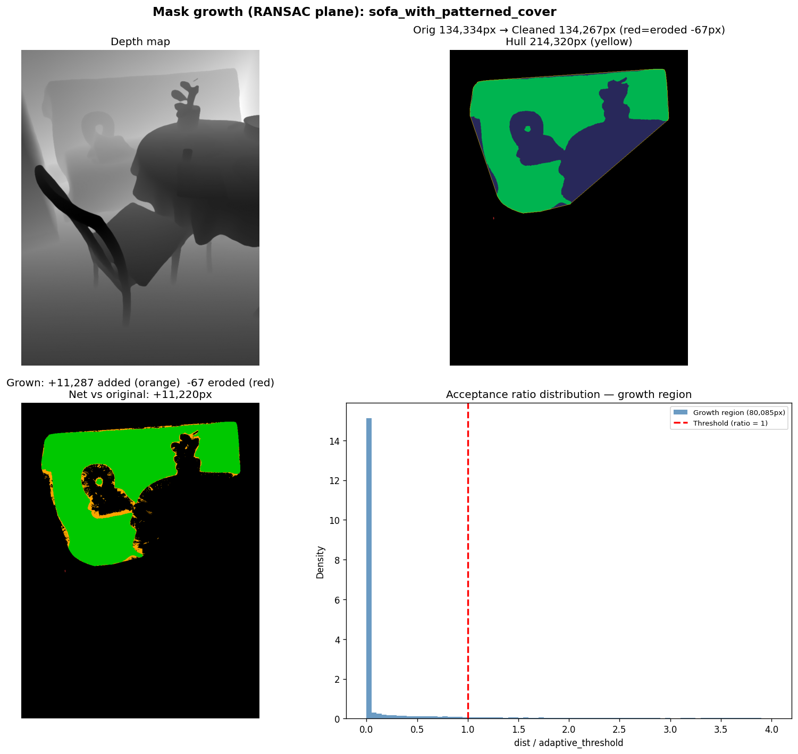
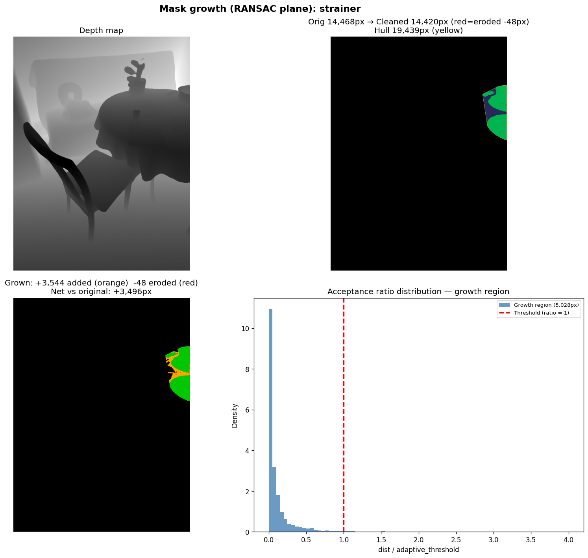
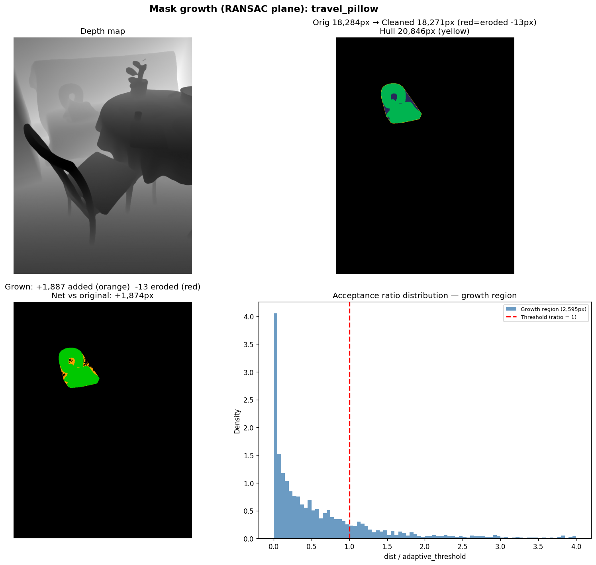
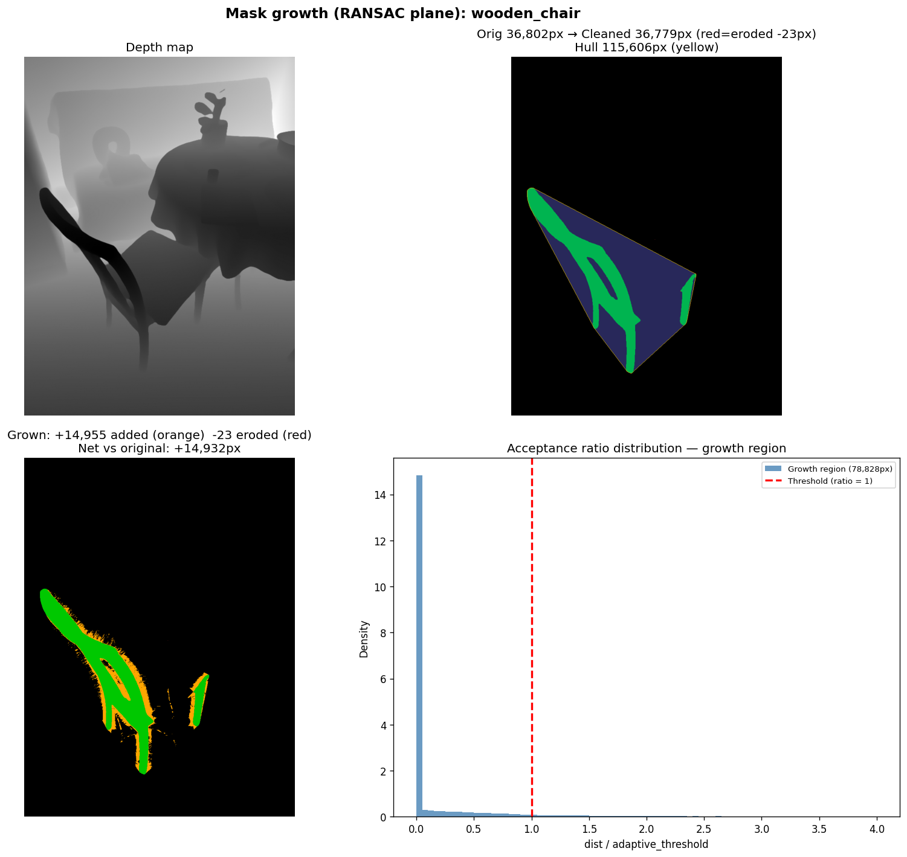

# SAM3D Dining Scene — RANSAC Plane Fitting v2 (Relaxed 3cm Floor)

**Date:** 2026-02-18
**Run:** `output/sam3d_dining_ransac_v2/`
**Scene:** Dining (9 objects)
**Baseline:** `output/sam3d_dining_ransac/` (RANSAC v1, 5mm floor) and `output/sam3d_dining_plane_dist/` (plane-distance, 3cm fixed)

---

## What Was Done

Re-ran the 8-sector RANSAC plane fitting algorithm with the minimum acceptance floor raised from **5mm → 3cm**, matching the fixed threshold used by the plane-distance method. This isolates whether the conservatism in RANSAC v1 was due to the tight floor threshold vs. the multi-sector plane-fitting itself.

```python
# v1 (5mm floor) — over-conservative on flat surfaces:
MIN_FLOOR_ERR = 0.005   # adaptive threshold = max(max_inlier_error, 5mm)

# v2 (3cm floor) — relaxed to match plane-distance method:
MIN_FLOOR_ERR = 0.03    # adaptive threshold = max(max_inlier_error, 3cm)
```

All other parameters unchanged: `ransac_thresh=5cm`, `k_search=60`, `n_sectors=8`, `min_inliers=3`.

---

## Key Finding: 3cm Floor Substantially Recovers RANSAC Performance

Raising the floor from 5mm to 3cm doubles or triples the added pixels on most objects, bringing RANSAC v2 to roughly half the plane-distance coverage. The remaining gap is due to the **multi-sector constraint** (`min_inliers=3` requires Q's in at least 3 different sectors) — hull pixels far from the mask with sparse sector coverage are still rejected.

---

## Results: All Four Methods

| Object | Mask (px) | v5 Angle | Plane-Dist | RANSAC v1 (5mm) | RANSAC v2 (3cm) | Eroded | Notes |
|---|---|---|---|---|---|---|---|
| chair_cushion | 39,822 | +6px | +6,436px | +1,625px | **+4,413px** | -19px | Curved cushion |
| chair_legs | 262,985 | +33,530px | +35,300px | +4,819px | **+8,960px** | -98px | Flat — multi-sector sparsity limits growth |
| newspaper | 16,463 | +4,041px | +389px | +365px | **+389px** | -9px | Identical to plane-dist |
| placemat | 12,344 | +168px | +1,187px | +220px | **+375px** | -8px | Small flat object |
| round_table_with_tablecloth | 84,560 | +48,088px | +45,143px | +12,044px | **+22,111px** | -37px | Draped cloth |
| sofa_with_patterned_cover | 134,334 | +30,072px | +36,710px | +4,101px | **+11,287px** | -67px | Large curved sofa |
| strainer | 14,468 | +4,823px | +4,922px | +2,735px | **+3,544px** | -48px | Perforated shape |
| travel_pillow | 18,284 | +1,745px | +2,509px | +747px | **+1,887px** | -13px | Curved U-shape |
| wooden_chair | 36,802 | +22,795px | +23,945px | +4,325px | **+14,955px** | -23px | Sparse frame |

---

## Per-Object Visualizations

Each 4-panel: acceptance ratio map (green < 1 = accepted, red > 1 = rejected) | original + cleaned + hull | grown mask | ratio histogram.



**chair_cushion:** +4,413px (v1: +1,625px → v2: +4,413px). Significant improvement — the curved cushion now gets 69% of what plane-distance adds. 3cm floor allows acceptance of cushion-surface pixels that the 5mm floor rejected.



**chair_legs:** +8,960px (v1: +4,819px → v2: +8,960px). Better but still only 25% of plane-distance (+35,300px). The multi-leg silhouette creates many hull pixels far from the mask where some 2D sectors contain no mask pixels → `min_inliers` not met → rejection persists.



**newspaper:** +389px — identical to plane-distance result. RANSAC and plane-distance agree perfectly here. The hull region genuinely overlaps with the table surface; both methods correctly limit growth.



**placemat:** +375px (v1: +220px → v2: +375px). Still below plane-distance (+1,187px). Small flat object with small hull gap; 3cm floor relaxes acceptance but multi-sector constraint still limits.



**round_table_with_tablecloth:** +22,111px (v1: +12,044px → v2: +22,111px). Substantial improvement, now at 49% of plane-distance (+45,143px). Draped tablecloth has enough surrounding mask pixels in all sectors at the hull boundary.



**sofa_with_patterned_cover:** +11,287px (v1: +4,101px → v2: +11,287px). Large improvement, at 31% of plane-distance. The sofa's large hull gap means many hull pixels are far from the mask edge with sparse sector coverage.



**strainer:** +3,544px (v1: +2,735px → v2: +3,544px). Now at 72% of plane-distance (+4,922px). Small complex shape with good sector coverage near the hull boundary.



**travel_pillow:** +1,887px (v1: +747px → v2: +1,887px). Now at 75% of plane-distance (+2,509px). U-shaped pillow has good surrounding sector coverage.



**wooden_chair:** +14,955px (v1: +4,325px → v2: +14,955px). Large improvement (3.5×), now at 62% of plane-distance (+23,945px). Chair frame has large hull gap; hull pixels deep inside the gap have some empty sectors → partial rejection remains.

---

## Observations

- **Relaxing floor from 5mm → 3cm roughly doubles RANSAC pixel additions** across all objects. Total: ~30K (v1) → ~68K (v2) → ~156K (plane-dist).
- **`newspaper` is the anchor**: RANSAC v2 exactly matches plane-distance (+389px). Both methods correctly and conservatively reject the off-surface hull region.
- **Multi-sector constraint is the remaining bottleneck**: objects with large hull gaps (`chair_legs`, `sofa`, `round_table`) still fall short of plane-distance. Hull pixels far from the mask edge can't find Q's in all 8 sectors → RANSAC requires `min_inliers=3` sectors with valid 3D points to fit a plane.
- **Small-to-medium objects with compact hulls** (`strainer`, `travel_pillow`, `chair_cushion`) recover well with the 3cm floor, reaching 69–75% of plane-distance.
- **RANSAC v2 is more conservative than plane-distance everywhere** — the multi-sector plane fit is a stricter criterion than single-nearest-neighbor plane distance, even at the same threshold.

---

## Algorithm Comparison Summary

| Property | Plane-Distance (EDT) | RANSAC v1 (5mm) | RANSAC v2 (3cm) |
|---|---|---|---|
| Acceptance threshold | Fixed 3cm | max(inlier_err, 5mm) | max(inlier_err, 3cm) |
| Reference | Single nearest neighbor | 8-sector RANSAC plane | 8-sector RANSAC plane |
| Total pixels added | ~156K | ~30K | **~68K** |
| `newspaper` (correctness check) | +389px | +365px | **+389px** |
| Large-gap objects | Good | Very poor | Moderate |
| Curved objects | Good | Poor | Moderate |
| Flat compact objects | Good | Moderate | Good |

---

## What Was Not Isolated

- Optimal `min_floor_err` between 5mm and 3cm not swept — could test 10mm, 15mm, 20mm.
- Reducing `min_inliers` from 3 to 2 would help objects with sparse sector coverage (large gaps) — not tested.
- Increasing `k_search` beyond 60 would populate more sectors for large hull gaps — not tested.
- TRELLIS reconstruction quality impact not measured — visualization only.

---

## Files

| File | Description |
|---|---|
| `visualize_convex_hull_growth.py` | RANSAC v2 script (current config: `MIN_FLOOR_ERR=0.03`) |
| `output/sam3d_dining_ransac_v2/vis/` | RANSAC v2 mask growth images (3cm floor) |
| `output/sam3d_dining_ransac/vis/` | RANSAC v1 mask growth images (5mm floor) |
| `output/sam3d_dining_plane_dist/vis/` | Plane-distance mask growth images |

### Key Code Change

- `visualize_convex_hull_growth.py` — `MIN_FLOOR_ERR` changed from `0.005` → `0.03`; `OUTPUT_DIR` → `sam3d_dining_ransac_v2`
