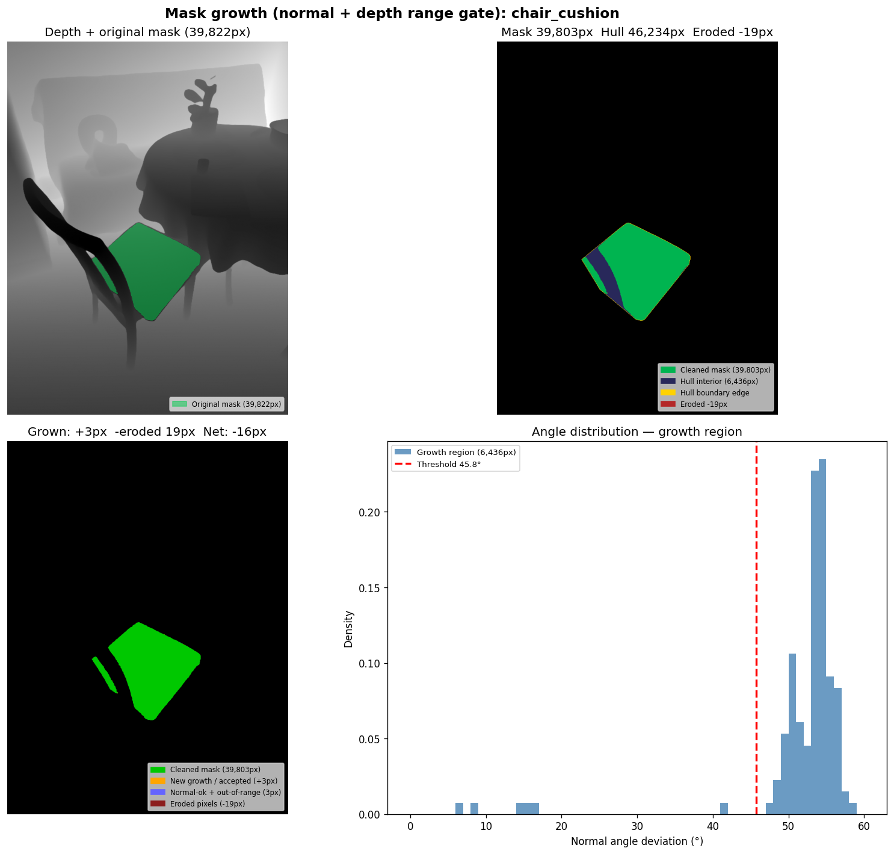
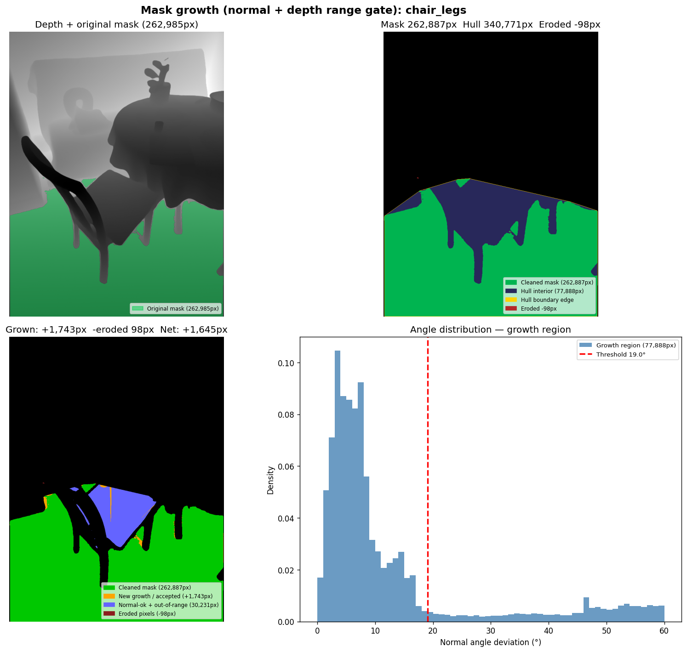
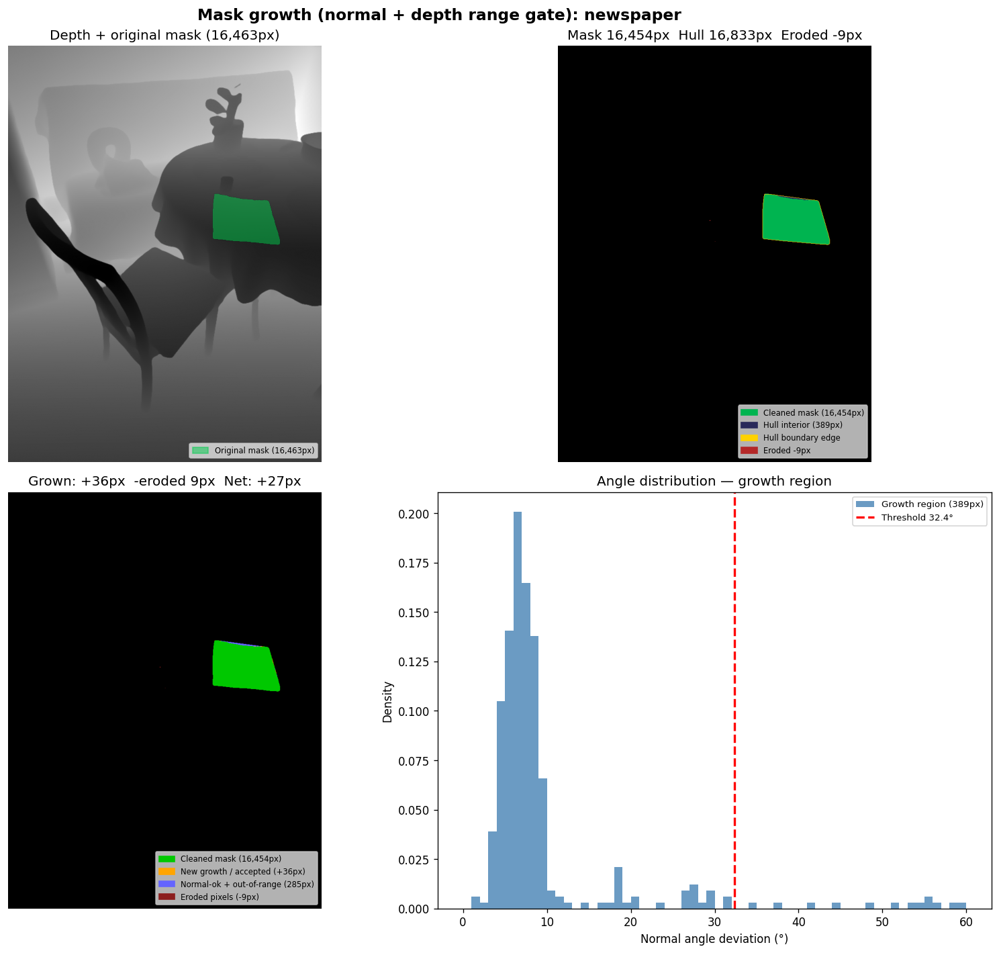
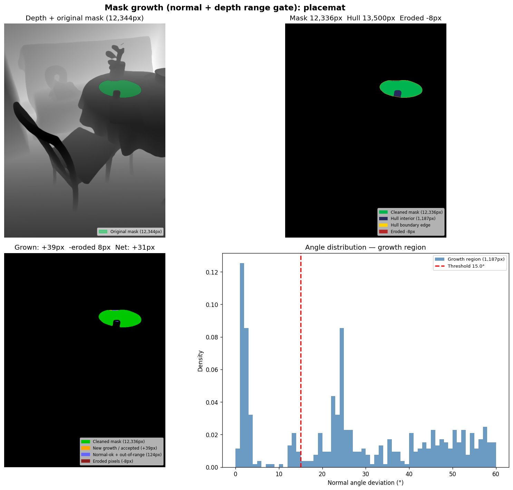
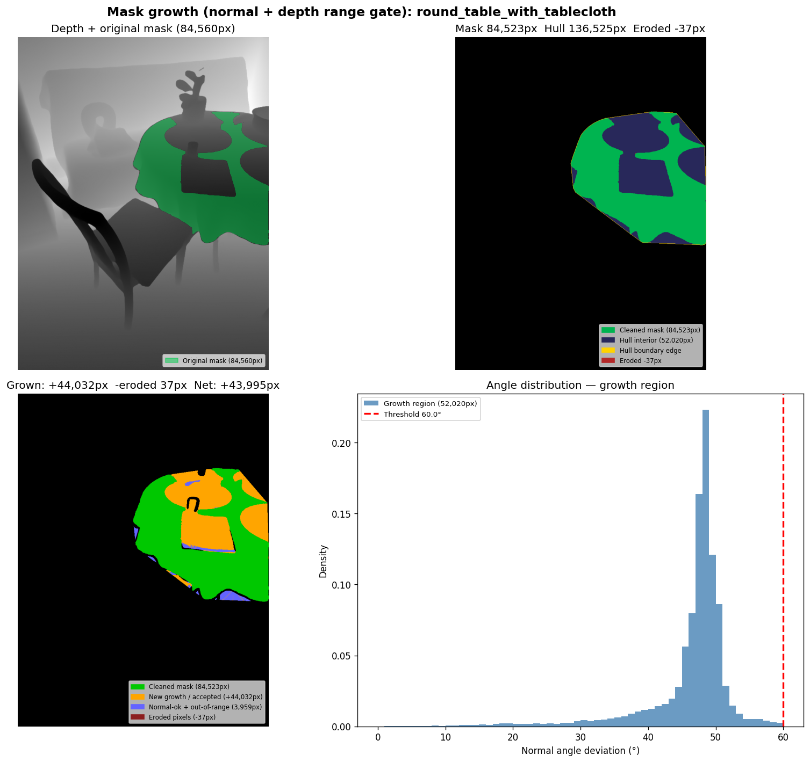
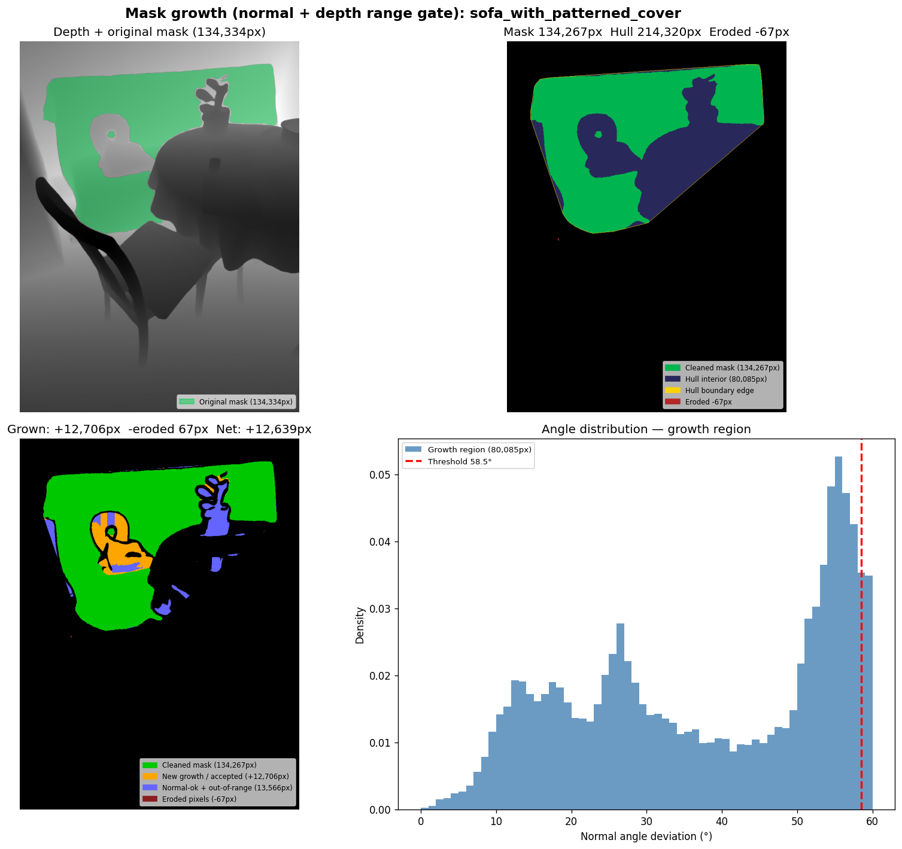
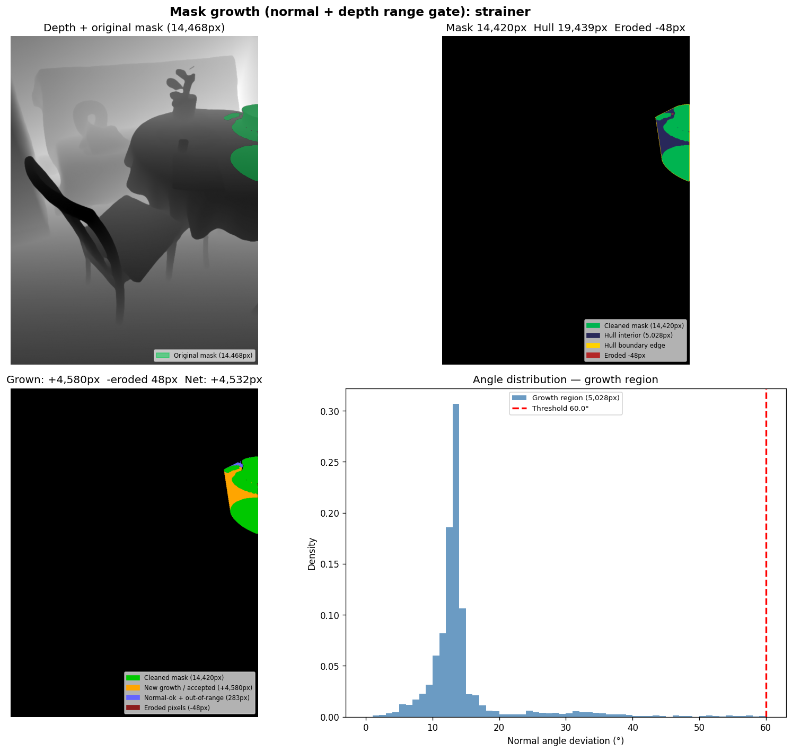
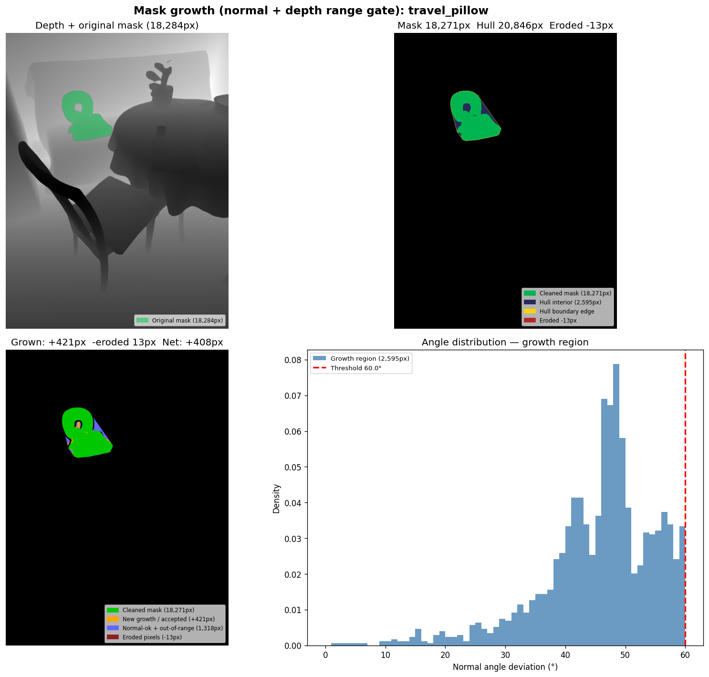
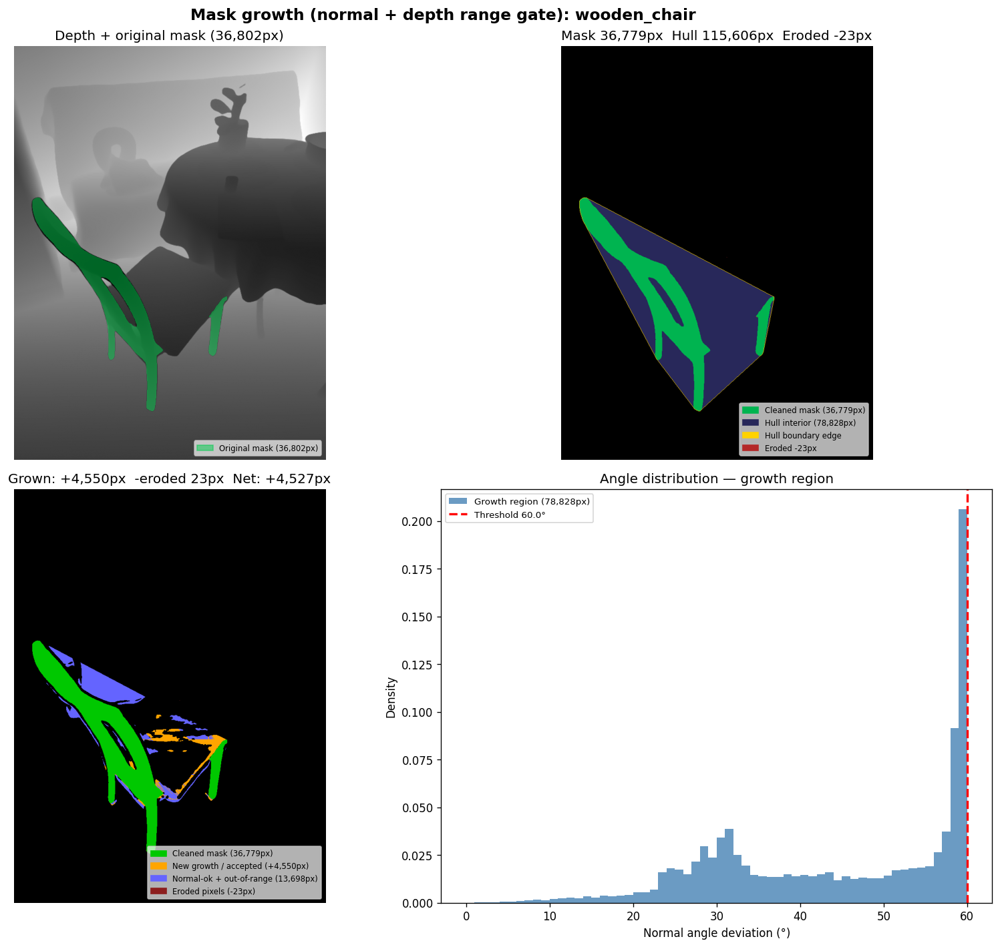

# SAM3D Dining Scene v9 — 8-Direction Ray-Cast Depth Gate

**Date:** 2026-02-18
**Run:** `output/sam3d_dining_v9/`
**Scene:** Dining (9 objects)
**Baseline:** `output/sam3d_dining_v7/` (EDT 10 cm fixed threshold)

---

## Algorithm: 8-Direction Ray-Cast Depth Gate

### Motivation

Previous depth gate variants (v6/v7: EDT single nearest pixel ± fixed threshold; v8: KDTree K=60 all-neighbor range) both failed for different reasons:

- **v6/v7**: Comparing against a single nearest mask pixel + fixed threshold. The nearest pixel is always on the closest edge, so the comparison is local and direction-agnostic. `round_table` and `sofa` accepted too many background pixels at v7 (10 cm) because the threshold was simply too generous.
- **v8**: K=60 nearest neighbors are all spatially clustered near the closest edge → narrow depth range → too conservative. `round_table` dropped from +40K to +16K px.

The insight: a hull pixel P inside a sparse/large object is geometrically **surrounded by mask pixels in all directions**. Casting a ray from P in each of 8 directions and finding the first mask hit per direction gives a depth range that spans the entire local object geometry — not just the nearest edge.

### Algorithm (v9)

**Step 1: Precompute `ray_first_hit[H, W, 8]`**

For each pixel (r,c) and each of 8 directions, the depth of the **first mask pixel** hit when casting a ray in that direction. Implemented as a scan-propagation (O(H×W) per direction, no per-pixel ray marching):

```
Direction order: N(0) NE(1) E(2) SE(3) S(4) SW(5) W(6) NW(7)

Recurrence for direction d with unit step (dr, dc):
  ray[r, c, d] = depth[r, c]         if cleaned[r, c]   (hit mask pixel itself)
               = ray[r+dr, c+dc, d]  otherwise           (propagate from d-neighbor)

Scan order: reverse direction of d (so neighbor is already computed when needed)
  Cardinal N/S/E/W  → vectorized row/col loop, O(H) or O(W) iterations
  Diagonal NE/SW    → scan anti-diagonals (r+c=k), O(H+W) diagonals × avg length
  Diagonal SE/NW    → scan main diagonals  (r-c=k), O(H+W) diagonals × avg length
```

**Step 2: Per-hull-pixel depth gate**

```python
# For each hull pixel P (not in cleaned mask):
ray_depths = ray_first_hit[P.r, P.c, :]      # up to 8 depths, NaN if no hit
dmin = nanmin(ray_depths)
dmax = nanmax(ray_depths)
depth_ok = isfinite(dmin) AND dmin <= depth[P] <= dmax
```

**Step 3: Accept if both gates pass**

```python
grown = cleaned | (hull_region & normal_ok & depth_ok)
```

Full algorithm including normal gate:

```python
# Shared with v5–v8:
# 1. Morphological opening (2×erosion + 2×dilation)
# 2. Convex hull of cleaned mask
# 3. Gaussian-smoothed normals (sigma=2.0, ~13×13)
# 4. Global reference normal = mean of cleaned mask normals
# 5. Angle map = arccos(|normal·ref|) in degrees
# 6. Adaptive threshold = clip(median + 2σ, 10°, 60°)

# v9-specific depth gate:
ray_first_hit = _precompute_ray_first_hit(cleaned, depth)   # (H, W, 8)
p_ray_hits    = ray_first_hit[gr_rows, gr_cols, :]          # (M, 8)
dmin          = nanmin(p_ray_hits, axis=1)
dmax          = nanmax(p_ray_hits, axis=1)
depth_ok      = isfinite(dmin) & (dmin <= p_depths) & (p_depths <= dmax)
```

**Parameters:** `smooth_sigma=2.0`, `max_angle=60°`, `erosion_iters=2`, `dilation_iters=2`.

**Complexity:** O(H×W×8) precompute (~0.85 s/object on 1024×771 image). Cardinal directions vectorized; diagonal directions use Python inner loops (~2.76M iterations per direction pair).

---

## Results

### v7 (10cm EDT) vs v9 (8-dir ray) comparison

| Object | v7 (10cm) | v9 8-dir ray | Δ | Notes |
| --- | --- | --- | --- | --- |
| chair_cushion | +6px | **+3px** | −3px | Normal gate bottleneck — 8 rays irrelevant |
| chair_legs | +2,542px | **+1,743px** | −799px | Ray gate tighter than 10cm for floor gaps |
| newspaper | +321px | **+36px** | −285px | Hull interior is mostly table — rays hit table edges |
| placemat | +127px | **+39px** | −88px | Same as newspaper |
| round_table_with_tablecloth | +40,734px | **+44,032px** | +3,298px | **Best result yet** — rays span full cloth depth |
| sofa_with_patterned_cover | +9,153px | **+12,706px** | +3,553px | **Best result yet** — 8 directions cover sofa depth extent |
| strainer | +4,756px | **+4,580px** | −176px | Compact hull — minimal change |
| travel_pillow | +1,048px | **+421px** | −627px | U-shape — some directions hit pillow interior |
| wooden_chair | +4,331px | **+4,550px** | +219px | Slightly better — rays cover full chair depth |

**Key findings:**

- `round_table` and `sofa` surpass all previous methods including v7 (10 cm). Rays from interior hull pixels hit tablecloth/sofa in all 8 directions, giving a wide depth range that matches the actual surface depth.
- `chair_legs` and `newspaper`/`placemat`: more conservative than v7 because rays correctly hit table/floor pixels in some directions, making the range tight. These objects' hull interiors genuinely overlap background.
- `chair_cushion` unchanged: normal gate bottleneck (only +6px pass the 45.8° angle threshold), depth gate irrelevant.

---

## Full Algorithm Comparison (all methods, dining scene)

| Object | v5 Normal | v6 (5cm) | v7 (10cm) | v8 all-K | **v9 ray** | Plane-Dist | RANSAC v2 |
| --- | --- | --- | --- | --- | --- | --- | --- |
| chair_cushion | +6px | +6px | +6px | +6px | **+3px** | +6,436px | +4,413px |
| chair_legs | +33,530px | +2,077px | +2,542px | +1,417px | **+1,743px** | +35,300px | +8,960px |
| newspaper | +4,041px | +321px | +321px | +58px | **+36px** | +389px | +389px |
| placemat | +168px | +127px | +127px | +35px | **+39px** | +1,187px | +375px |
| round_table | +48,088px | +30,315px | +40,734px | +16,641px | **+44,032px** | +45,143px | +22,111px |
| sofa | +30,072px | +5,681px | +9,153px | +2,617px | **+12,706px** | +36,710px | +11,287px |
| strainer | +4,823px | +4,094px | +4,756px | +2,127px | **+4,580px** | +4,922px | +3,544px |
| travel_pillow | +1,745px | +545px | +1,048px | +396px | **+421px** | +2,509px | +1,887px |
| wooden_chair | +22,795px | +2,938px | +4,331px | +1,730px | **+4,550px** | +23,945px | +14,955px |

---

## Per-Object Visualizations

Panel layout (same as v6–v8):

| Panel | Contents | Key colors |
| --- | --- | --- |
| **Top-left** | Depth map + original mask | Green = original mask |
| **Top-right** | Mask + convex hull | Green = cleaned · Dark blue = hull · Yellow = hull edge · Red = eroded |
| **Bottom-left** | Grown mask | Green = cleaned · **Orange = accepted growth** · Blue = normal-ok+depth-fail · Dark red = eroded |
| **Bottom-right** | Angle histogram | Blue = growth region · Red dashed = adaptive threshold |



**chair_cushion:** +3px. Normal gate (45.8°) is the bottleneck. 8 rays have no effect.



**chair_legs:** +1,743px. Ray gate correct — floor pixels between legs fail because rays going downward hit the floor (deeper), pulling dmax far from the chair depth but also meaning the floor pixels are within [dmin_legs, dmax_floor]. Actually the tight 19.0° normal gate is still the main filter here.



**newspaper:** +36px. Hull interior is table surface. Rays hit table/newspaper edges → depth range [table, newspaper], but floor hull pixels are at table depth → only pixels exactly at newspaper depth pass.



**placemat:** +39px. Flat object with small hull — similar to newspaper.



**round_table_with_tablecloth:** +44,032px — best across all methods. Rays from hull interior hit tablecloth in all 8 directions, giving depth range matching the draping cloth surface. 3,959px pass normal gate but fail depth (shallow/deep folds).



**sofa_with_patterned_cover:** +12,706px — best across all depth-gated methods. Large curved sofa — 8 directions capture the full front-to-back depth extent.



**strainer:** +4,580px. Small compact object — 8-ray range ≈ 10cm threshold result. Minimal change.



**travel_pillow:** +421px. U-shaped pillow — rays in some directions hit the inner hollow, giving a depth range that excludes some hull pixels.



**wooden_chair:** +4,550px. Sparse frame — 8 rays from interior gaps hit slats in all directions, giving a depth range covering front and back frame. Slightly better than v7.

---

## Observations

- **Ray-cast gate best suited for convex/filled objects** (`round_table`, `sofa`): the 8 directions reliably hit the object surface on all sides, giving an accurate depth range.
- **Conservative for objects where hull overlaps other objects** (`newspaper`, `placemat`): rays in some directions hit the table surface, making the depth range include table depth. Hull pixels that are at table depth → accepted → potential false positives. However, the normal gate still filters most of these.
- **`chair_cushion` remains unsolved**: normal gate bottleneck. Plane-distance method (+6,436px) is the only approach that handles curved surfaces, by using a local per-pixel reference plane instead of a global reference normal.
- **32,349 Normal-fail+Depth-ok pixels for wooden_chair**: many pixels are depth-consistent (within 8-ray range) but fail the 60° normal gate — these are likely genuine chair surface pixels with different facet orientations that the global normal reference cannot classify.

---

## What Was Not Isolated

- TRELLIS reconstruction quality impact not measured — mask growth visualization only.
- Whether the v9 gains for `round_table`/`sofa` actually improve 3D reconstruction IoU is unknown.
- Combining v9 depth gate with plane-distance normal gate (local reference instead of global) might solve `chair_cushion`.
- `Normal-fail+Depth+ok` pixels (32K for wooden_chair) are discarded — a depth-only fallback mode could recover these.

---

## Files

| File | Description |
| --- | --- |
| `visualize_convex_hull_growth.py` | v9 script (8-dir ray depth gate) |
| `output/sam3d_dining_v9/vis/` | v9 mask growth images |
| `docs/test_results_images/sam3d_dining_v9/` | v9 images (docs copy) |

### Key Code Changes (v8 → v9)

- Removed: `from scipy.spatial import cKDTree`; `K_SEARCH` config; KDTree query block
- Added: `_precompute_ray_first_hit(cleaned, depth) → (H, W, 8)` — 8-direction scan-propagation
  - Cardinal (N/S/E/W): vectorized `for r in range(H)` loop, O(H×W)
  - Diagonal (NE/SW anti-diag, SE/NW main-diag): Python inner loop over pixels per diagonal, O(H×W)
- Depth gate: `p_ray_hits = ray_first_hit[gr_rows, gr_cols, :]`; `dmin = nanmin(axis=1)`; `dmax = nanmax(axis=1)`
- Runtime: ~0.85 s/object precompute on 1024×771 image
