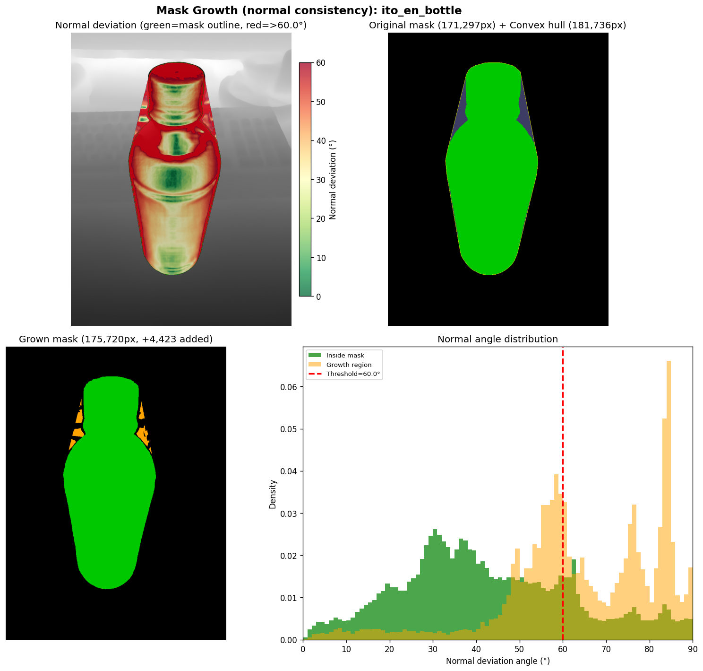
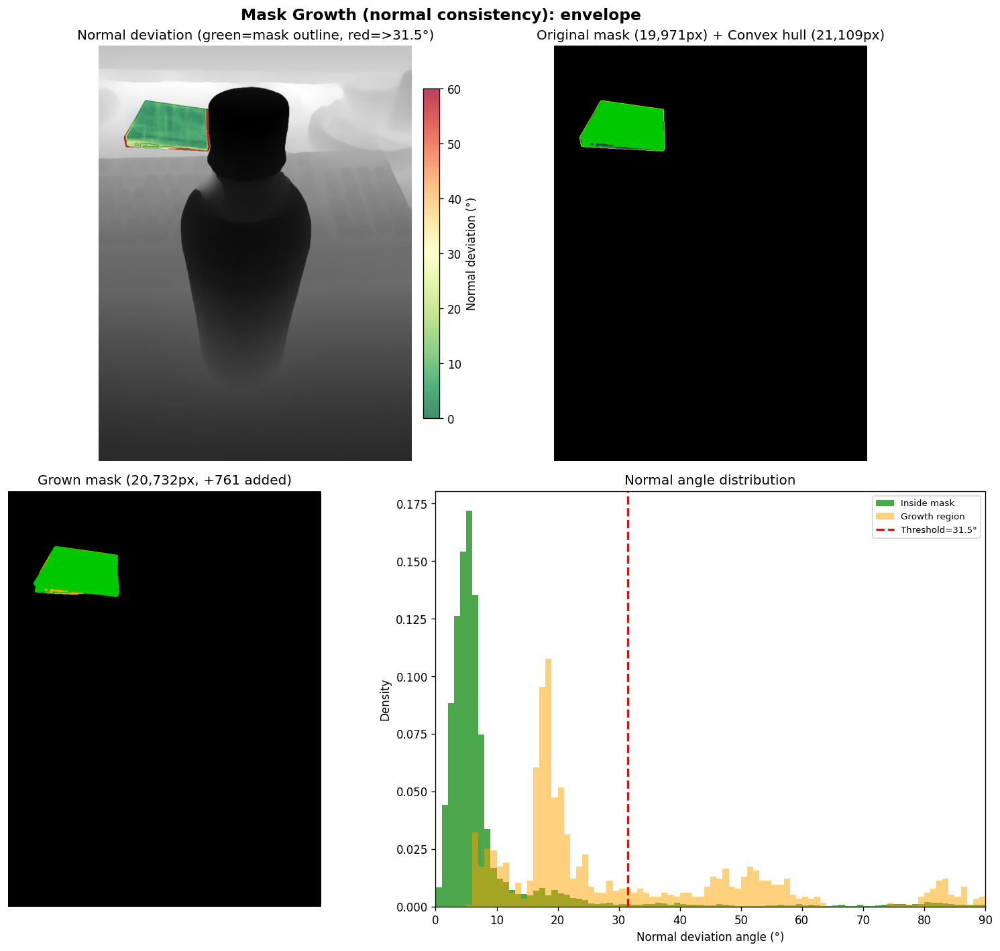
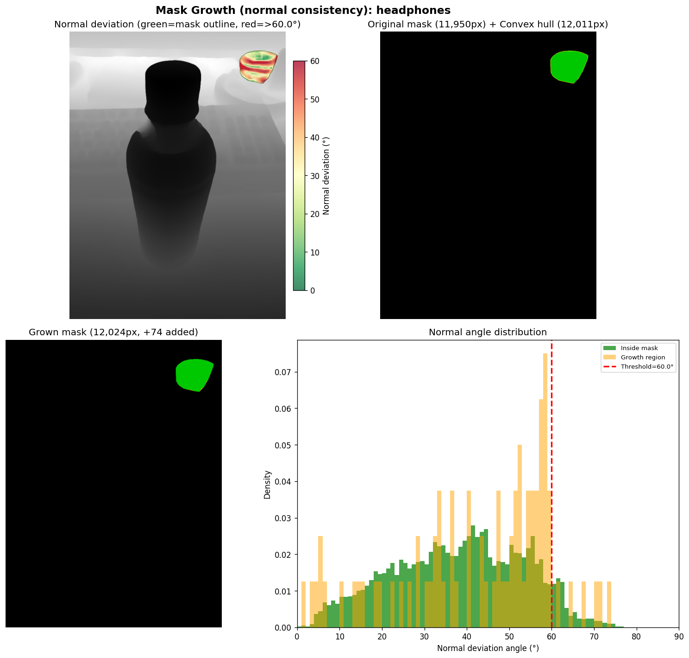
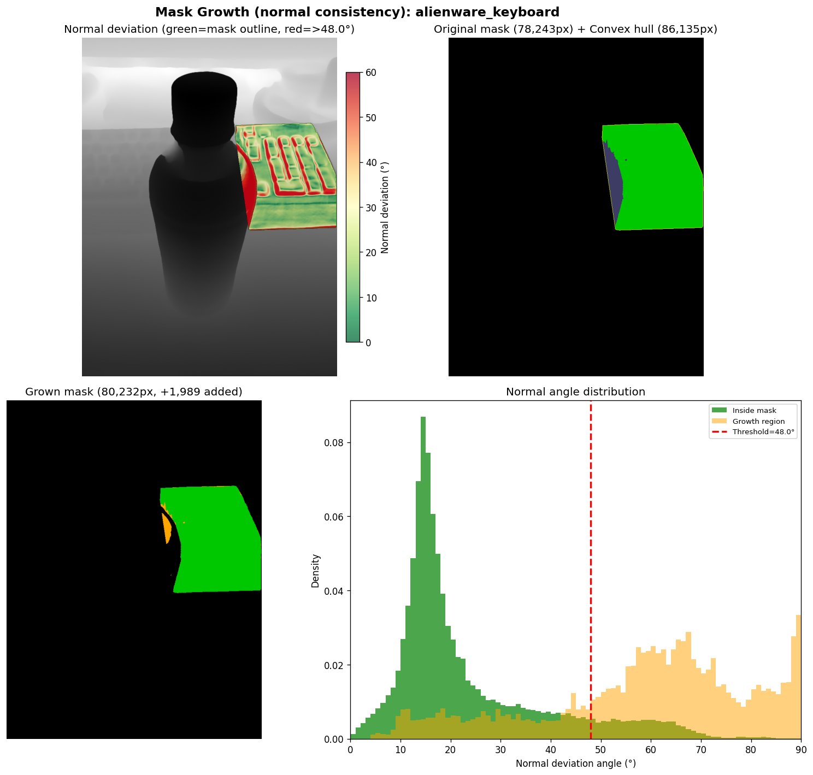
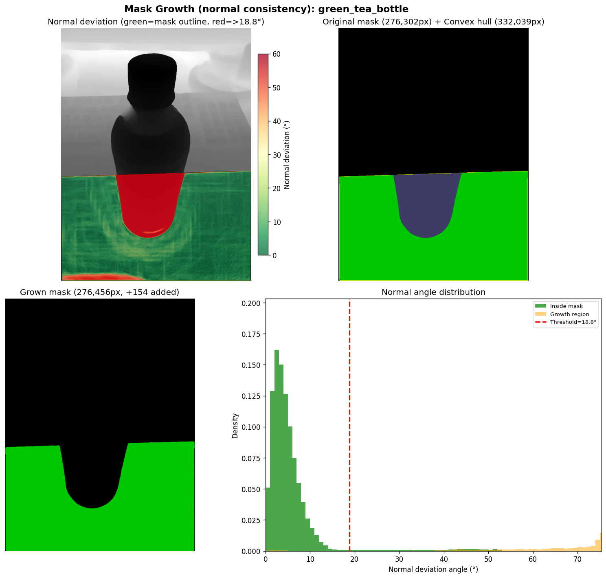

# SAM3D Convex Hull v3 — Normal-Consistency Mask Growth

**Date:** 2026-02-18
**Run:** `output/sam3d_convex_hull_v3/`
**Scene:** Greentea (5 objects)
**Baseline:** `output/sam3d_convex_hull_v2/` (Sobel-based growth)

---

## What Was Done

v2 (`sam3d_convex_hull_v2`) used Sobel depth gradient as the stop criterion for convex hull mask growth — grew into hull region where `sobel_magnitude < median + 2σ`. This is 2D-only and has no 3D surface understanding.

v3 replaces Sobel with **local surface normal consistency**: compute per-pixel 3D normals from the MoGe pointmap, compare each candidate hull pixel's normal to the object's reference normal, and allow growth only where the angle deviation is below an adaptive threshold. This makes the growth surface-aware — stopping at genuine 3D surface boundaries regardless of depth gradient.

---

## Key Finding: Connectivity Blockage in Iterative Dilation

The first implementation used iterative 8-neighbor dilation from the original mask through safe pixels (same approach as the Sobel version). Results were dramatically worse than Sobel:

| Object | Sobel v2 | Normal (connected dilation) |
|---|---|---|
| ito_en_bottle | +7,585px | **+8px** |
| alienware_keyboard | +1,154px | +590px |

**Root cause:** Depth-discontinuity pixels at the mask border have degenerate normals (cross product of vectors pointing in opposing 3D directions). These form a high-deviation "ring" around the mask edge that iterative dilation cannot cross, blocking access to safe interior hull pixels.

**Fix:** Replace iterative connected dilation with **direct assignment** — all hull pixels satisfying `angle < threshold AND valid normal` join the mask at once, no connectivity required.

---

## Algorithm (v3 Final)

```python
# 1. Gaussian-smooth pointmap (σ=2.0, effective 13×13 window)
pm = gaussian_filter(pointmap, sigma=[2.0, 2.0, 0])

# 2. Per-pixel normals via central differences
dx[:, 1:-1] = pm[:, 2:] - pm[:, :-2]   # ±1 pixel stencil
dy[1:-1, :]  = pm[2:, :] - pm[:-2, :]
normals = cross(dx, dy)                  # (H, W, 3) unit normals

# 3. Reference normal = mean of valid normals inside original mask
ref_normal = normals[mask & valid].mean(axis=0)

# 4. Angle deviation: use |dot| for sign-ambiguity robustness
angle_map = arccos(|normals @ ref_normal|)   # (H, W) radians

# 5. Adaptive threshold: median + 2σ of angles inside mask
#    clamped to [10°, 60°]
threshold = clip(median + 2*std, 10°, 60°)

# 6. Direct assignment
grown = mask | (hull_region & angle < threshold & valid_normal)
```

**max_threshold_deg = 60°** handles curved surfaces: bottle shoulder/neck normals deviate 40–60° from the front-face mean, so 45° (the previous cap) blocked them. Background surfaces (table: normal up, ~90° from bottle normal) are correctly rejected at 60°.

**smooth_sigma = 2.0 (13×13)** vs 1.5 (9×9): larger window gives more noise-robust normals at the cost of slightly blurred edges.

---

## Results

### v2 Sobel vs v3 Normal-Consistency (σ=2.0, max=60°)

| Object | v2 Sobel | v3 Normal | Threshold | Notes |
|---|---|---|---|---|
| ito_en_bottle | +7,585px | **+4,423px** | 60.0° (cap) | Curved — side pixels at >60° excluded |
| green_tea_bottle | +5,903px | **+154px** | 18.8° | Better: rejects spurious shadow pixels |
| alienware_keyboard | +1,154px | **+1,989px** | 48.0° | Flat plate — direct assign more aggressive |
| headphones | +74px | **+74px** | 60.0° (cap) | Nearly convex, hull gap only 61px |
| envelope | +1,059px | **+761px** | 31.5° | Flat rect — tight adaptive threshold |

### Effect of window size (ito_en_bottle)

| σ (window) | Added pixels | Notes |
|---|---|---|
| 1.5 (~9×9) | +4,772px | Noisier normals, slightly more permissive |
| 2.0 (~13×13) | +4,423px | Smoother normals, marginally fewer |

---

## Per-Object Visualizations

Each 4-panel: normal deviation angle map | original mask + convex hull | grown mask | angle histogram.



**ito_en_bottle (+4,423px, threshold=60.0°):** Normal angle map clearly distinguishes bottle surface (green/yellow, low deviation) from background (red, high deviation). Growth fills shoulder/neck gap. Side pixels with normals >60° from front-face mean are excluded — fundamental limitation of global reference normal for curved objects.



**envelope (+761px, threshold=31.5°):** Flat rectangular surface → tight adaptive threshold. Growth fills corner gaps while correctly rejecting non-envelope hull pixels.



**headphones (+74px, threshold=60.0°):** Hull gap is only 61px — mask was already nearly convex. Same result as Sobel.



**alienware_keyboard (+1,989px, threshold=48.0°):** More aggressive than Sobel (+1,154px). Direct assignment captures concavities that the iterative dilation couldn't reach through the depth-edge ring.



**green_tea_bottle (+154px, threshold=18.8°):** Correct behavior — hull region is background/air around the contaminated shadow mask. Sobel added +5,903px of additional flat shadow surface; normal method correctly rejects them (different surface normals). The degenerate mask remains a problem but isn't made worse.

---

## Observations

- **Normal method is better for flat objects with shadow contamination** (green_tea_bottle): Sobel sees uniform depth = low gradient = safe. Normal sees uniform flat normal = tight threshold = correct rejection of background.
- **Normal method is comparable or better for flat objects** (keyboard, envelope): direct assignment bridges the dilation blockage that Sobel's connected approach avoided.
- **Normal method is worse for curved objects** (ito_en_bottle): global mean reference normal loses information about curvature. Cylinder normals span 0°–90°; capping at 60° excludes extreme side pixels that are legitimately part of the object.
- **Potential improvement**: per-pixel local reference (compare each candidate to its nearest original-mask neighbor via `distance_transform_edt`) would handle curvature naturally without a threshold cap.

---

## What Was Not Isolated

The v3 visualization-only run does not re-run TRELLIS reconstruction — IoU impact of normal-consistency growth vs Sobel growth is not yet measured. A full SAM3D pipeline run with normal-consistency masks would be needed to quantify the reconstruction quality difference.

---

## Files

| File | Description |
|---|---|
| `visualize_convex_hull_growth.py` | Normal-consistency visualization, outputs to v3 |
| `visualize_convex_hull_growth_sobel.py` | Original Sobel version (archived) |
| `output/sam3d_convex_hull_v3/vis/` | Normal-consistency mask growth images (σ=2.0) |
| `output/sam3d_convex_hull_v2/vis/` | Sobel mask growth images (original baseline) |

### Key Code Changes

- `visualize_convex_hull_growth.py` — replaced iterative dilation with direct assignment; `max_threshold_deg` 45°→60°; `smooth_sigma` 1.5→2.0
- `utils/third_party/sam3d/.../layout_post_optimization_utils.py:227-287` — same algorithm changes applied to live pipeline (`_grow_mask_to_convex_hull`)
