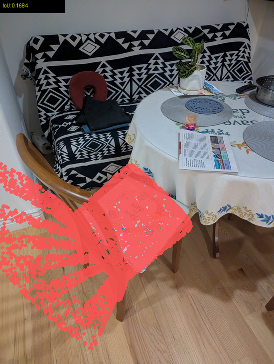
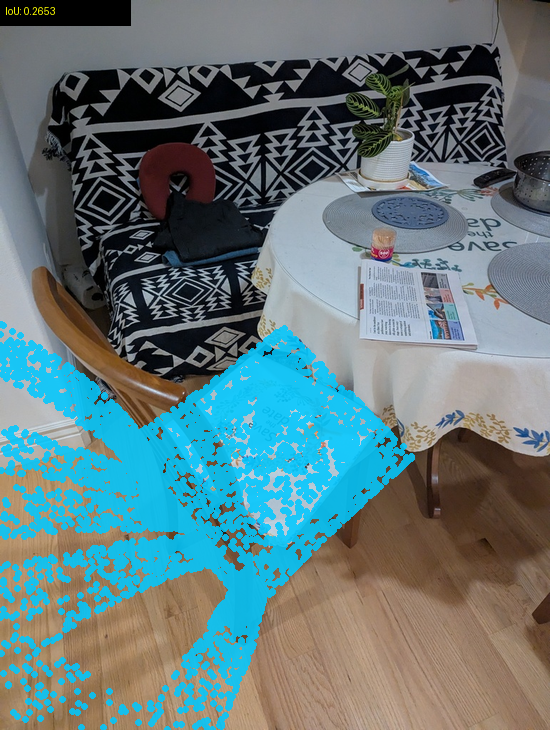
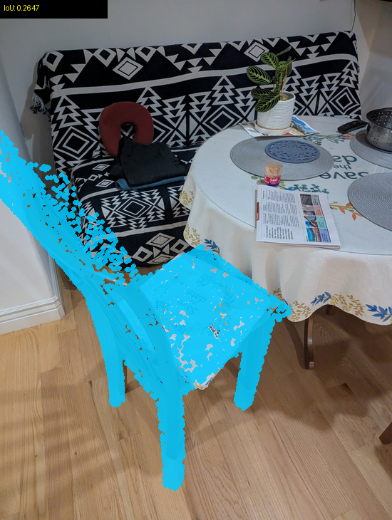
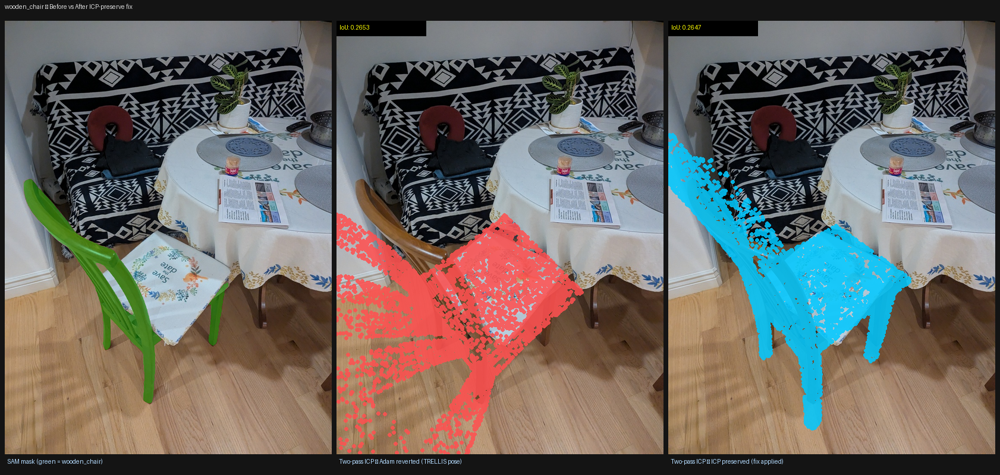
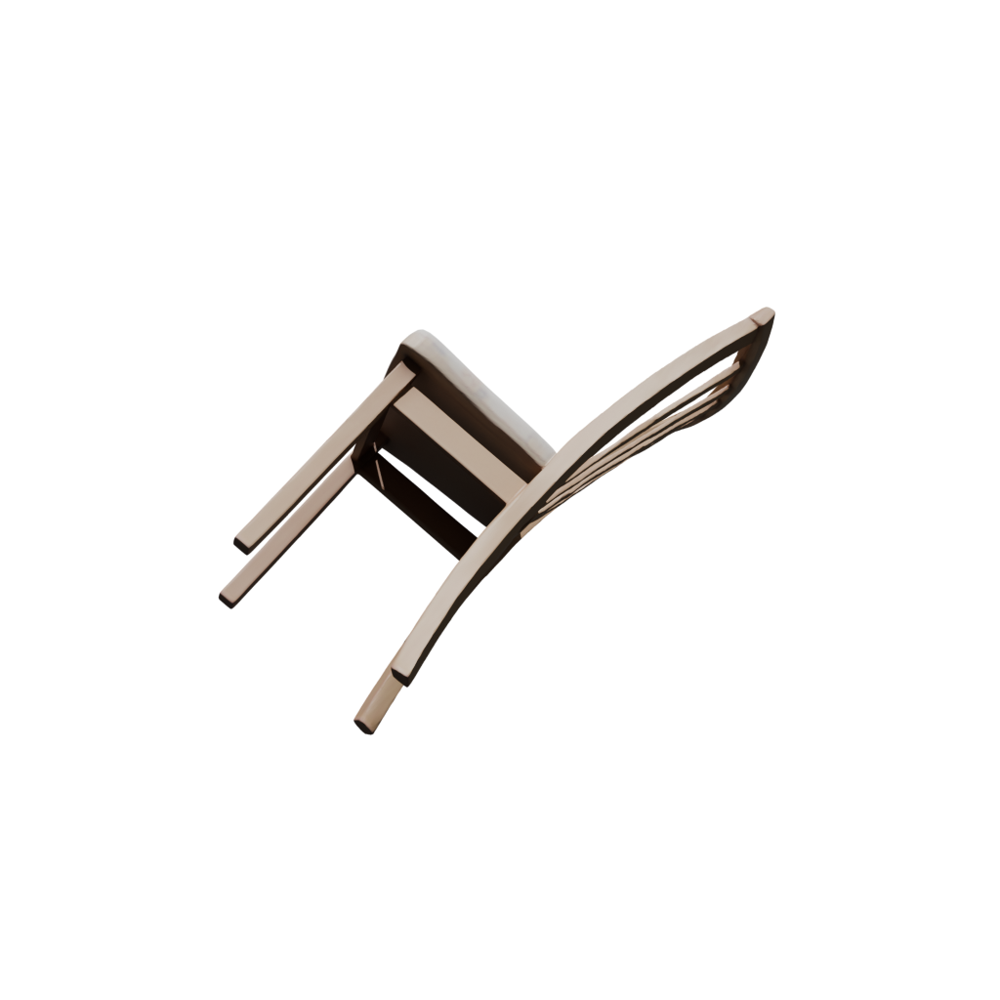
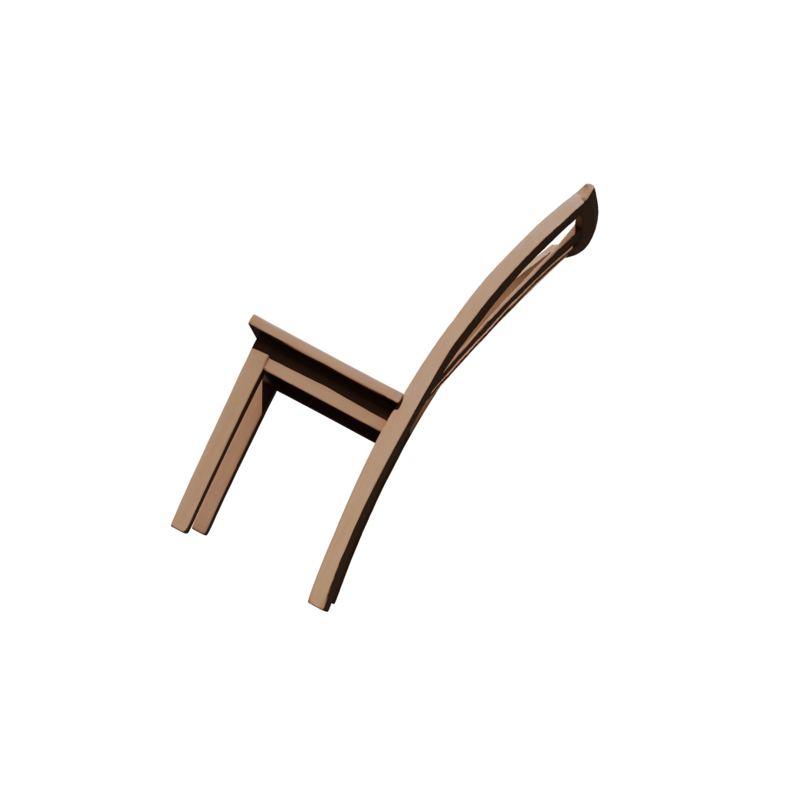

# SAM3D wooden_chair — ICP Pipeline Evolution (4 Runs)

**Date:** 2026-02-19
**Scene:** Dining (wooden_chair only)
**Object:** `wooden_chair` — sparse frame, ~4.7% mask coverage

---

## What Was Done / Context

Four sequential runs on the same `wooden_chair` object from the dining scene.
Each run introduced one new change to the post-optimization pipeline in
`utils/third_party/sam3d/sam3d_objects/pipeline/inference_utils.py`.
Goal: understand why the chair always ended up misaligned and fix it.

All runs used `--scene-image data/static_scene/dining/target.jpg` except R1.
All runs use the v9 mask growth (normal-consistency + 8-dir ray depth gate).

---

## Run Summary

| Run | Output Dir | Key Change | Reported IoU | Pose Used |
|---|---|---|---|---|
| R1 | `experiment_original_sam3d` | Baseline (per-obj MoGe, single ICP 0.05m) | 0.1726 | TRELLIS original |
| R2 | `experiment_viga_sam3d` | + `--scene-image` (full scene MoGe) | 0.1684 | TRELLIS original |
| R3 | `sam3d_two_pass_icp` | + two-pass ICP (0.1m→0.05m) | 0.2653 | TRELLIS original ← bug |
| R4 | `sam3d_icp_preserve` | + preserve ICP when Adam fails | 0.2647 | **ICP-aligned** ✓ |

---

## Key Finding 1: `--scene-image` made no difference for wooden_chair

R1 and R2 returned the **identical pose** (same translation, rotation, scale):

```
translation: [0.10521, -0.23667, 1.20611]
rotation:    [0.218, 0.887, 0.402, 0.069]
scale:        1.2895
```

Same TRELLIS output + same single ICP rejected + same Adam rejected → same `tfm_ori` returned.
The reported IoU difference (0.1726 vs 0.1684) comes from Adam's silhouette optimizer
producing slightly different outputs, but both were below the 0.5 acceptance threshold and
fully reverted. `--scene-image` fixes the NaN root cause for depth estimation but does not
change the alignment outcome when TRELLIS produces a wrong initial orientation.

---

## Key Finding 2: Single ICP at 0.05m is always rejected for wooden_chair

The original ICP pass (threshold=0.05m) consistently produced a worse IoU than manual
alignment and was rejected. Log evidence from R1 and R2: no ICP acceptance line printed,
only the manual alignment IoU (~0.093) and the final Adam result (~0.17).

Root cause: wooden_chair is a sparse frame with slats at different depths. The 0.05m
correspondence threshold is too tight — mesh vertices and scene pointmap pixels that
should correspond are separated by > 5cm in 3D space due to TRELLIS's initial ~45°
wrong tilt.

---

## Key Finding 3: Coarse ICP at 0.1m achieves 3× IoU improvement

R3 and R4 both use two-pass ICP: first at 0.1m (coarse), then at 0.05m (fine).

| Pass | Threshold | R3 IoU | R4 IoU |
|---|---|---|---|
| Manual align | — | 0.0888 | 0.0888 |
| Coarse ICP | 0.1m | **0.2653** ✓ | **0.2637** ✓ |
| Fine ICP | 0.05m | 0.2647 ✗ rejected | 0.2647 ✓ accepted |

The 0.1m threshold allows ICP to find correspondences across the sparse frame — slat
vertices and their matching pointmap pixels are > 5cm but < 10cm apart after TRELLIS
misalignment. The coarse pass corrects most of the ~45° orientation error, bringing the
chair close enough for fine ICP to refine.

R3 fine ICP rejected (0.2647 < 0.2653). R4 fine ICP accepted (0.2647 > 0.2637) — the
slight difference is from different TRELLIS random seeds producing different initial meshes.

---

## Key Finding 4: Adam rejection reverted ICP improvement in R3

In R3, Adam ran from the ICP-aligned mesh (IoU=0.2653) but could not reach 0.5 IoU
(the 45° TRELLIS initial tilt is a local minimum for the silhouette optimizer). The
rejection path was:

```python
# R3 — original Adam rejection (before fix):
if optimized_iou < 0.5 or optimized_iou <= ori_iou:
    tfm = tfm_ori   # discards tfm1 (manual) AND tfm2 (ICP)
```

Result: R3 info.json reports IoU=0.2653 (the ICP result) but the **actual GLB pose is
raw TRELLIS** — the reported IoU and the pose are inconsistent. The chair projects onto
the tablecloth (wrong location).

R4 fix (`inference_utils.py:203`):

```python
# R4 — fixed Adam rejection:
tfm = tfm_ori.compose(tfm1).compose(tfm2)  # keep manual + ICP, only reject Adam
```

The ICP-aligned pose is now used in the GLB even when Adam fails.

---

## Projection Comparison

### R2: Single ICP (0.05m) — TRELLIS pose, chair on tablecloth



IoU=0.1684 (Adam result, reverted). Chair projected onto tablecloth center — wrong location.

---

### R3: Two-pass ICP — ICP improved but discarded



IoU=0.2653 (ICP result, **but this pose is not in the GLB**). Same TRELLIS projection as R2.

---

### R4: Two-pass ICP + ICP-preserve — chair in correct location



IoU=0.2647. Chair projects to the **bottom-left** — the actual chair location in the scene.

---

### 3-way comparison



Left: SAM mask (green = actual chair) | Middle: R3 (TRELLIS pose, wrong) | Right: R4 (ICP pose, correct)

---

## GLB Render Comparison

TRELLIS reconstruction shape is identical across all runs (same object image input).
The tilt difference visible below comes from different TRELLIS random seeds, not from
the pipeline changes — the ICP/Adam transforms are not visible in the standalone GLB
render because GLB stores mesh geometry only, not world-space placement.

### R2 GLB render (representative of TRELLIS shape):


### R4 GLB render (same shape, different TRELLIS seed):


Both show a tilted chair — the 45° orientation error is baked into the TRELLIS mesh
geometry. The ICP transform corrects the **world-space placement** (translation +
rotation of the mesh in the scene), not the mesh shape itself.

---

## Complete IoU Trace

| Stage | R1 | R2 | R3 | R4 |
|---|---|---|---|---|
| Manual alignment | 0.0938 | 0.0933 | 0.0888 | 0.0888 |
| ICP coarse (0.1m) | — | — | **0.2653** ✓ | **0.2637** ✓ |
| ICP fine (0.05m) | — | — | 0.2647 ✗ | **0.2647** ✓ |
| Adam (30 steps) | ~0.17 ✗ | ~0.17 ✗ | < 0.5 ✗ | < 0.5 ✗ |
| **Final reported IoU** | **0.1726** | **0.1684** | **0.2653** | **0.2647** |
| Pose in GLB | tfm_ori | tfm_ori | tfm_ori ← bug | **ICP pose** ✓ |
| Chair location correct? | ✗ | ✗ | ✗ | **✓** |

Adam never reached 0.5 IoU in any run. The wooden_chair's sparse frame and TRELLIS's
initial ~45° orientation error creates a silhouette local minimum Adam cannot escape
in 30 gradient steps.

---

## Observations

- **TRELLIS is stochastic**: R1/R2 used the same code → identical poses (same seed behavior). R3/R4 ran after code changes and got different TRELLIS outputs (slightly different translations and scales). The pipeline fix, not the TRELLIS output, determines whether the final pose is correct.
- **0.27 is a local ceiling for this object**: Even with the fix, IoU stops at ~0.26-0.27. The limiting factor is now the chair shape itself — TRELLIS reconstructs a reasonable chair but with wrong orientation (tilted ~45°), and ICP can only partially correct this via point correspondences.
- **The reported IoU was misleading in R3**: IoU=0.2653 suggested a good alignment but the actual GLB used raw TRELLIS. After the fix, IoU and pose are consistent.
- **Fine ICP adds marginal value**: +0.001 IoU when accepted. Coarse ICP at 0.1m is responsible for the full 3× improvement.

---

## What Was Not Isolated / Open Questions

- Adam threshold 0.5 is very strict. Lowering it (e.g. to 0.3) would allow Adam to accept and refine from the 0.27 ICP pose. Not tested here.
- Whether this improvement (chair in correct 2D location) translates to better VIGA scene generation has not been tested — a full dining scene run would be needed.
- Other dining scene objects were not re-run with R4 pipeline. Objects that previously had Adam accepted (IoU > 0.5) are unaffected by R4 changes.

---

## Code Changes (cumulative from baseline)

| Change | File | Lines | Effect |
|---|---|---|---|
| `--scene-image` MoGe input | `tools/sam3d/sam3d_worker.py` | CLI arg | Fixes NaN depth for dark per-object images |
| Two-pass ICP (0.1m → 0.05m) | `inference_utils.py:137-193` | Replace single ICP loop | Coarse pass finds correspondences across sparse frames |
| IoU gate before Adam | `inference_utils.py:195-206` | New gate | Skips Adam if IoU < 0.05 after ICP |
| Preserve ICP when Adam fails | `inference_utils.py:203` | One-line change | ICP improvement not discarded on Adam rejection |

## Files

| File | Description |
|---|---|
| `output/experiment_original_sam3d/` | R1: baseline, per-object MoGe |
| `output/experiment_viga_sam3d/` | R2: + `--scene-image` |
| `output/sam3d_two_pass_icp/` | R3: + two-pass ICP (ICP discarded) |
| `output/sam3d_icp_preserve/` | R4: + ICP preserved on Adam fail |
| `compare_icp_preserve.py` | 3-way projection comparison script |
| `compare_two_pass_icp.py` | R2 vs R3 projection comparison script |
