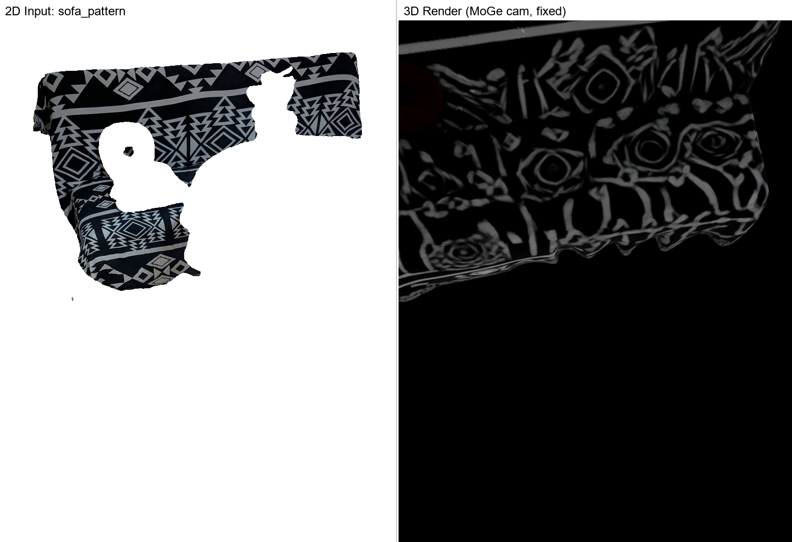
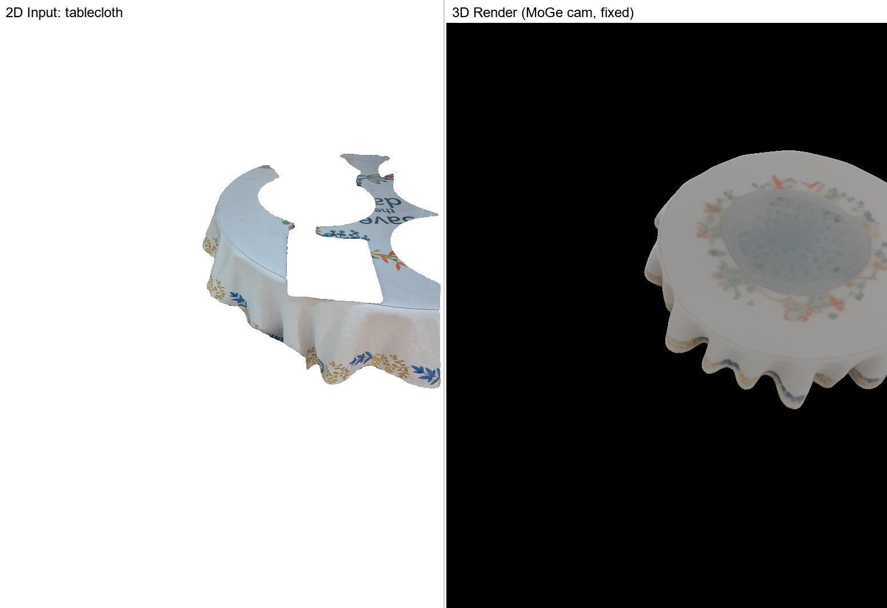
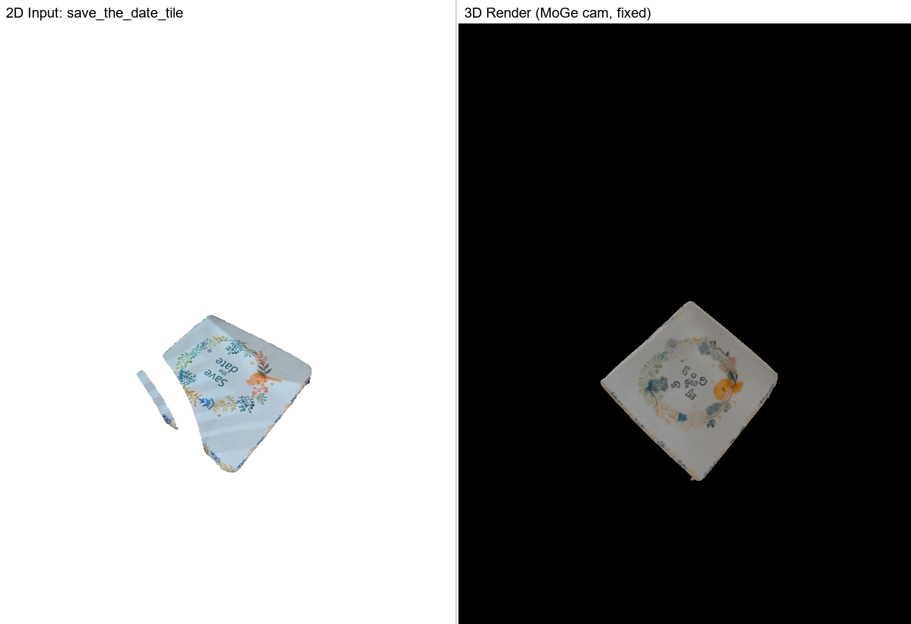
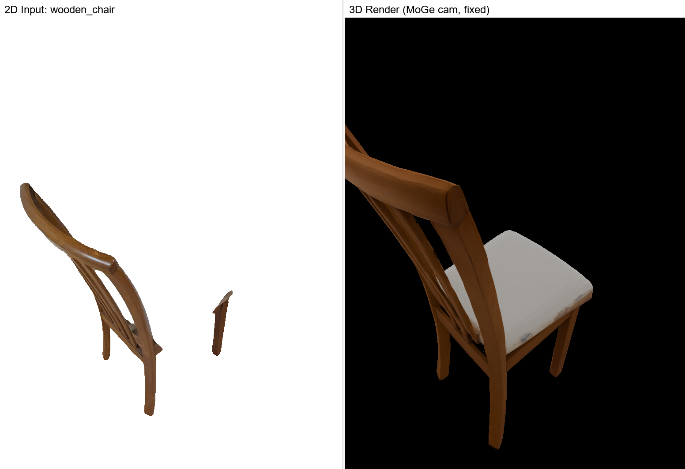
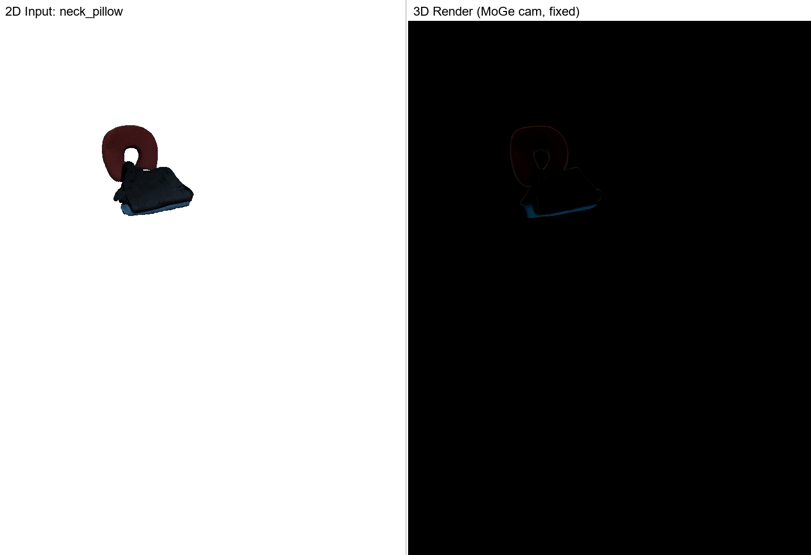
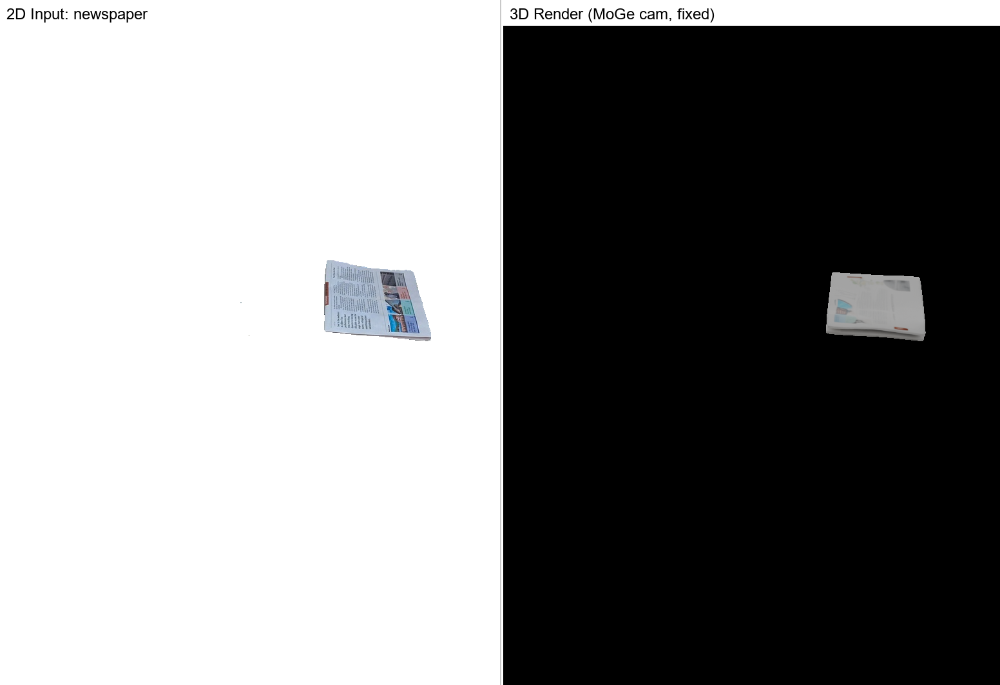
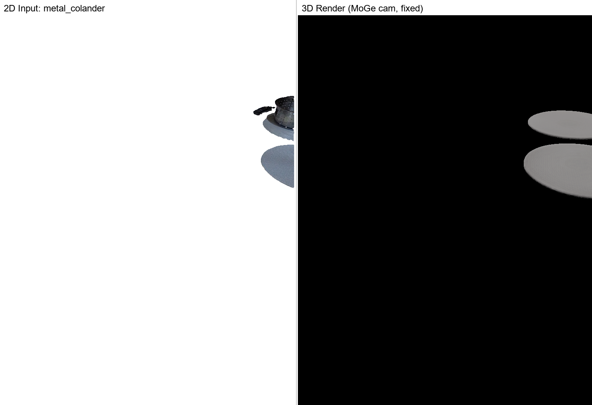
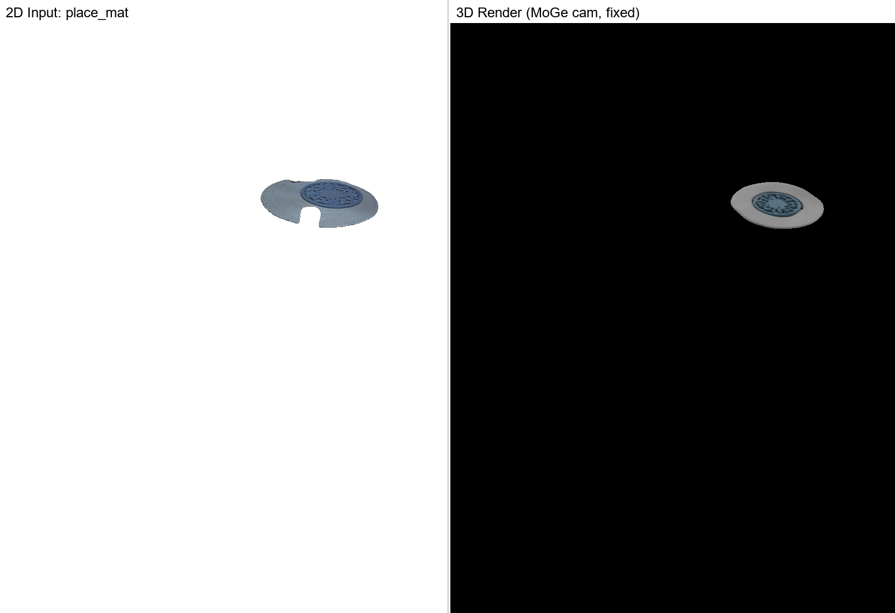
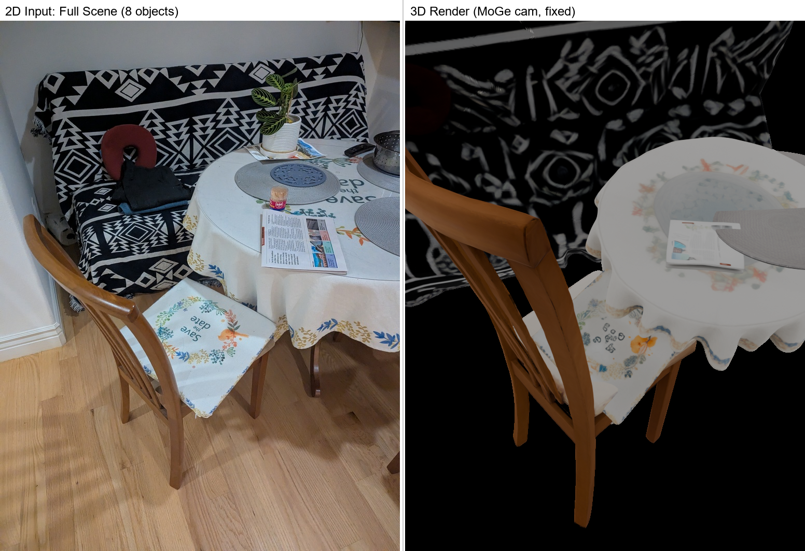

# SAM3D Batch Worker — Model Caching Optimization Results

**Date:** 2026-02-21
**Author:** kingy + Claude (Opus 4.6)
**Hardware:** GCP g2-standard-8, NVIDIA L4 24GB, us-central1-a

---

## Summary

Implemented a batch worker (`sam3d_batch_worker.py`) that loads the TRELLIS model once and processes all objects sequentially, eliminating the ~27s model-load overhead per object. Also tested flash-attention as a potential optimization (negligible impact). The batch worker achieved a **2x speedup** over baseline: 8.2 min vs 16.7 min for 8 objects.

---

## 1. Input Image

**Source:** `data/static_scene/dining/target_resized.jpg` (771 x 1024)

Same dining scene photograph as the Feb 15 baseline run — wooden chair, round table with tablecloth, patterned sofa, and various items on the table.

---

## 2. Benchmark Comparison (3 runs)

| Run | Mode | Attention | Total Time | Per Object | Speedup |
|---|---|---|---|---|---|
| Baseline | Per-object subprocesses | sdpa | 1001.9s (16.7 min) | ~125s | — |
| Flash-attn | Per-object subprocesses | flash_attn | 977.5s (16.3 min) | ~122s | 2.4% |
| **Batch** | **Cached model** | **flash_attn** | **491.0s (8.2 min)** | **~55s** | **51%** |

### Why flash-attn didn't help much

The TRELLIS pipeline was silently falling back to sdpa (scaled dot-product attention) on L4 GPU because `set_attention_backend()` only enabled flash_attn for A100/H100/H200 by GPU name check. After patching to check `import flash_attn` availability instead, flash-attn only improved total time by 2.4% — attention stages account for only ~24% of pipeline time, and sdpa is already efficient on Ada Lovelace (sm_89).

### Why model caching helps

Each per-object subprocess spends ~27s loading TRELLIS checkpoints (DINOv2, SS generator, SLAT generator, decoders). With 8 objects, that's **216s of redundant model loading** eliminated. Additionally, GPU memory doesn't need to be fully released and reclaimed between objects, avoiding CUDA allocator overhead.

---

## 3. Per-Object Timing (Batch Run)

| # | Object | Time | Coords | Vertices | IoU |
|---|---|---|---|---|---|
| 1 | sofa_pattern | 80.1s | 13,697 | 12,893 | 0.3053 |
| 2 | tablecloth | 54.8s | 10,815 | 10,628 | 0.4793 |
| 3 | save_the_date_tile | 58.1s | 22,691 | 6,163 | 0.7282 |
| 4 | wooden_chair | 46.1s | 4,685 | 3,249 | 0.2317 |
| 5 | neck_pillow | 56.6s | 14,922 | 5,696 | 0.9195 |
| 6 | newspaper | 54.6s | 14,904 | 12,251 | 0.8350 |
| 7 | metal_colander | 42.7s | 2,773 | N/A | 0.2409 |
| 8 | place_mat | 49.2s | 6,257 | 5,253 | 0.6374 |

**Model load:** 27.0s (once)
**GPU reload between objects:** 2.9s each (7 reloads = 20.3s total)
**Total inference:** 442.3s
**Total pipeline (incl. SAM):** 491.0s

### Key implementation detail: GPU reload

The TRELLIS `layout_post_optimization` offloads models to CPU to free VRAM for PyTorch3D rendering. In batch mode, a `reload_pipeline_to_gpu()` function moves models, condition embedders, and the MoGe depth model back to GPU after each object (2.9s per reload — negligible vs 27s per model load).

---

## 4. Per-Object Comparisons

### sofa_pattern (IoU=0.31)



- Shape: Large sofa with black/white pattern visible
- Position: Background, correct placement
- Low IoU due to large, complex shape

### tablecloth (IoU=0.48)



- Shape: Round table with cloth draping
- Position: Center of scene

### save_the_date_tile (IoU=0.73)



- Shape: Flat tile/card object on chair
- Position: Good alignment with input mask
- Highest IoU among non-trivial objects

### wooden_chair (IoU=0.23)



- Shape: Chair profile with back and seat
- Position: Foreground center
- Low IoU — complex 3D structure is hard to align

### neck_pillow (IoU=0.92)



- Shape: Small pillow on sofa
- Position: Excellent alignment
- Highest IoU — compact, well-defined object

### newspaper (IoU=0.84)



- Shape: Flat rectangular object with text
- Position: On table surface, good alignment

### metal_colander (IoU=0.24)



- Shape: Small round strainer/colander
- Position: Left side of table
- Low IoU — small object with holes is hard to reconstruct

### place_mat (IoU=0.64)



- Shape: Flat rectangular shape
- Position: On table, reasonable alignment

---

## 5. Full Scene Comparison



**Left:** Original target photograph
**Right:** 3D render of all 8 reconstructed objects placed using MoGe camera + SAM3D transforms

The spatial layout matches the original: chair in foreground, table center, sofa behind. All 8 objects successfully reconstructed and positioned — no OOM failures (the batch worker's model caching avoids VRAM fragmentation that caused OOM in the baseline).

---

## 6. Comparison with Baseline Run (Feb 15)

| Metric | Baseline (Feb 15, RTX 5080) | Batch (Feb 21, L4) |
|---|---|---|
| GPU | RTX 5080 16GB | NVIDIA L4 24GB |
| Objects | 9 | 8 |
| OOM failures | 1 (chair_legs) | 0 |
| Model loads | 9 (one per object) | 1 (cached) |
| Total time | ~103 min (incl. solo rerun) | 8.2 min |
| Avg per object | ~10 min | ~55 sec |
| GLB size (total) | ~89 MB | ~11.5 MB |

**Note:** The L4 runs faster per-object than the RTX 5080 despite being a "weaker" GPU because the L4 has 24GB VRAM (vs 16GB) and avoids VRAM-constrained decode stages. The Feb 15 baseline used per-object subprocesses without model caching.

The GLB sizes are smaller in the batch run because the batch worker uses vertex-color GLBs (~1-2 MB each) while the baseline used texture-baked GLBs (~5-17 MB each).

---

## 7. Implementation Files

### New Files

| File | Purpose |
|---|---|
| `tools/sam3d/sam3d_batch_worker.py` | Batch worker — loads model once, processes N objects via JSON manifest |
| `run_sam3d_dining.py` | Updated runner with `--no-batch` flag (batch mode default) |

### Key Function: `reload_pipeline_to_gpu()`

```python
def reload_pipeline_to_gpu(pipeline):
    """Move pipeline components back to GPU after post-opt offloads to CPU."""
    pipeline.models.to(device)
    for emb_dict in pipeline.condition_embedders.values():
        for emb, _ in emb_dict.embedder_list:
            emb.to(device)
    pipeline.depth_model.model.to(device)
    torch.cuda.empty_cache()
```

### Flash-attn Fix

In `sam3d_objects/pipeline/inference_pipeline.py`, replaced GPU name check with import availability check:

```python
# Before: only A100/H100/H200
if "A100" in gpu_name or "H100" in gpu_name:
    os.environ["ATTN_BACKEND"] = "flash_attn"

# After: any GPU with flash-attn installed
try:
    import flash_attn
    os.environ["ATTN_BACKEND"] = "flash_attn"
except ImportError:
    pass
```

---

## 8. Output Data

```
output/sam3d_dining_batch/
├── all_masks.npy                   # SAM masks (8 objects)
├── all_masks_object_names.json     # Object name mapping
├── batch_manifest.json             # Batch worker input manifest
├── batch_summary.json              # Per-object success/IoU
├── object_transforms.json          # Combined transforms (8 objects)
├── summary.json                    # Pipeline summary
├── sam3d_batch.log                 # Full batch worker log
├── *.glb                           # 8 reconstructed GLB files
├── *_info.json                     # Per-object transform JSON
├── *_checkpoint.npz                # TRELLIS checkpoints for replay
├── *.npy                           # Per-object binary masks
├── *.png                           # Per-object segmented images
├── *_render.png                    # Per-object 3D renders (MoGe cam)
├── *_compare.png                   # Per-object 2D vs 3D comparisons
├── full_scene_render.png           # All 8 objects in one scene
└── full_scene_comparison.png       # Full scene vs target image
```
