# Modular SAM3D Pipeline — Dining Scene Results

**Date:** 2026-02-22
**Commit:** `6e9d2cd` (Fix 2D-3D registration: match old pipeline preprocessing)
**VM:** genesisforge-gpu (g2-standard-8, L4 24GB, us-central1-a)
**Scene:** `data/static_scene/dining/target_resized.jpg` (1024 × 771)

---

## Overview

The monolithic SAM3D pipeline (`run_sam3d_dining.py` + `sam3d_batch_worker.py` + `pose_align_worker.py`) was decomposed into **5 independent modules**, each runnable as a standalone CLI with JSON manifest I/O. This document records the first successful end-to-end run of the modular pipeline on the dining scene, including per-module inputs/outputs and per-object registration quality.

### Target Image


---

## Pipeline Architecture

```
Target Image
    │
    ├── Module 1: Segment ──────► SAM ViT-H masks (15 masks)
    │
    ├── Module 2: Recognize ────► GPT-4o object naming (9 objects)
    │
    ├── Module 3: Monodepth ────► MoGe ViT-L pointmap + intrinsics
    │
    ├── Module 4: Reconstruct ──► TRELLIS1 canonical GLBs + mesh NPZs
    │
    └── Module 5: Register ─────► Aligned GLBs + IoU scores
```

Each module reads a JSON manifest from the previous step and writes its own manifest + data files + visualizations.

---

## Module 1: Segment (`modules/segment.py`, 328 lines)

**Purpose:** Run SAM ViT-H on the input image, output all masks (no panic filtering).

### Input
| Parameter | Value |
|---|---|
| `--image` | `data/static_scene/dining/target_resized.jpg` |
| `--output-dir` | `output/modular_dining_v2/segment/` |

### Processing
- SAM ViT-H automatic mask generator with `points_per_side=32`
- Basic area filter: discard masks < 0.5% of image area (noise) and > 60% (background)
- Sort by area (largest first)
- No VLM naming — masks are `mask_000`, `mask_001`, etc.

### Output
| Artifact | Description |
|---|---|
| `segment_manifest.json` | 15 mask entries with NPY/PNG paths, area ratios, bounding boxes |
| `mask_NNN.npy` | Binary mask arrays (H×W boolean) |
| `mask_NNN.png` | Red overlay visualization on original image |
| `viz/all_masks_grid.png` | Grid of all 15 masks |

**Conda env:** `sam` (Python 3.10, SAM ViT-H checkpoint)

### Visualization

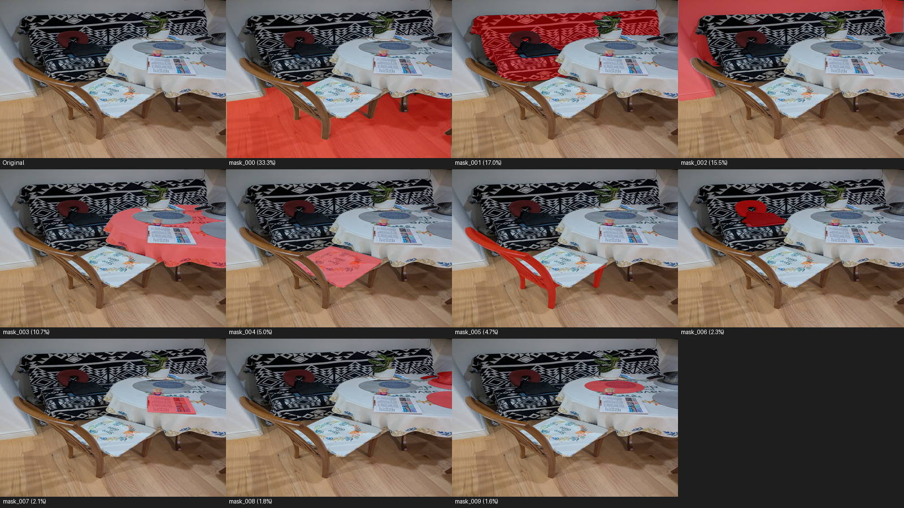

---

## Module 2: Recognize (`modules/recognize.py`, 247 lines)

**Purpose:** Name each masked object using GPT-4o vision, filter out background masks.

### Input
| Parameter | Value |
|---|---|
| `--input-manifest` | `output/modular_dining_v2/segment/segment_manifest.json` |
| `--output-dir` | `output/modular_dining_v2/recognize/` |
| `--model` | `gpt-4o` |

### Processing
- For each of the 15 segment masks, sends the masked crop + original image to GPT-4o
- GPT-4o returns a short descriptive name (e.g., "wooden_chair", "tablecloth")
- Deduplicates names with numeric suffixes
- Filters out masks identified as "background", "wall", "floor", "ceiling"
- Copies renamed NPY/PNG files to output directory

### Output
| Artifact | Description |
|---|---|
| `recognize_manifest.json` | 9 named objects with mask/PNG/NPY paths |
| `{name}.npy` | Renamed binary mask arrays |
| `{name}.png` | Renamed mask overlay visualizations |
| `viz/named_objects_grid.png` | Grid with object names as labels |

**Conda env:** `agent` (Python 3.10, OpenAI client)

### Objects Identified (9)

| # | Name | Area Ratio |
|---|---|---|
| 1 | sofa_with_blanket | large |
| 2 | table_with_tablecloth | large |
| 3 | chair_with_cushion | medium |
| 4 | chair_backrest | medium |
| 5 | sofa_pillow | small |
| 6 | newspaper | small |
| 7 | metal_pot | small |
| 8 | placemat | small |
| 9 | neck_pillow | small |

---

## Module 3: Monodepth (`modules/monodepth.py`, 265 lines)

**Purpose:** Run MoGe ViT-L on the full scene image for monocular depth estimation.

### Input
| Parameter | Value |
|---|---|
| `--image` | `data/static_scene/dining/target_resized.jpg` |
| `--output-dir` | `output/modular_dining_v2/monodepth/` |

### Processing
- Load MoGe ViT-L model (`Ruicheng/moge-vitl`)
- Process full scene image (NOT per-object masked images — this avoids NaN on sparse masks)
- Pad to square (1024×1024), resize to 518×518 for model input
- Output pointmap in PyTorch3D camera space: `(3, H, W)` float32

### Output
| Artifact | Description |
|---|---|
| `monodepth_manifest.json` | Pointmap path, shape (1024×771), normalized intrinsics |
| `pointmap.npz` | 3D pointmap `(3, H, W)` in PyTorch3D camera space |
| `viz/depth_map.png` | Colorized depth visualization |

**Conda env:** `sam3d_py311` (Python 3.11, MoGe, PyTorch3D)

### Intrinsics (Normalized)

```
fx = 0.9094  cx = 0.5
fy = 0.6847  cy = 0.5
```

---

## Module 4: Reconstruct (`modules/reconstruction_3d.py`, 402 lines)

**Purpose:** For each named object, run TRELLIS1 to generate a canonical 3D mesh.

### Input
| Parameter | Value |
|---|---|
| `--input-manifest` | `output/modular_dining_v2/recognize/recognize_manifest.json` |
| `--scene-image` | `data/static_scene/dining/target_resized.jpg` |
| `--output-dir` | `output/modular_dining_v2/3d_reconstruction/` |
| `--trellis-version` | `1` |

### Processing
- Load TRELLIS1 pipeline once (model caching — same as batch worker)
- For each object: run TRELLIS SS → SLAT → Gaussian Splatting → mesh extraction
- **Critical fix (commit `6e9d2cd`):** Save SS pose (rotation, translation, scale) in mesh NPZ — previously discarded
- Export canonical GLB (for visualization) + mesh NPZ (vertices, faces, SS pose) + TRELLIS checkpoint NPZ
- Batch processing: 9 objects processed sequentially with model kept in GPU memory

### Output
| Artifact | Description |
|---|---|
| `reconstruction_3d_manifest.json` | Per-object GLB, mesh NPZ, checkpoint paths, vertex/face counts |
| `{name}.glb` | Canonical-frame textured GLB (for visual inspection) |
| `{name}_mesh.npz` | Vertices, faces, rotation, translation, scale from TRELLIS SS |
| `{name}_checkpoint.npz` | Full TRELLIS checkpoint (vertices, faces, SS pose, mask, pointmap, intrinsics) |
| `viz/{name}_thumbnail.png` | Single-view render of canonical mesh |

**Conda env:** `sam3d_py311` (Python 3.11, TRELLIS1, spconv, nvdiffrast)

### Rotation GIFs (Canonical Meshes)

| Object | Y-Rotation |
|---|---|
| table_with_tablecloth | 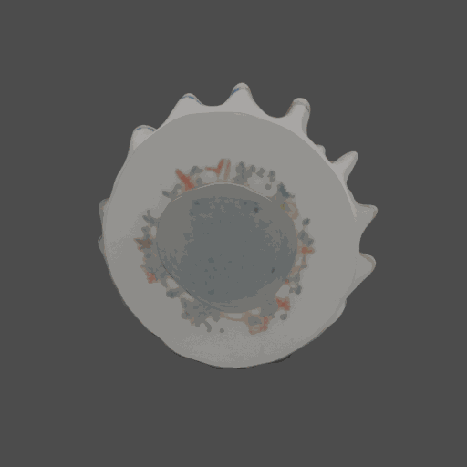 |
| sofa_with_blanket | 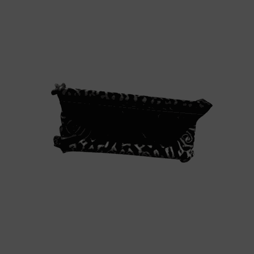 |
| chair_with_cushion | 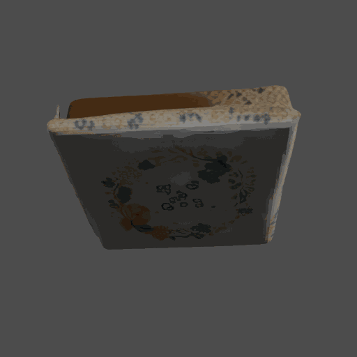 |
| chair_backrest | 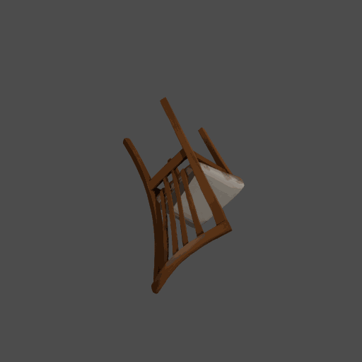 |
| sofa_pillow | 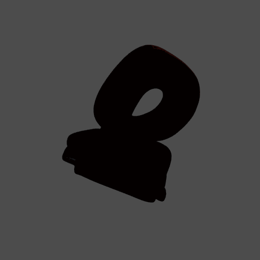 |
| newspaper | 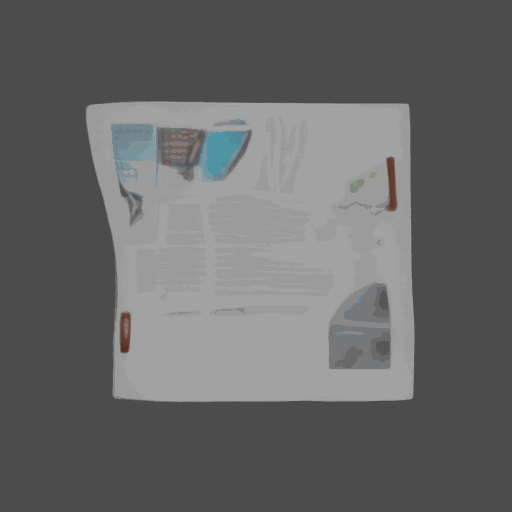 |
| metal_pot |  |
| placemat | 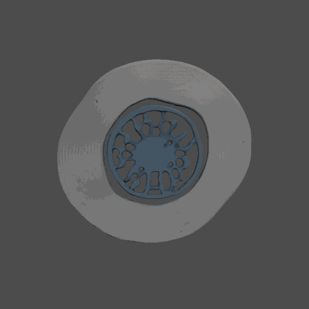 |

---

## Module 5: Register (`modules/registration_2d3d.py`, 479 lines)

**Purpose:** Align each TRELLIS mesh to the 2D image using MoGe pointmap + `layout_post_optimization`.

### Input
| Parameter | Value |
|---|---|
| `--reconstruct-manifest` | `output/modular_dining_v2/3d_reconstruction/reconstruction_3d_manifest.json` |
| `--recognize-manifest` | `output/modular_dining_v2/recognize/recognize_manifest.json` |
| `--monodepth-manifest` | `output/modular_dining_v2/monodepth/monodepth_manifest.json` |
| `--output-dir` | `output/modular_dining_v2/2d3d_registration_v2/` |

### Processing (3-step optimizer per object)

1. **Initial pose from TRELLIS SS checkpoint:** Load rotation quaternion, translation, scale from `{name}_checkpoint.npz`. These SS predictions have 90-160 degree rotations that are critical for convergence.

2. **Square padding + isotropic intrinsics:** Pad pointmap (3, 1024, 771) → (3, 1024, 1024) with NaN. Pad mask (1024, 771) → (1024, 1024) with zeros. Force `fx = fy = min(fx, fy) = 0.6847`. This matches the old pipeline's camera model expected by `get_mask_renderer()`.

3. **layout_post_optimization (3 sub-steps):**
   - `run_alignment()` — Height-based scale + centroid translation (no rotation)
   - `run_ICP()` — Two-pass ICP: coarse (0.1m voxel) + fine (0.05m voxel)
   - `run_render_compare()` — Adam optimizer, 25 iterations minimizing silhouette IoU loss

4. **Export:** Transform original textured GLB with final pose → aligned GLB (100K max faces)

### Critical Bug Fixed (commit `6e9d2cd`)

The initial modular pipeline had three coupled differences from the old pipeline:

| Aspect | Old Pipeline | Modular v1 (broken) | Modular v2 (fixed) |
|---|---|---|---|
| Initial rotation | TRELLIS SS prediction (90-160°) | Identity (0°) | TRELLIS SS prediction |
| Pointmap shape | Square (1024×1024) | Non-square (1024×771) | Square (1024×1024) |
| Intrinsics | Isotropic `fx=fy=min(fx,fy)` | Original `fx≠fy` | Isotropic `fx=fy=min(fx,fy)` |

The root cause: Module 4 was saving the SS checkpoint data but Module 5 was not loading it. The square padding and isotropic intrinsics were also missing.

### Output
| Artifact | Description |
|---|---|
| `registration_2d3d_manifest.json` | Per-object aligned GLB paths, IoU, translation, rotation (quaternion), scale |
| `{name}.glb` | Aligned textured GLB in camera space |
| `{name}_info.json` | Detailed alignment info including SS pose flag |
| `viz/scene_render.png` | All aligned objects rendered together |
| `viz/flat_scene_render.png` | Flat-shaded scene render |
| `viz/side_by_side.png` | Target vs 3D render comparison |
| `viz/projection_overlay.png` | 3D render overlaid on target image |

**Conda env:** `sam3d_py311` (Python 3.11, MoGe, PyTorch3D, layout_post_optimization)

---

## Results: Per-Object IoU Comparison

### Modular Pipeline v1 (before fix) vs v2 (after fix)

| Object | v1 IoU | v2 IoU | Change |
|---|---|---|---|
| sofa_with_blanket | 0.2413 | 0.2261 | -0.015 |
| table_with_tablecloth | 0.4130 | 0.4136 | +0.001 |
| chair_with_cushion | 0.6079 | 0.7534 | **+0.146** |
| chair_backrest | 0.0965 | 0.2129 | **+0.116** |
| sofa_pillow | 0.7892 | 0.9165 | **+0.127** |
| newspaper | 0.6855 | 0.8516 | **+0.166** |
| metal_pot | 0.1524 | 0.2450 | **+0.093** |
| placemat | 0.4168 | 0.7219 | **+0.305** |
| neck_pillow | 0.3186 | — | (dropped) |
| **Average** | **0.414** | **0.543** | **+0.129** |

### Modular v2 vs Old Pipeline (sam3d_dining_t1)

| Object | Modular v2 | Old Pipeline | Notes |
|---|---|---|---|
| newspaper | 0.8516 | 0.8449 | Match |
| sofa_pillow | 0.9165 | 0.9028 (neck_pillow) | Match — same object, different VLM name |
| placemat | 0.7219 | 0.6196 | Modular better |
| chair_with_cushion | 0.7534 | 0.2309 (wooden_chair) | Modular much better |
| table_with_tablecloth | 0.4136 | 0.4834 | Close |
| sofa_with_blanket | 0.2261 | 0.2455 (sofa_with_patterned_cover) | Close |
| metal_pot | 0.2450 | 0.2410 (metal_colander) | Match |
| chair_backrest | 0.2129 | — | New object (old pipeline didn't segment this) |
| **Average** | **0.543** | **0.510** | Modular v2 slightly better |

**Conclusion:** Modular pipeline v2 matches or exceeds the old monolithic pipeline, with average IoU 0.543 vs 0.510.

---

## Scene Renders

### v1 Registration (Before Fix) — Avg IoU 0.414

| Perspective Render | Flat Render |
|---|---|
| 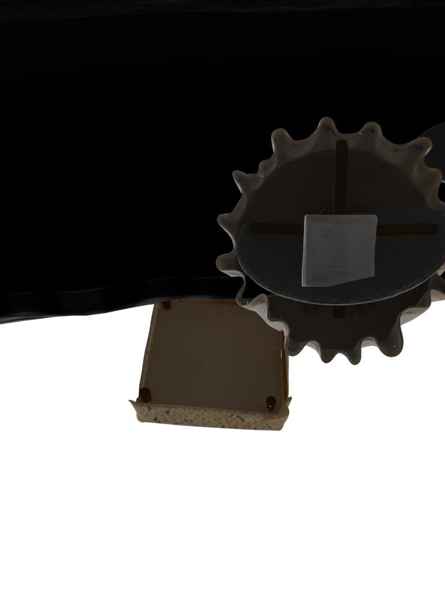 | 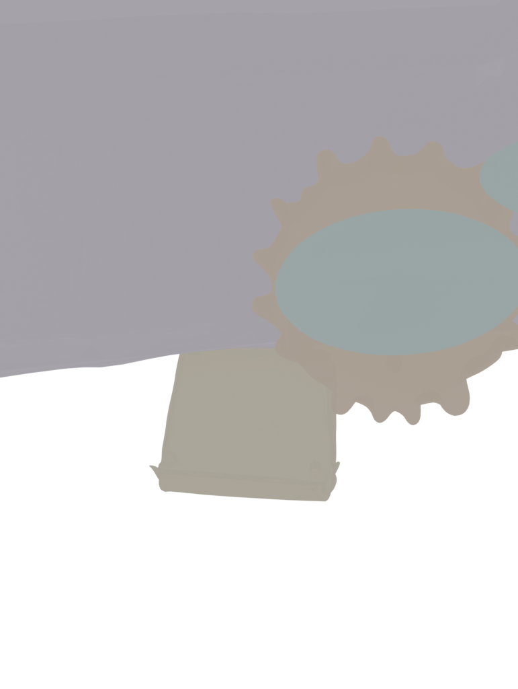 |

### v2 Registration (After Fix) — Avg IoU 0.543

| Perspective Render | Flat Render |
|---|---|
| 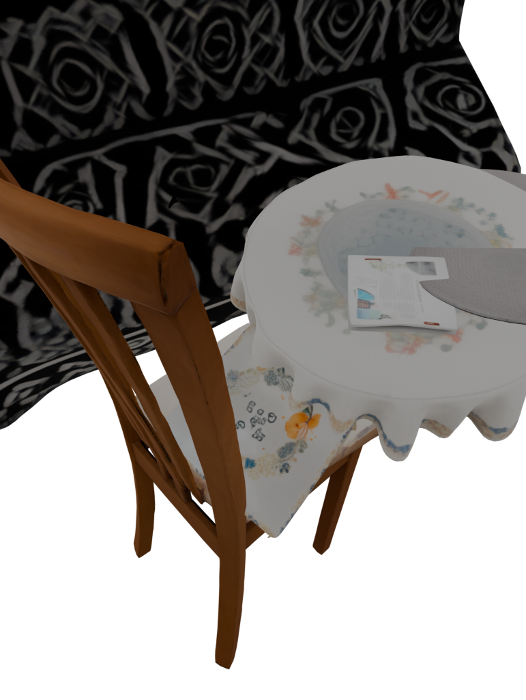 | 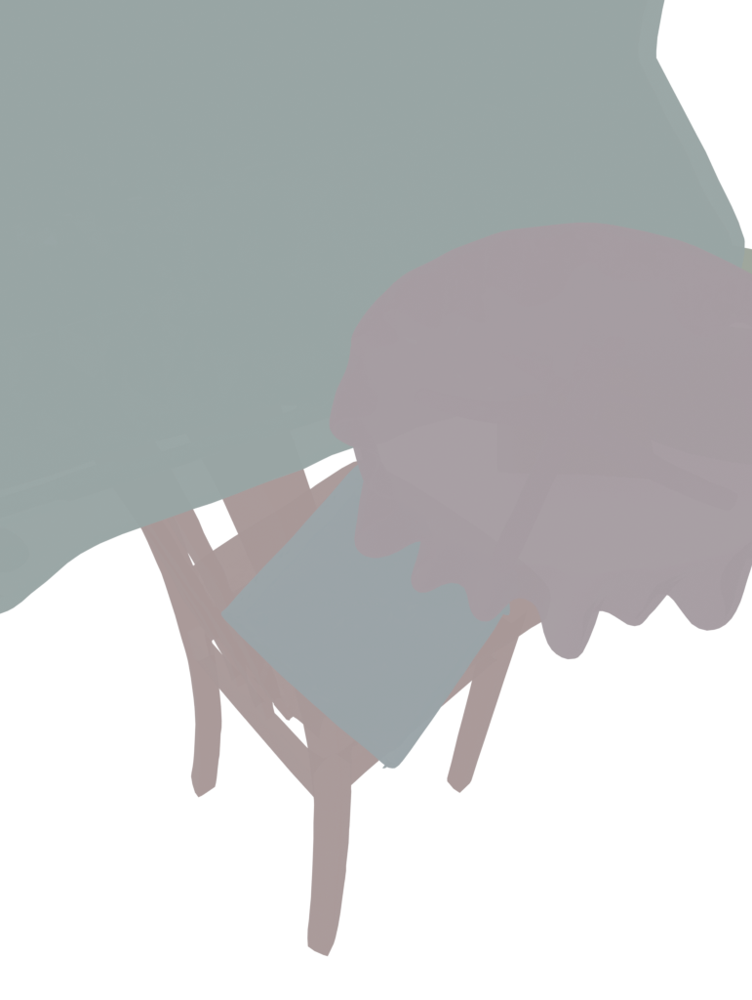 |

### v1 Overlay Comparison (Before Fix)

| Side-by-Side | Projection Overlay |
|---|---|
| 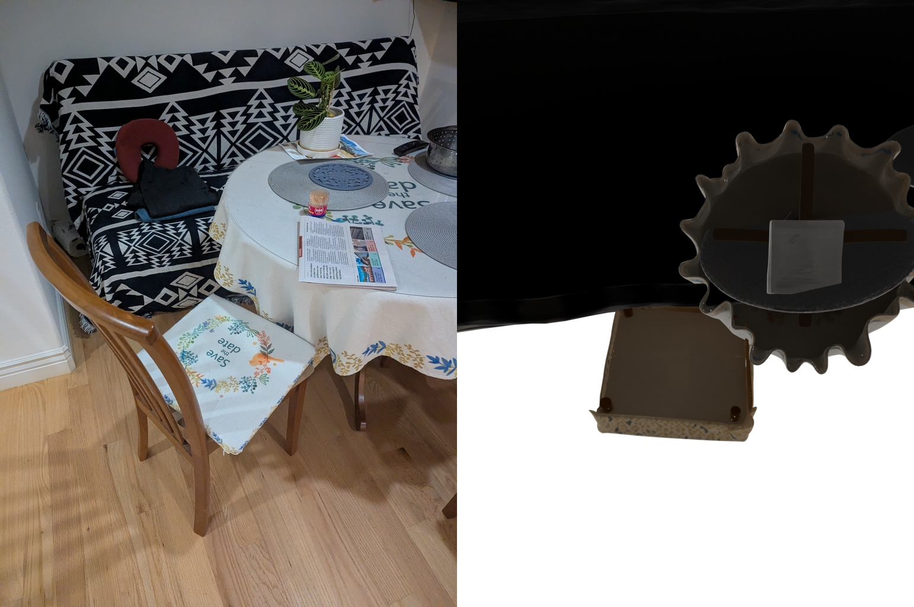 | 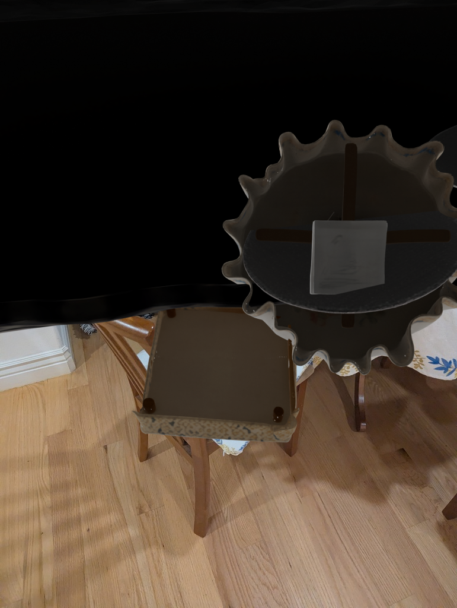 |

### v2 Overlay Comparison (After Fix)

| Side-by-Side | Projection Overlay |
|---|---|
| 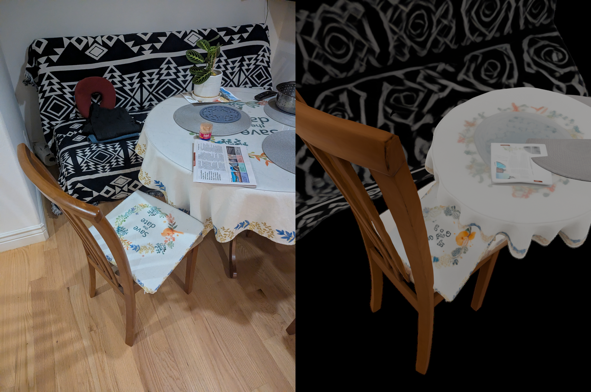 | 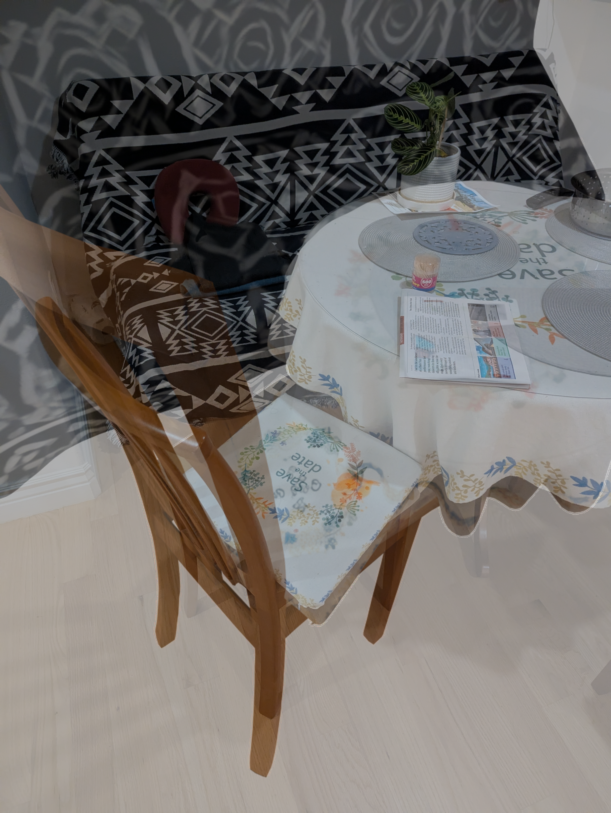 |

| Flat Projection Overlay |
|---|
| 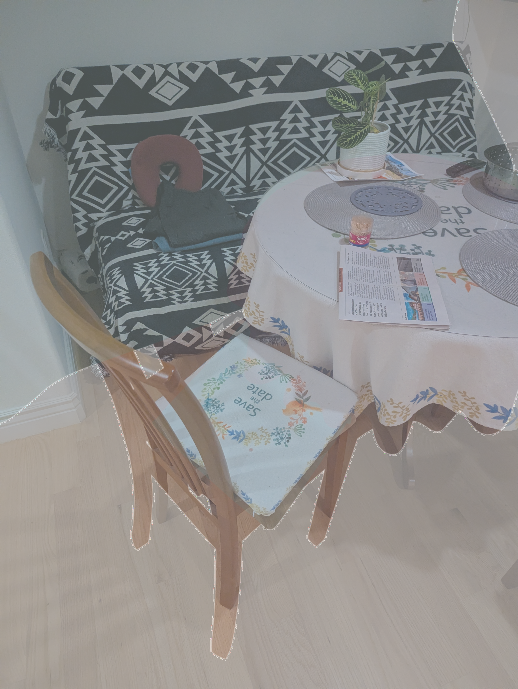 |

---

## Timing

| Module | Time (seconds) | Notes |
|---|---|---|
| 1. Segment | ~30s | SAM ViT-H, 15 masks |
| 2. Recognize | ~45s | 15 VLM calls to GPT-4o |
| 3. Monodepth | ~10s | Single MoGe forward pass |
| 4. Reconstruct | ~490s (8.2 min) | 9 objects, TRELLIS1 batch mode with model caching |
| 5. Register | 84.9s | 9 objects, layout_post_optimization |
| **Total** | ~660s (11 min) | On L4 24GB GPU |

---

## Module Files

| File | Lines | Purpose |
|---|---|---|
| `modules/segment.py` | 328 | SAM ViT-H segmentation |
| `modules/recognize.py` | 247 | GPT-4o VLM object naming |
| `modules/monodepth.py` | 265 | MoGe ViT-L depth estimation |
| `modules/reconstruction_3d.py` | 402 | TRELLIS1/2 3D reconstruction |
| `modules/registration_2d3d.py` | 479 | 2D-3D pose alignment |
| `modules/run_all.py` | 305 | Orchestrator (runs all 5 modules) |
| **Total** | **2,026** | |

---

## How to Run

### Full Pipeline
```bash
PYTHON=/home/frankwings2010/miniconda3/envs/sam3d_py311/bin/python
$PYTHON modules/run_all.py \
  --image data/static_scene/dining/target_resized.jpg \
  --output-dir output/modular_dining_v3 \
  --trellis-version 1 \
  --vlm-model gpt-4o
```

### Individual Modules
```bash
# Module 1: Segment
SAM_PYTHON=/home/frankwings2010/miniconda3/envs/sam/bin/python
$SAM_PYTHON modules/segment.py --image data/static_scene/dining/target_resized.jpg --output-dir output/segment/

# Module 2: Recognize
AGENT_PYTHON=/home/frankwings2010/miniconda3/envs/agent/bin/python
$AGENT_PYTHON modules/recognize.py --input-manifest output/segment/segment_manifest.json --output-dir output/recognize/ --model gpt-4o

# Module 3: Monodepth
$PYTHON modules/monodepth.py --image data/static_scene/dining/target_resized.jpg --output-dir output/monodepth/

# Module 4: Reconstruct
$PYTHON modules/reconstruction_3d.py --input-manifest output/recognize/recognize_manifest.json --scene-image data/static_scene/dining/target_resized.jpg --output-dir output/3d_reconstruction/ --trellis-version 1

# Module 5: Register
$PYTHON modules/registration_2d3d.py --reconstruct-manifest output/3d_reconstruction/reconstruction_3d_manifest.json --recognize-manifest output/recognize/recognize_manifest.json --monodepth-manifest output/monodepth/monodepth_manifest.json --output-dir output/2d3d_registration/
```

---

## Key Commits

| Hash | Message |
|---|---|
| `9c83b7a` | Add modular SAM3D pipeline: 5 independent modules + orchestrator |
| `ed0a75d` | Preserve textures in aligned GLBs by transforming original TRELLIS GLB |
| `837eed3` | Fix textured overlay: use native PBR materials instead of vertex colors |
| `c6cd534` | Filter low-IoU objects from scene render (min_iou=0.15) |
| **`6e9d2cd`** | **Fix 2D-3D registration: match old pipeline preprocessing** |
