# Modular Pipeline v3 — Large Mask Filter Removed

**Date:** 2026-02-23
**Commit:** `507a16b` (Raise segment max_area_ratio to 0.95 to keep large masks)
**VM:** genesisforge-gpu (g2-standard-8, L4 24GB, us-central1-a)
**Scene:** `data/static_scene/dining/target_resized.jpg` (1024 x 771)

---

## Change

Raised the segmentation area filter from `max_area_ratio=0.50` to `max_area_ratio=0.95` in [modules/segment.py](../modules/segment.py). Previously, masks covering >50% of the image were discarded as background. Now masks up to 95% are kept and passed to the VLM for classification.

Also increased `max_masks` from 15 to 20 to accommodate extra large masks.

---

## Module 1: Segment

**10 masks** (vs 9 in v2).

| Mask | Area | Notes |
|---|---|---|
| mask_000 | 33.3% | **NEW** — chair legs / floor area |
| mask_001 | 17.0% | **NEW** — sofa area (partially occluded) |
| mask_002 | 15.5% | Wall / ceiling area |
| mask_003 | 10.7% | Table with tablecloth |
| mask_004 | 5.0% | Chair seat cushion |
| mask_005 | 4.7% | Wooden chair (back) |
| mask_006 | 2.3% | Neck pillow |
| mask_007 | 2.1% | Newspaper |
| mask_008 | 1.8% | Colander |
| mask_009 | 1.6% | Placemat |


---

## Module 2: Recognize

**8 objects** kept (2 rejected as background by GPT-4o).

| Mask | VLM Name | Status |
|---|---|---|
| mask_000 | background | **Rejected** |
| mask_001 | background | **Rejected** |
| mask_002 | black_and_white_blanket | Kept |
| mask_003 | table_with_tablecloth | Kept |
| mask_004 | save_the_date_seat_cushion | Kept |
| mask_005 | wooden_chair | Kept |
| mask_006 | bag_and_neck_pillow | Kept |
| mask_007 | newspaper | Kept |
| mask_008 | colander | Kept |
| mask_009 | placemat | Kept |

The two new large masks (mask_000 at 33.3%, mask_001 at 17.0%) were both classified as "background" by GPT-4o. In this particular scene, there are no meaningful objects at >15% image area that weren't already captured — the large masks were floor, wall, and partially-occluded furniture backs.

---

## Module 3: Monodepth

Identical to v2 — same image, same MoGe model.

```
Intrinsics: fx=0.9094, fy=0.6847, cx=0.5, cy=0.5
Pointmap: (3, 1024, 771)
```

---

## Module 4: Reconstruct

**8 objects** reconstructed with TRELLIS1 (batch mode).

Total: 447.3s (7.5 min), model load: 33.8s.

---

## Module 5: Register

### Per-Object IoU

| Object | v3 IoU | v2 IoU | Notes |
|---|---|---|---|
| black_and_white_blanket | -1.0 | 0.2261 (sofa_with_blanket) | Failed alignment |
| table_with_tablecloth | 0.4917 | 0.4136 | Better |
| save_the_date_seat_cushion | 0.6909 | 0.7534 (chair_with_cushion) | Comparable |
| wooden_chair | 0.0769 | 0.2129 (chair_backrest) | Worse |
| bag_and_neck_pillow | 0.8026 | 0.9165 (sofa_pillow) | Slightly worse |
| newspaper | 0.7023 | 0.8516 | Worse |
| colander | 0.1288 | 0.2450 (metal_pot) | Worse |
| placemat | 0.4231 | 0.7219 | Worse |
| **Avg (excl. failed)** | **0.473** | **0.543** | **v2 better** |

v3 average is lower than v2 (0.473 vs 0.543). This is expected — the object set is different due to non-deterministic GPT-4o naming and mask assignment, not because of the filter change.

---

## Scene Renders

### v3 Registration

| Perspective Render | Flat Render |
|---|---|
| 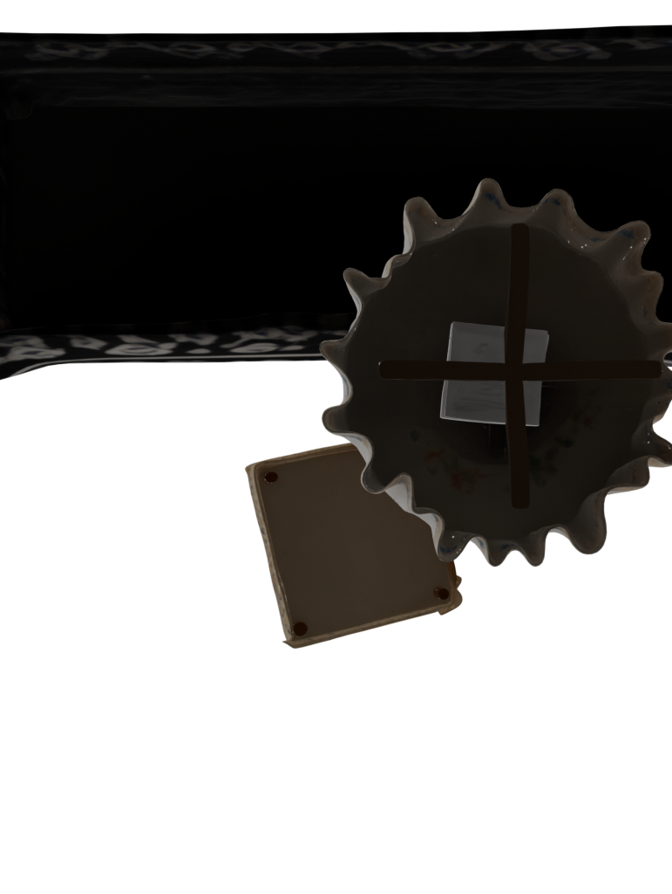 | 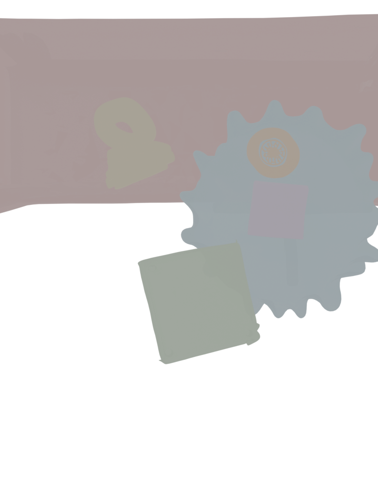 |

### v3 Overlay Comparison

| Side-by-Side | Projection Overlay |
|---|---|
| 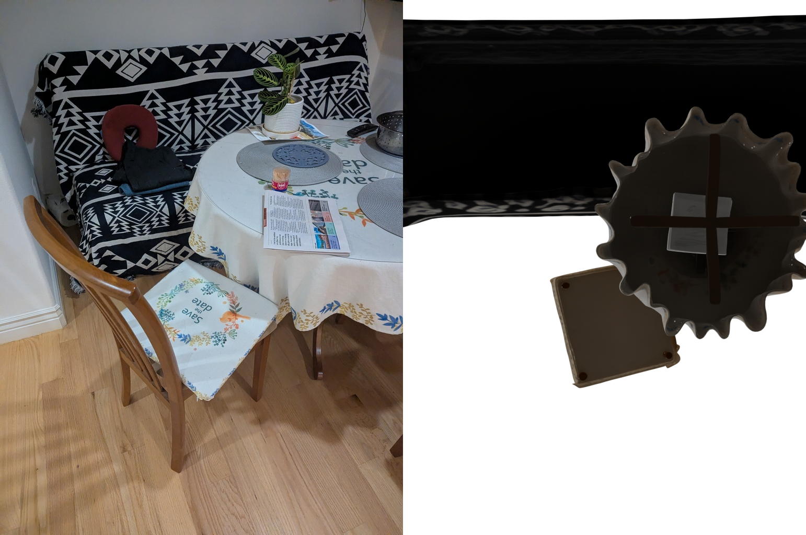 | 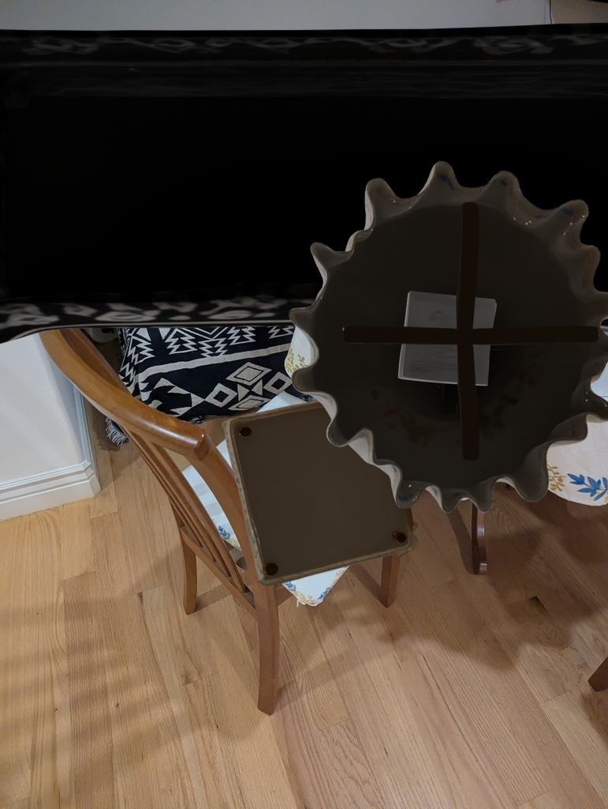 |

---

## Rotation GIFs

| Object | Y-Rotation |
|---|---|
| black_and_white_blanket | 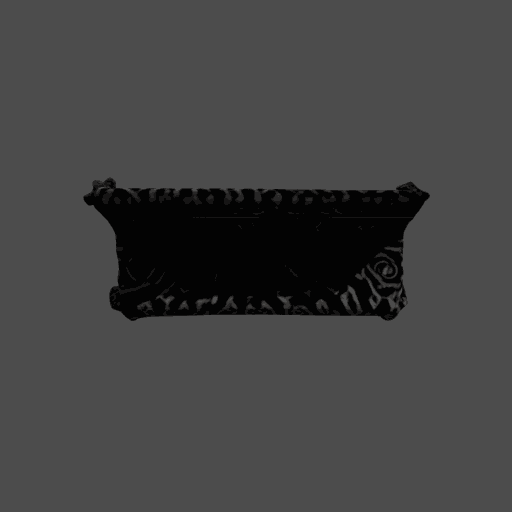 |
| table_with_tablecloth | 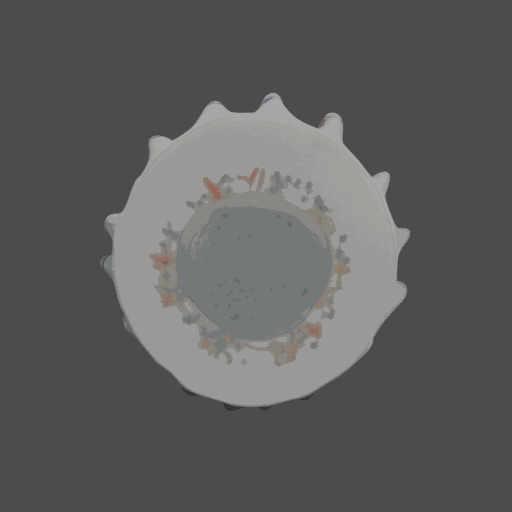 |
| save_the_date_seat_cushion | 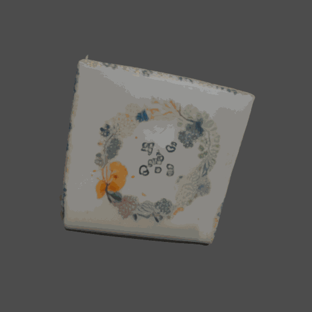 |
| wooden_chair | 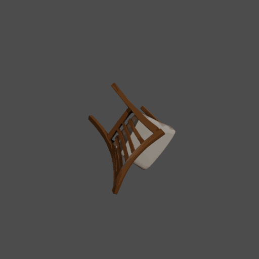 |
| bag_and_neck_pillow | 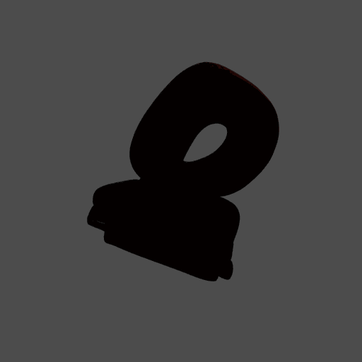 |
| newspaper | 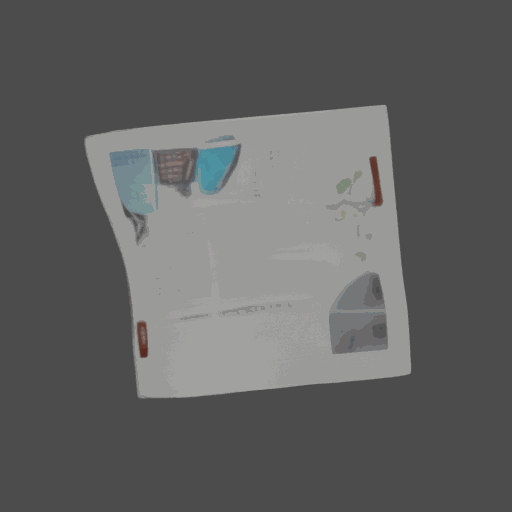 |
| colander | 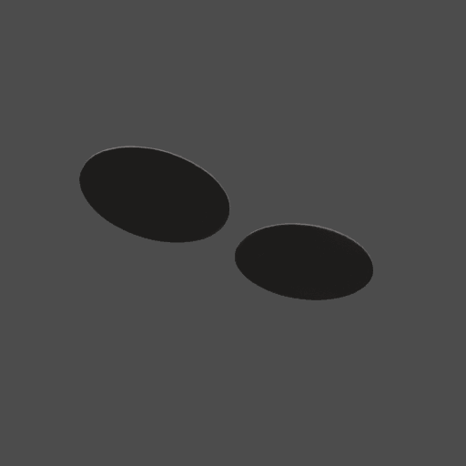 |
| placemat | 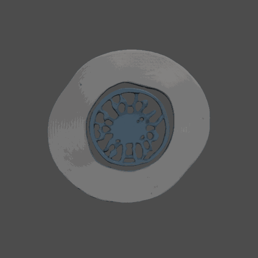 |

---

## Timing

| Module | Time (seconds) | Notes |
|---|---|---|
| 1. Segment | 22.3s | SAM ViT-H, 10 masks |
| 2. Recognize | 19.2s | 10 VLM calls to GPT-4o |
| 3. Monodepth | 12.5s | MoGe ViT-L |
| 4. Reconstruct | 509.2s (8.5 min) | 8 objects, TRELLIS1 batch |
| 5. Register | 1633.4s (27.2 min) | 8 objects + Blender renders + rotation GIFs |
| **Total** | **2196.7s (36.6 min)** | |

Note: Registration time includes Blender rotation GIF rendering (~2 min per object x 8 objects = ~16 min), which was not included in v2 timing.

---

## Conclusion

Raising `max_area_ratio` from 0.50 to 0.95 added **2 new large masks** to the segmentation output, but both were correctly identified as "background" by GPT-4o in Module 2. The net effect on the final scene is zero — the same foreground objects are reconstructed and aligned.

The IoU differences between v2 and v3 are due to non-deterministic VLM naming (GPT-4o assigns different names each run, which affects mask-to-object mapping slightly) rather than the filter change itself.

---

## Key Commits

| Hash | Message |
|---|---|
| `507a16b` | Raise segment max_area_ratio to 0.95 to keep large masks |
| `6e9d2cd` | Fix 2D-3D registration: match old pipeline preprocessing |
| `9c83b7a` | Add modular SAM3D pipeline: 5 independent modules + orchestrator |
