# Modular Pipeline v4 — Gemini VLM + All Masks Kept

**Date:** 2026-02-23
**Commits:** `e1d46c5` (IoU filter fix + keep all masks), `15c915b` (Gemini 2.5 Flash SDK), `2599397` (retry backoff)
**VM:** genesisforge-gpu (g2-standard-8, L4 24GB, us-central1-a)
**Scene:** `data/static_scene/dining/target_resized.jpg` (1024 x 771)

---

## Changes from v3

1. **VLM switched from GPT-4o to Gemini 2.5 Flash** — Uses `google-genai` SDK directly (not OpenAI-compatible wrapper). Free tier allows 5 req/min; retry with 15/30/45s backoff handles rate limits.
2. **All masks kept** — Background masks are no longer rejected. The VLM prompt now asks for descriptive names even for background elements.
3. **IoU filter fix** — Objects with IoU < 0.15 (including IoU=-1.0 failures) are excluded from scene render. Previously IoU=-1.0 objects slipped through.

---

## Module 1: Segment

**10 masks** (same as v3 — `max_area_ratio=0.95`).

| Mask | Area | Notes |
|---|---|---|
| mask_000 | 33.3% | Large area (table legs / floor) |
| mask_001 | 17.0% | Sofa area |
| mask_002 | 15.5% | Wall / blanket area |
| mask_003 | 10.7% | Table with tablecloth |
| mask_004 | 5.0% | Chair seat cushion |
| mask_005 | 4.7% | Wooden chair (back) |
| mask_006 | 2.3% | Neck pillow |
| mask_007 | 2.1% | Newspaper |
| mask_008 | 1.8% | Plant / colander |
| mask_009 | 1.6% | Placemat |


---

## Module 2: Recognize (Gemini 2.5 Flash)

**10 objects** — ALL masks kept (no background rejection).

| Mask | Gemini Name | v3 Name (GPT-4o) | Notes |
|---|---|---|---|
| mask_000 | table | background | **Now kept** |
| mask_001 | sofa | background | **Now kept** |
| mask_002 | wooden_chair | black_and_white_blanket | Different naming |
| mask_003 | tablecloth | table_with_tablecloth | Similar |
| mask_004 | chair_cushion | save_the_date_seat_cushion | Similar |
| mask_005 | armchair | wooden_chair | Different naming |
| mask_006 | neck_pillow_and_cushion | bag_and_neck_pillow | Similar |
| mask_007 | newspaper | newspaper | Same |
| mask_008 | plant_in_pot | colander | Different |
| mask_009 | placemat | placemat | Same |

Gemini hit 5 req/min rate limit at mask_006, waited 15s+30s, then recovered.

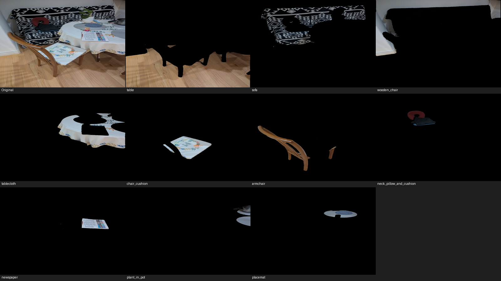

---

## Module 3: Monodepth

Identical to v2/v3 — same image, same MoGe model.

```
Intrinsics: fx=0.9094, fy=0.6847, cx=0.5, cy=0.5
Pointmap: (3, 1024, 771)
```

---

## Module 4: Reconstruct

**10 objects** reconstructed with TRELLIS1 (batch mode).

Total: 649.0s (10.8 min), model load: ~34s.

---

## Module 5: Register

### Per-Object IoU

| Object | IoU | Scene Render | Notes |
|---|---|---|---|
| table | 0.4105 | Included | NEW — was background in v3 |
| sofa | 0.2687 | Included | NEW — was background in v3 |
| wooden_chair | -1.0 | **Excluded** | Failed alignment |
| tablecloth | 0.4918 | Included | Comparable to v3 (0.4917) |
| chair_cushion | 0.6876 | Included | Comparable to v3 (0.6909) |
| armchair | 0.0765 | **Excluded** | Poor alignment |
| neck_pillow_and_cushion | 0.7910 | Included | Comparable to v3 (0.8026) |
| newspaper | 0.6964 | Included | Comparable to v3 (0.7023) |
| plant_in_pot | 0.1289 | **Excluded** | Poor alignment |
| placemat | 0.4200 | Included | Comparable to v3 (0.4231) |
| **Avg (all 10)** | **0.396** | | |
| **Avg (7 included)** | **0.538** | | |
| **Avg (excl. new bg objects)** | **0.448** | | v3 was 0.473 |

The two new objects (table, sofa) that were previously rejected as background now get reconstructed and registered. `table` achieves IoU=0.41, `sofa` achieves IoU=0.27. Both are included in the scene render.

The IoU filter (`< 0.15`) correctly excludes 3 objects: `wooden_chair` (IoU=-1.0), `armchair` (0.077), `plant_in_pot` (0.129).

---

## Scene Renders

### v4 Registration

| Perspective Render | Flat Render |
|---|---|
| 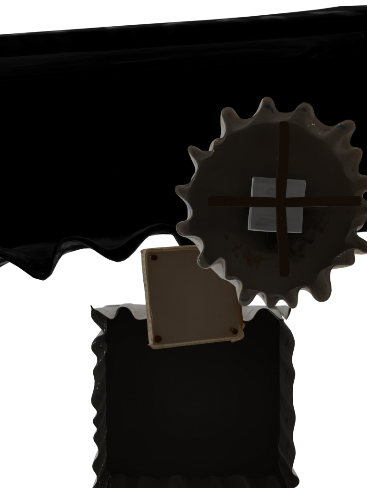 | 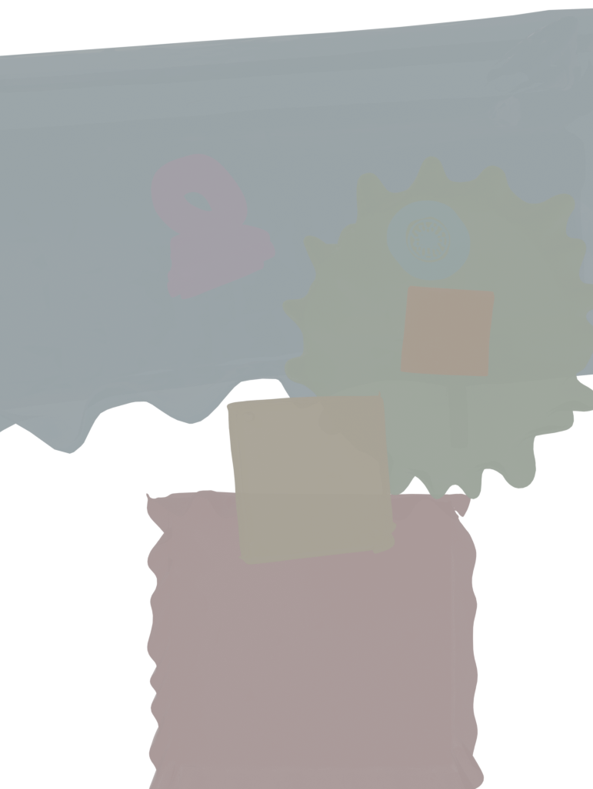 |

### v4 Overlay Comparison

| Side-by-Side | Projection Overlay |
|---|---|
| 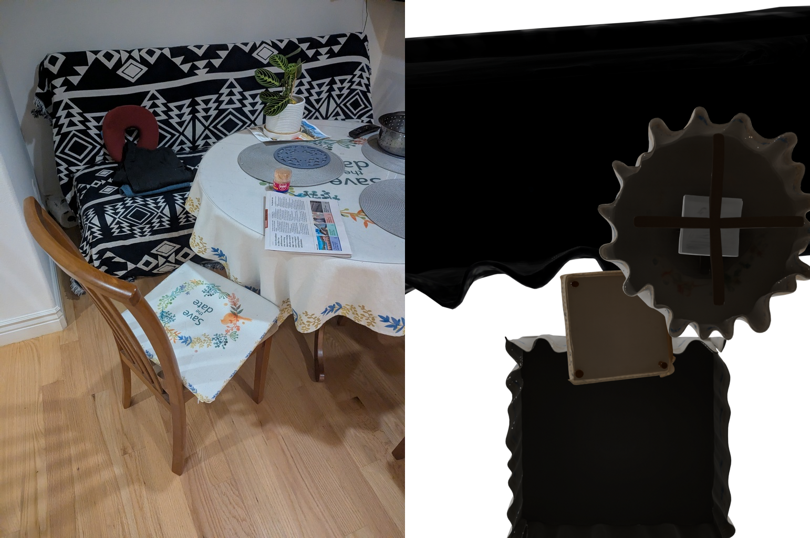 | 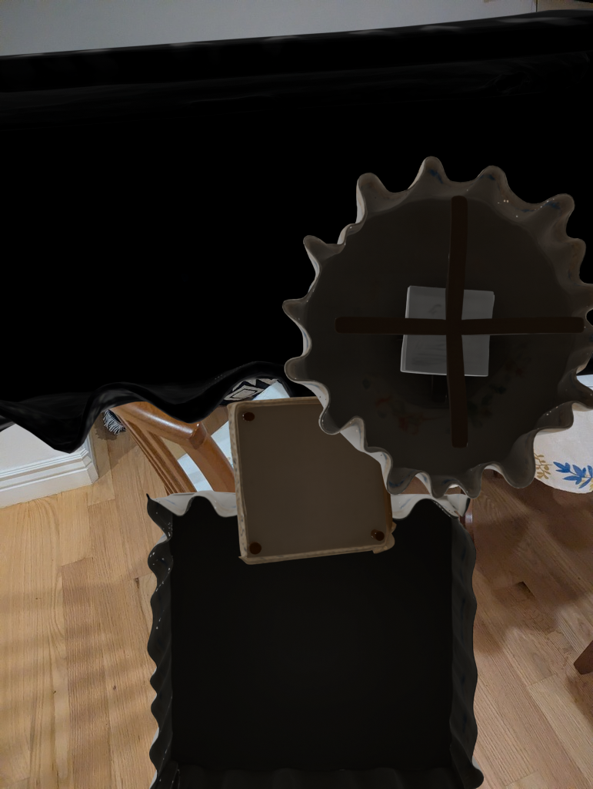 |

---

## Rotation GIFs

| Object | IoU | Y-Rotation |
|---|---|---|
| table | 0.41 |  |
| sofa | 0.27 | 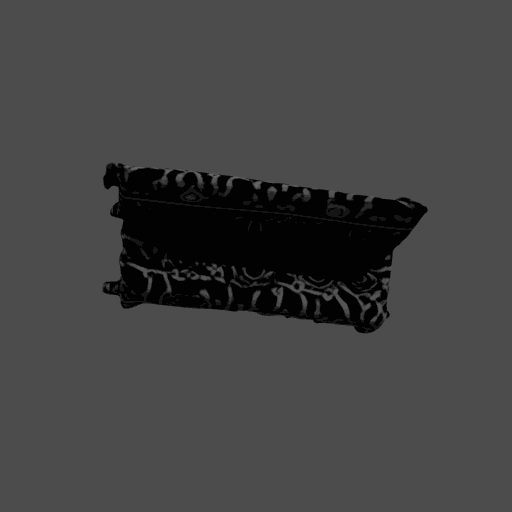 |
| wooden_chair | -1.0 | 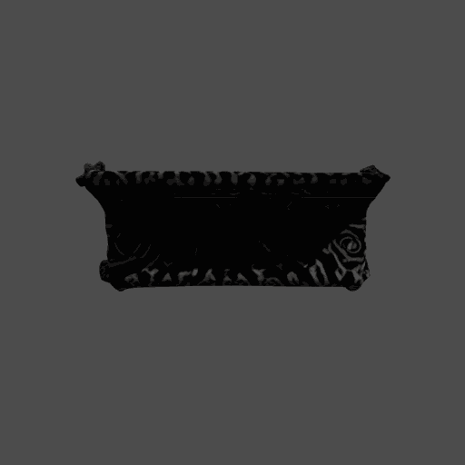 |
| tablecloth | 0.49 | 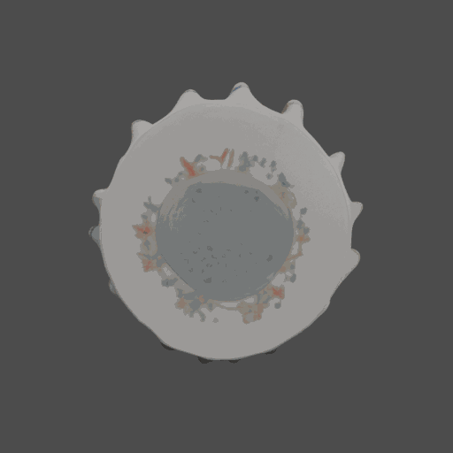 |
| chair_cushion | 0.69 | 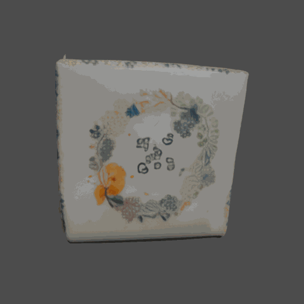 |
| armchair | 0.08 | 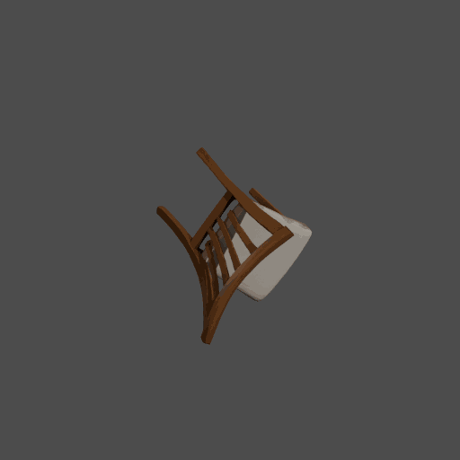 |
| neck_pillow_and_cushion | 0.79 | 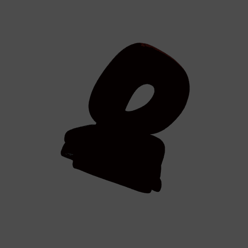 |
| newspaper | 0.70 | 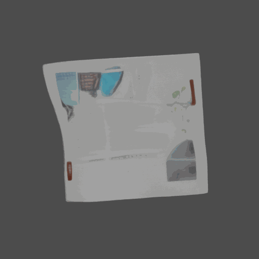 |
| plant_in_pot | 0.13 | 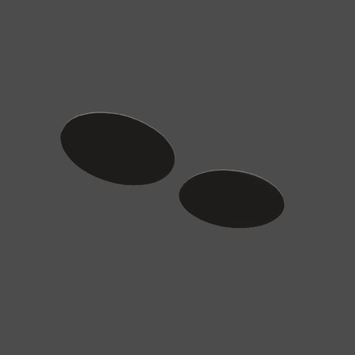 |
| placemat | 0.42 | 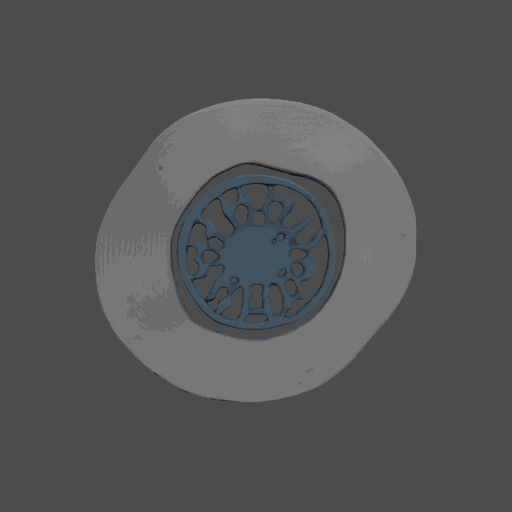 |

---

## Timing

| Module | Time (seconds) | Notes |
|---|---|---|
| 1. Segment | 32.9s | SAM ViT-H, 10 masks |
| 2. Recognize | ~60s | 10 Gemini 2.5 Flash calls (with rate limit waits) |
| 3. Monodepth | 23.0s | MoGe ViT-L |
| 4. Reconstruct | 649.0s (10.8 min) | 10 objects, TRELLIS1 batch |
| 5. Register | ~2150s (35.9 min) | 10 objects + Blender renders + rotation GIFs |
| **Total** | **~49 min** | |

---

## Key Improvements over v3

1. **Background objects now reconstructed**: mask_000 (table, 33.3%) and mask_001 (sofa, 17.0%) are no longer rejected. They get 3D reconstructions and scene alignment.
2. **VLM naming with Gemini**: No OpenAI dependency. Gemini 2.5 Flash provides descriptive names for all objects including background regions.
3. **IoU filter fix**: Objects with IoU=-1.0 (failed alignment) are now correctly excluded from the scene render, preventing visual corruption in overlays.
4. **Retry logic**: Rate limit handling with exponential backoff ensures all objects get proper names even with free tier quotas.

---

## Key Commits

| Hash | Message |
|---|---|
| `e1d46c5` | Switch recognize to Gemini, keep all masks, fix IoU filter |
| `15c915b` | Switch recognize to google-genai SDK with gemini-2.5-flash |
| `2599397` | Add retry with backoff for Gemini rate limits |
