# TRELLIS2 vs SAM3D — Dining Scene Comparison

**Date:** 2026-02-24
**Hardware:** GCP g2-standard-8, NVIDIA L4 24GB, us-central1-a
**Input:** `data/static_scene/dining/target_resized.jpg` (771 x 1024)

---

## 1. Input Image


---

## 2. Pipeline Summary

| | SAM3D | TRELLIS2 |
|:---|:---|:---|
| **Model** | TRELLIS 500M (Structured Latent) | TRELLIS.2 4B (O-Voxel) |
| **Segmentation** | SAM ViT-H (automatic) | SAM ViT-H (automatic) |
| **Objects detected** | 8 | 8 |
| **Depth estimation** | MoGe ViT-L (scene-level) | MoGe ViT-L (scene-level) |
| **Pose alignment** | ICP + gradient optimization | ICP + multi-start Y-rotation (4x) |
| **SS pose prior** | Yes (MoT sparse structure) | No (feed-forward only) |
| **GLB format** | Vertex colors (baked) | Vertex colors (from O-Voxel remesh) |
| **Reconstruction time** | 515.2s (8.6 min) | 804.6s (13.4 min) |
| **Pose alignment time** | included above | 381.6s (6.4 min) |
| **SAM segmentation** | 52.7s | reused from SAM3D run |
| **Total time** | 567.9s (9.5 min) | ~1186s (19.8 min) |
| **Avg IoU** | **0.53** | **0.23** |

**SAM3D achieves 2.3x better alignment (IoU) in half the time.**

---

## 3. Per-Object IoU Comparison

### TRELLIS2 Objects (sorted by IoU)

| # | Object | IoU | GLB Size | Rotation GIF |
|:---:|:---|:---:|:---:|:---:|
| 1 | pillow_and_blanket | **0.58** | 57.6 MB | 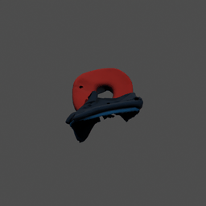 |
| 2 | sofa_cover | **0.40** | 81.2 MB | 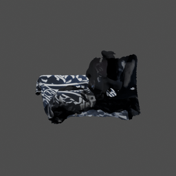 |
| 3 | chair | **0.24** | 27.7 MB | 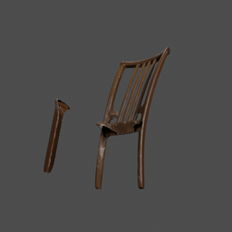 |
| 4 | tablecloth | **0.20** | 24.0 MB | 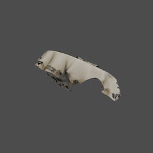 |
| 5 | newspaper | **0.15** | 19.4 MB | 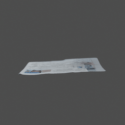 |
| 6 | chair_cover | **0.10** | 40.2 MB | 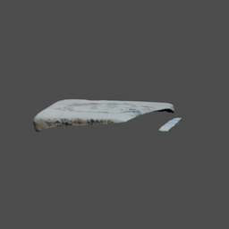 |
| 7 | plant | **0.09** | 42.4 MB | 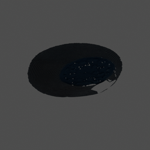 |
| 8 | pot_and_trivet | **0.08** | 18.4 MB | 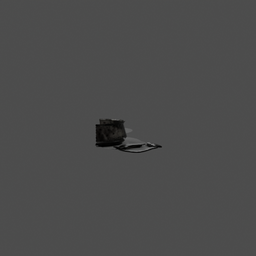 |

### SAM3D Objects (sorted by IoU)

| # | Object | IoU | GLB Size | Y-Rotation | X-Rotation |
|:---:|:---|:---:|:---:|:---:|:---:|
| 1 | neck_pillow | **0.90** | 1.2 MB | 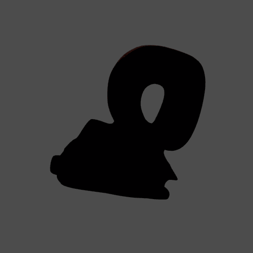 |  |
| 2 | newspaper | **0.84** | 1.4 MB | 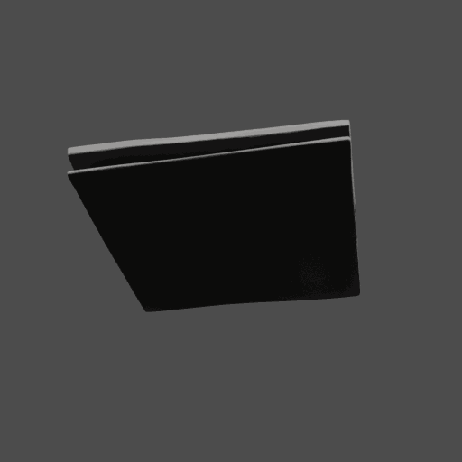 |  |
| 3 | broken_tile | **0.72** | 1.4 MB | 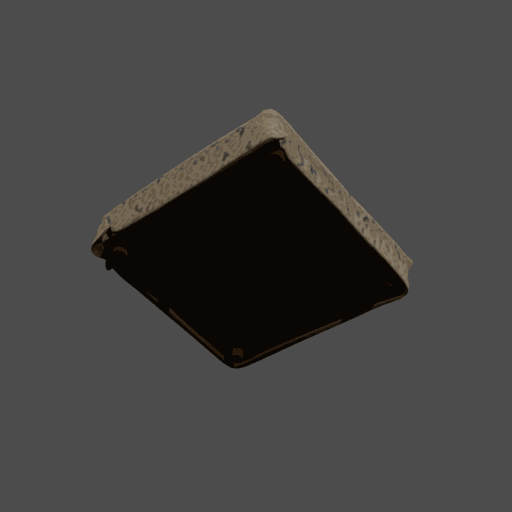 |  |
| 4 | placemat | **0.62** | 1.4 MB | 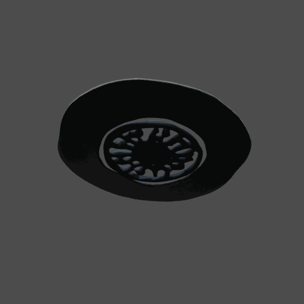 |  |
| 5 | table_with_flower_tablecloth | **0.48** | 1.6 MB | 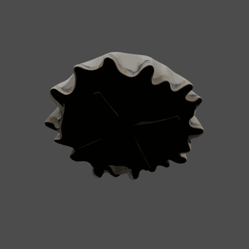 |  |
| 6 | sofa_with_patterned_cover | **0.25** | 1.7 MB | 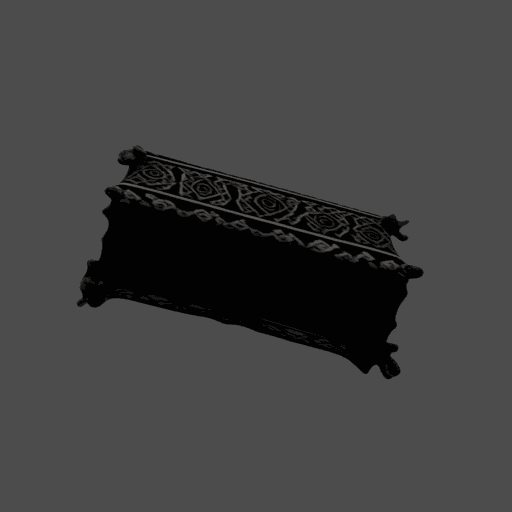 |  |
| 7 | metal_colander | **0.24** | 1.2 MB | 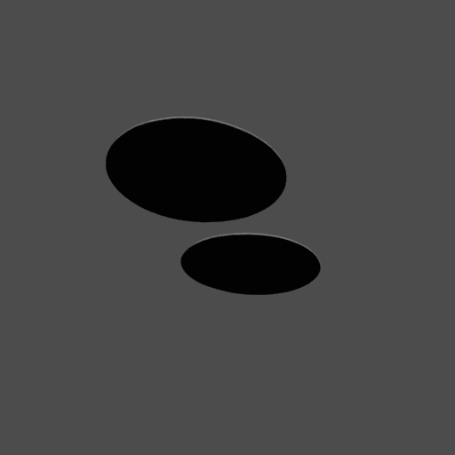 |  |
| 8 | wooden_chair | **0.23** | 1.2 MB | 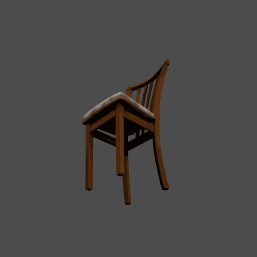 |  |

### Comparable Object Pairs

Where the same physical object was segmented by both runs, direct comparison:

| Physical Object | SAM3D Name (IoU) | T2 Name (IoU) | Delta |
|:---|:---|:---|:---:|
| Patterned sofa | sofa_with_patterned_cover (0.25) | sofa_cover (0.40) | **T2 +0.15** |
| Table with cloth | table_with_flower_tablecloth (0.48) | tablecloth (0.20) | SAM3D +0.28 |
| Wooden chair | wooden_chair (0.23) | chair (0.24) | ~tied |
| Newspaper | newspaper (0.84) | newspaper (0.15) | SAM3D +0.69 |

**Only the sofa improved with TRELLIS2.** The newspaper shows the largest regression — SAM3D achieved 0.84 IoU vs T2's 0.15.

---

## 4. Segmentation Masks

### TRELLIS2 Mask Grid

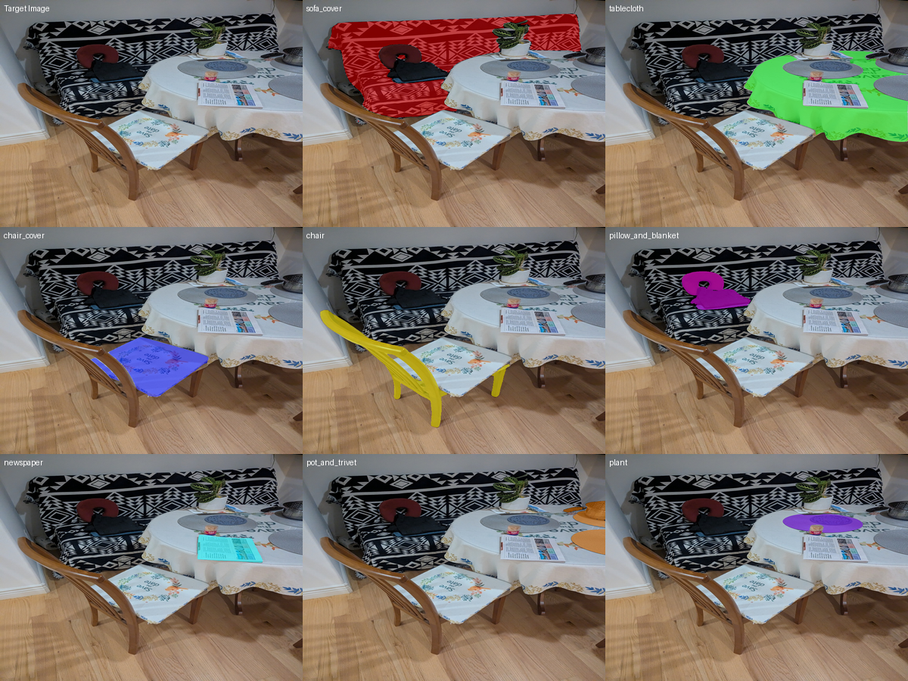

### SAM3D Mask Grid

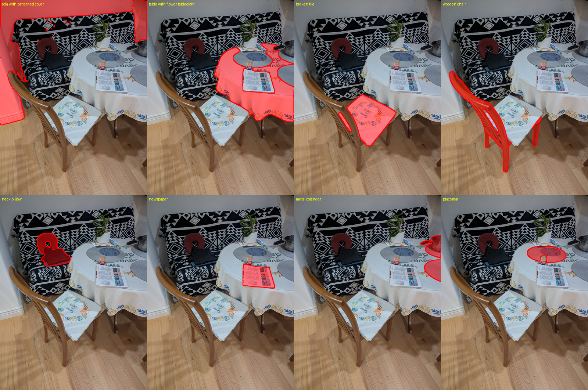

**Note:** Different SAM runs produced different object decompositions. TRELLIS2 segmented: sofa_cover, tablecloth, chair_cover, chair, pillow_and_blanket, newspaper, pot_and_trivet, plant. SAM3D segmented: sofa_with_patterned_cover, table_with_flower_tablecloth, broken_tile, wooden_chair, neck_pillow, newspaper, metal_colander, placemat.

---

## 5. Full Scene Comparison

### TRELLIS2 Scene Render

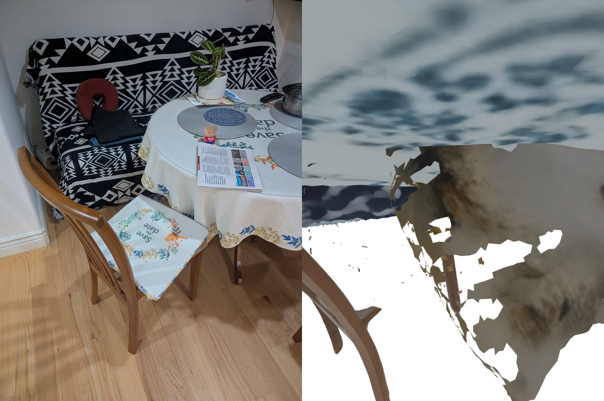

**Left:** Original target (mirrored for camera match) | **Right:** TRELLIS2 3D render

### TRELLIS2 Scene Overlay

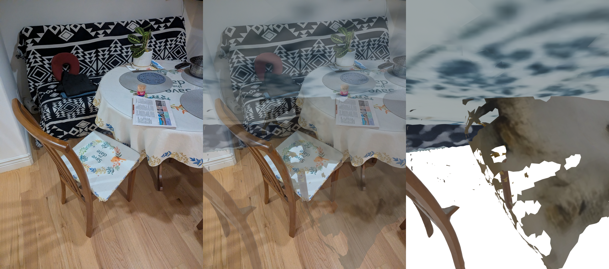

**Left:** Target | **Center:** 50% overlay blend | **Right:** 3D render only

### SAM3D Scene Render

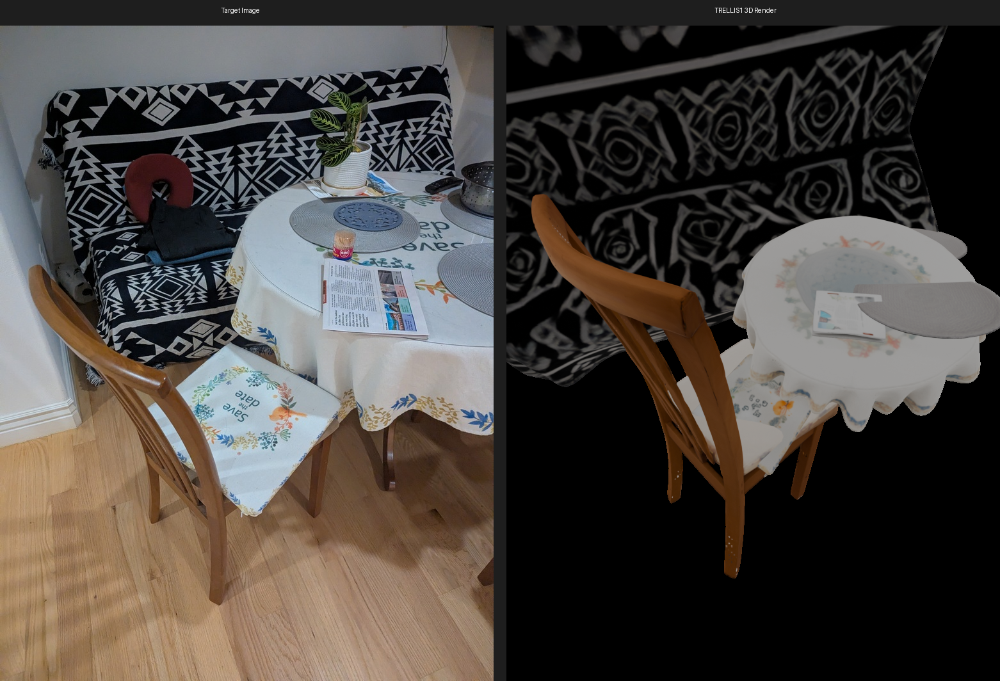

**Left:** Original target | **Right:** SAM3D 3D render with MoGe camera alignment

---

## 6. TRELLIS2 Per-Object Timing

| Object | Inference | GLB Export | Total |
|:---|:---:|:---:|:---:|
| sofa_cover | 117.8s | 22.5s | 140.6s |
| chair_cover | 70.8s | 60.3s | 131.2s |
| tablecloth | 96.9s | 15.3s | 112.2s |
| pot_and_trivet | 73.4s | 21.6s | 95.0s |
| plant | 37.5s | 58.3s | 95.9s |
| newspaper | 27.3s | 64.6s | 91.9s |
| pillow_and_blanket | 51.9s | 18.3s | 70.3s |
| chair | 49.3s | 17.9s | 67.3s |
| **Model loading** | | | **169.4s** |
| **Total** | | | **804.6s** |

---

## 7. GLB Texture Analysis

| Property | SAM3D | TRELLIS2 |
|:---|:---|:---|
| Visual type | Vertex colors (baked) | Vertex colors (from O-Voxel remesh) |
| UV textures | No (SAM3D bakes to vertices) | PBR textures on GCP (`_pbr.glb`), vertex colors locally |
| Avg GLB size | 1.4 MB | 38.9 MB (28x larger) |
| Avg vertex count | ~80K | ~1M (12x more) |
| Mesh quality | Gaussian splatting → mesh | Flexicubes (O-Voxel) → remesh |
| Edge sharing | High (~86%) | High (~86% after remesh) |

**Key finding:** TRELLIS2 GLBs are ~28x larger than SAM3D due to much higher polygon counts from the O-Voxel decoder. However, higher polygon count does not translate to better alignment — vertex density != geometric accuracy.

**Dark objects (plant, pot_and_trivet):** These objects appear very dark in renders because their source pixels are genuinely dark-colored (metallic pot, dark foliage). This is correct texture behavior, not a bug.

---

## 8. Why TRELLIS2 Underperforms

### 1. No SS Pose Prior (largest factor)

SAM3D's pipeline includes a **Sparse Structure (SS) model** that predicts initial rotation, translation, and scale for each object. This gives ICP a good starting pose, leading to reliable convergence.

TRELLIS2 has no equivalent — the O-Voxel architecture is purely feed-forward with no sparse structure stage. The multi-start Y-rotation (4x) compensates partially but cannot match a learned pose prior.

**Evidence:** Module 4b experiment (2026-02-24) showed that applying SAM3D's SS model to TRELLIS2 objects produces no improvement (avg IoU 0.157 → 0.157), confirming the SS model is trained end-to-end with SAM3D's decoder output space and doesn't transfer.

### 2. Mesh Topology Differences

TRELLIS2's Flexicubes decoder produces different surface topology than SAM3D's Gaussian splatting decoder. Even after remeshing to fix triangle soup, the surface normals and vertex distributions differ, making ICP registration harder.

### 3. Object Decomposition Variance

Different SAM runs produced different object boundaries (8 objects each but different decompositions). Some TRELLIS2 objects span larger/combined regions (e.g., "pillow_and_blanket" vs separate "neck_pillow"), making reconstruction harder.

---

## 9. Summary

| Metric | SAM3D | TRELLIS2 | Winner |
|:---|:---:|:---:|:---:|
| Average IoU | **0.53** | 0.23 | SAM3D (2.3x) |
| Best single object | **0.90** | 0.58 | SAM3D |
| Objects with IoU > 0.5 | **4/8** | 1/8 | SAM3D |
| Reconstruction time | **515s** | 805s | SAM3D (1.6x faster) |
| Total pipeline time | **568s** | ~1186s | SAM3D (2.1x faster) |
| GLB size (total) | **11 MB** | 311 MB | SAM3D (28x smaller) |
| Scene render quality | Good overlap | Poor (holes, gaps) | SAM3D |

**Conclusion:** SAM3D (SAM3D) significantly outperforms TRELLIS2 on the dining scene benchmark across all metrics — alignment quality, speed, and output efficiency. The gap is primarily driven by SAM3D's SS pose prior, which TRELLIS2 lacks and cannot replicate via post-hoc methods. TRELLIS2's larger model (4B vs 500M) and higher polygon outputs do not compensate for the missing pose estimation stage.

### Pipeline Configuration

| Setting | SAM3D | TRELLIS2 |
|:---|:---|:---|
| 3D Model | TRELLIS 500M | TRELLIS.2 4B |
| Decoder | Gaussian Splatting + Mesh | Flexicubes (O-Voxel) |
| Pose Prior | SS (MoT) → ICP refinement | None → Multi-start ICP |
| Depth | MoGe ViT-L (scene-level) | MoGe ViT-L (scene-level) |
| Render | Blender EEVEE, 771x1024 | Blender EEVEE, 771x1024 |
| Rotation GIFs | Blender Cycles, 512x512, 24f | Blender Cycles, 512x512, 24f |
| GPU | NVIDIA L4 24GB | NVIDIA L4 24GB |

### Output Files

```
output/sam3d_dining_t2/
├── full_scene_comparison.png       # Target vs 3D render side-by-side
├── full_scene_render.png           # All 8 objects in one Blender scene
├── object_transforms.json          # Per-object pose (quaternion, translation, scale)
├── summary.json                    # Pipeline summary with IoU per object
├── trellis2_summary.json           # TRELLIS2 per-object timing
├── trellis2_manifest.json          # Object list with GCP paths
├── pose_manifest.json              # Full pipeline manifest
├── pose_align_summary.json         # Alignment results
├── *.glb                           # 8 aligned GLB meshes (vertex colors)
├── *.png                           # 8 segmented input images
├── *.npy                           # 8 binary masks
├── *_info.json                     # 8 per-object pose JSONs
├── viz/
│   ├── mask_grid.png               # 3x3 grid of mask overlays
│   ├── overlay.png                 # All masks overlaid on target
│   └── *_rotation.gif              # 8 turntable GIFs (Blender Cycles)
├── viz_1024/
│   ├── comparison_fixed.png        # Target vs render (hi-res)
│   ├── triptych_fixed.png          # Target | overlay | render
│   └── *_rotation.gif              # 8 turntable GIFs (1024px)
└── rotation_gifs/
    └── *_y_rotation.gif            # 8 Y-axis turntable GIFs (from viz/)
```
